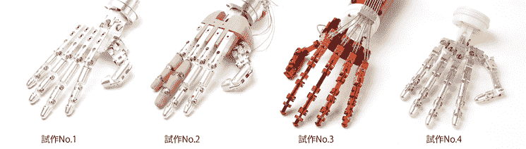
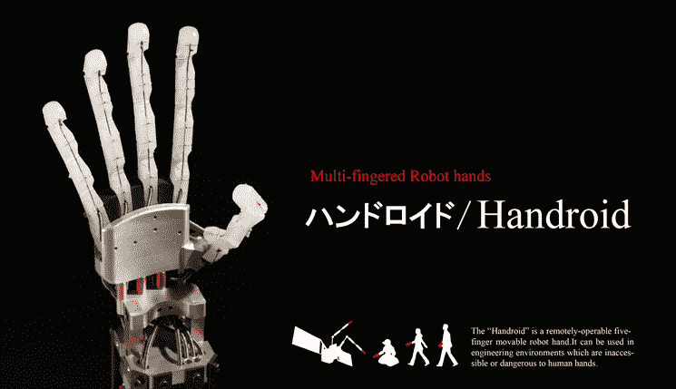

# Handroid:日本公司展示高级机器人手(视频)

> 原文：<https://web.archive.org/web/https://techcrunch.com/2011/08/24/handroid-japanese-company-shows-advanced-robot-hand-video/>

# Handroid:日本公司展示高级机器人手(视频)

总部位于日本的科技初创公司 [ITK](https://web.archive.org/web/20230205022553/http://www.itk-pro.com/en/index.html) 让我们离[机器人时代](https://web.archive.org/web/20230205022553/https://techcrunch.com/tag/robocalypse/)更近了一步。世界各地的机器人专家正在致力于制造适合触摸人类或处理易碎物品的机器人[的](https://web.archive.org/web/20230205022553/https://techcrunch.com/tag/robots/)[手](https://web.archive.org/web/20230205022553/https://techcrunch.com/2011/01/26/video-super-robust-german-robot-hand/)，这是一个众所周知难以解决的问题。

ITK 现在正在用一种新型号的手动机器人进行比赛，这种手动机器人似乎是目前最先进的机器人之一。这个机器人拥有五个完全可以活动的手指，看起来很像阿诺德·施瓦辛格在《终结者 2》中使用的手。

操作员可以远程控制每个手指(手控机器人可以模仿操作员的动作)，例如在使用人手太危险的环境中。重量只有 740 克，非常轻，这促使 ITK 研究开发一种可以由脑电波或大脑神经控制的假手的可能性。

ITK 计划在大约两年内将这款手控盒商业化，每台售价约为 6500 美元——对于这样一款设备来说，这是一个非常低的价格。

下面是宣传片视频:
【YouTube = http://www . YouTube . com/watch？v = b 65 dbxi 94 Wu&w = 560&h = 345】

via[robn able](https://web.archive.org/web/20230205022553/http://www.robonable.jp/news/2011/08/24itk.html)[JP]