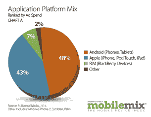
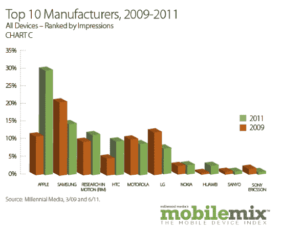
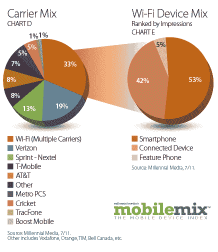

# 千禧一代:7 月份，Android 以 61%的移动广告浏览量连续第八个月位居 iOS 榜首 TechCrunch

> 原文：<https://web.archive.org/web/http://techcrunch.com/2011/08/24/millennial-android-tops-ios-for-the-eighth-month-with-61-percent-of-mobile-ad-impressions-in-july/>

众所周知，Android 正在快速增长，尤其是在过去的一年里。作为美国最大的移动广告网络之一的千禧媒体，[最近报道](https://web.archive.org/web/20230203105911/https://techcrunch.com/2011/08/12/millennial-q2-report-android-ad-impressions-up-53-percent-ios-up-4-percent/) Android 的移动广告印象份额从 2010 年 3 月的 6%上升到 2011 年 6 月的[54%](https://web.archive.org/web/20230203105911/https://techcrunch.com/2011/07/15/ios-rim-mobile-ad-impressions-pick-up-in-q2-as-android-growth-levels-off/),超过了 iOS。7 月份的报告显示了类似的增长模式，7 月份，Android 显示出特别强劲的增长，其操作系统的移动广告印象份额当月增长了 15%，占千禧一代网络印象的 61%。这是 Android 连续第八个月超过 iOS。

7 月份，iOS 在千禧一代网络上的份额实际上有所下降，从 6 月份的 26%下降到 21%。RIM 在 7 月份以 14%的份额落后，比 6 月份下降了一个百分点。在全球范围内，iOS 和 RIM 的月环比印象相对持平，但 Android 的月环比印象增长了 31%。7 月份，Symbian 的浏览量增长了 11%，但 Windows Phone 7 的浏览量环比增长了 71%。

Millennial 报告称，智能手机移动广告印象份额环比增长 5%，并在 7 月份以 68%的印象数继续高居设备榜首。联网设备(如 iPads)和功能手机各占 16%。

在第一个月，千禧一代推出了支持 Wi-Fi 的设备，7 月，Wi-Fi 占运营商组合的 33%。在 Wi-Fi 中，智能手机占网络上所有 Wi-Fi 印象的一半以上，而连接设备，包括平板电脑、游戏设备和电子阅读器，占
7 月份 Wi-Fi 印象的 42%。

正如该公司几周前的智能报告所述，由于智能手机的日益普及，制造商苹果、HTC 和华为在过去两年中的印象份额都增加了一倍以上。Millennial 表示，在 2009 年，它的第一份 20 大手机名单中包含了功能手机和智能手机，包括七款 BREW 设备、三款 Java 设备、两款黑莓和 Windows Mobile 设备、iPhone 和一款谷歌 Android 设备。在 2011 年的 Q2，同样的名单完全由智能手机组成(有更多的 Android 手机)。

7 月，苹果继续成为领先的设备制造商网络，占前 15 名制造商印象份额的 26%，iPhone 以 13%的印象份额保持前 20 名手机排名的第一位。三星实际上是增长最快的一个月，比 6 月份增长了 28%，连续第六个月位居第二。

Millennial 还对网络应用的广告支出进行了细分，Android 的广告支出超过了 iOS。根据该报告，48%的广告支出来自安卓应用，而 43%的广告支出来自 iOS 应用。

从应用类型来看，游戏应用占网络应用展示的 29%，环比增长 35%。另一个增长巨大的类别是健康和健身应用程序，其印象环比增长 13%(卡路里计算和食谱应用程序占该类别的三分之二)。

