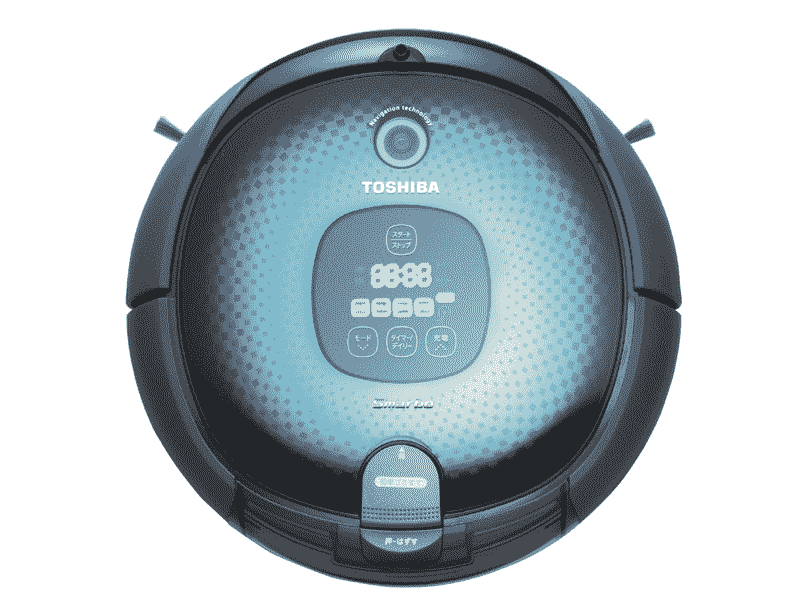
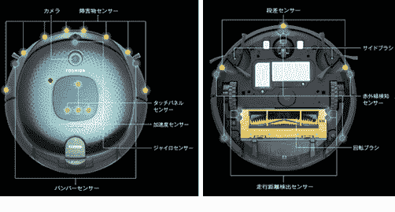
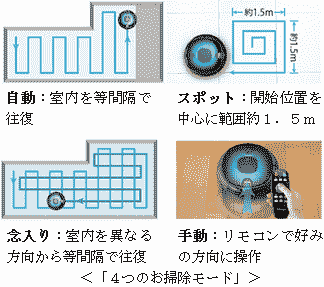
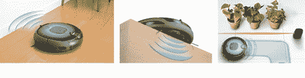

# Smarbo:东芝宣布 Roomba 竞争对手 TechCrunch

> 原文：<https://web.archive.org/web/http://techcrunch.com/2011/08/24/smarbo-toshiba-announces-roomba-competitor/>

# Smarbo:东芝宣布 Roomba 竞争对手

Roomba 刚刚迎来了来自日本的新竞争:[东芝](https://web.archive.org/web/20230203140729/https://techcrunch.com/tag/toshiba)已经[宣布](https://web.archive.org/web/20230203140729/http://www.toshiba.co.jp/tha/about/press/110824.htm)【JP】一款新的清洁[机器人](https://web.archive.org/web/20230203140729/https://techcrunch.com/tag/robots)今天，所谓的 Smarbo(可能是“智能机器人”的简称)。就像它的美国同行一样，东芝机器人主要用于家庭。

东芝在机器人中内置了相当多的功能，例如两个 CPU(细节未知)，一个摄像头和一组 38 个传感器(陀螺仪，加速度，距离检测等)。).该公司表示，Smarbo 可以在大约 90 分钟内清洁 100 平方米的区域，这样大小的房间电费仅为 2 日元(0.03 美元)。

就像 Roomba 一样，Smarbo 会绕过附近的物体，并在完成后自动返回充电站。买家可以通过某些方式对 Smarbo 进行编程。例如，如果他们想彻底清洁房间内的一小块区域，他们可以选择“定点模式”，让机器人只在 1.5×1.5 米的正方形内转圈，然后返回充电站(见下文)。

Smarbo 的尺寸为 355×355×93 毫米，重 3.7 千克，工作压力为 52 分贝。

东芝计划于 10 月 1 日开始在日本销售这款电脑(顺便说一下，Roomba 也在日本销售)，售价为 1175 美元(包括一个遥控器和充电站)。