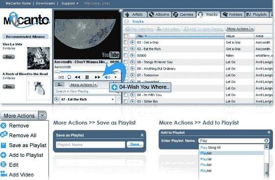

# 以成为音乐收存箱为目标，Mecanto 推出了一项经济实惠的流媒体和存储服务 TechCrunch

> 原文：<https://web.archive.org/web/http://techcrunch.com/2011/08/25/aiming-to-be-the-dropbox-of-music-mecanto-launches-an-affordable-streaming-and-storage-service/>

如果你是基于云的音乐储物柜的粉丝，这是一个活着的好时机。回到 3 月，亚马逊凭借其“云驱动器”和“云播放器”在音乐流媒体和存储领域出人意料地击败了苹果和谷歌。此后，谷歌和苹果都推出了云音乐产品(或其测试版)，随着时间的推移，这三家公司都在继续改进和发展。

作为一名音乐爱好者，很高兴看到云音乐存储和流媒体服务齐头并进，即使我们都不得不承认有自己的个人最爱。因为，坦白地说，这个领域的竞争越多越好。这就是为什么你应该关注一家新的创业公司，它正在进入左边的阶段: [Mecanto](https://web.archive.org/web/20230203131515/http://www.mecanto.com/) 。是的，今天，一种新的云音乐服务进入了舞台，承诺向世界各地的听众提供无限的音乐流和存储——这不会影响你的钱包。 **(Mecanto 向 TC 读者提供 1000 份 6 个月的免费订阅。万岁。更多信息见下文。)**

总部位于特拉维夫的 Mecanto 本周推出了一款支持云的音乐播放器和存储服务，该服务易于设置，并具有用户希望从他们可信赖的 neighborhood music locker 获得的所有功能:无限存储和流媒体，自动将 iTunes 库和 PC 文件夹与你的在线帐户(从多台 PC)同步的能力，全球可用性，播放列表编辑，视频，轻松浏览，以及跨平台功能。同样，用户可以在网上找到 Mecanto，或者在 iOS、Android、Windows Phone 和 Symbian 上移动。

MeCanto 移动界面非常漂亮，让用户能够轻松收听歌曲和专辑，或者创建播放列表。歌曲通过 3G 或 WiFi 播放，用户可以听任何他们想听的歌曲，而不必担心歌曲会占用他们手机的多少空间。这杯敬你，克劳德。

听起来是个很好的开始，对吧？当然，但有亚马逊、谷歌、苹果、Spotify 和无数其他公司的名字在盯着他们，Mecanto 肯定有一段艰难的路要走。也就是说，现在的负担能力是以色列音乐服务的一个强大卖点。看一下它的竞争对手:Spotify Unlimited 和 Premium 每年分别花费 60 美元和 120 美元，iCloud 每年大约花费 25 美元，亚马逊的 Cloud Drive 和 Cloud Player 每年至少花费 20 美元(无限存储可能是限时提供的)。

另一方面，谷歌目前是免费的，但它不太可能长期保持这种状态。相比之下，每年 20 美元的 Mecanto 是大型玩家的一个有吸引力的替代选择，特别是因为它提供全球可用性，跨平台集成和即时上传——这是一个其竞争对手只提供部分的套件。

此外，首次使用 Mecanto 的用户可以获得为期一个月的免费试用服务，在结束时，他们可以支付 20 美元的全年费用，或者以每月 2 美元的费率分摊。要开始使用，用户只需下载一个小应用程序到他们的桌面上，然后它会自动上传和同步你所有的音乐。吧嗒吧嗒，吧嗒吧嗒。最棒的是:Mecanto 的上传过程加快了，这意味着用户几乎可以立即访问他们的音乐，甚至在上传完成之前。听众可以立即访问他们的音乐，或者他们可以选择以较慢的速度上传他们的文件，节省带宽而不必担心延迟。

不想在脸书时代反社会，音乐服务还提供社交功能，包括将 YouTube 视频添加到个人账户和播放列表的能力，以及在脸书和推特上分享这些 YouTube 剪辑的能力，Last.fm 曲目搜索，将当前曲目分享到社交网络，多桌面同步和曲目智能分类。至于文件支持？梅坎托工程与 MP3，M4A，WMA，OGG，FLAC，和他们的大多数衍生物。

Mecanto 所谓的“三个屏幕和一个云”平台确实是这个领域大牌的一个很好的替代选择，“音乐 Dropbox”不是一个不公平的类比。当然，它的设计与其他一些产品不太一样，但它的经济性、全球可用性和跨平台功能可能只是给了 Mecanto 一条腿，它需要在一个充斥着熟悉名称的空间中得到认真对待。

到目前为止，这家初创公司已经从私人天使那里筹集了 200 万美元的资金，但你可以肯定的是，随着它开始扩大规模并在全球推广，它将寻求更多的现金。

以色列的 music locker 绝对值得一看，尤其是在为期一个月的免费试用的支持下，并且第一批点击这里的 1000 名 TechCrunch 读者将获得这项服务为期六个月的免费试用。我是说，谁不喜欢音乐交易呢？看看这个。