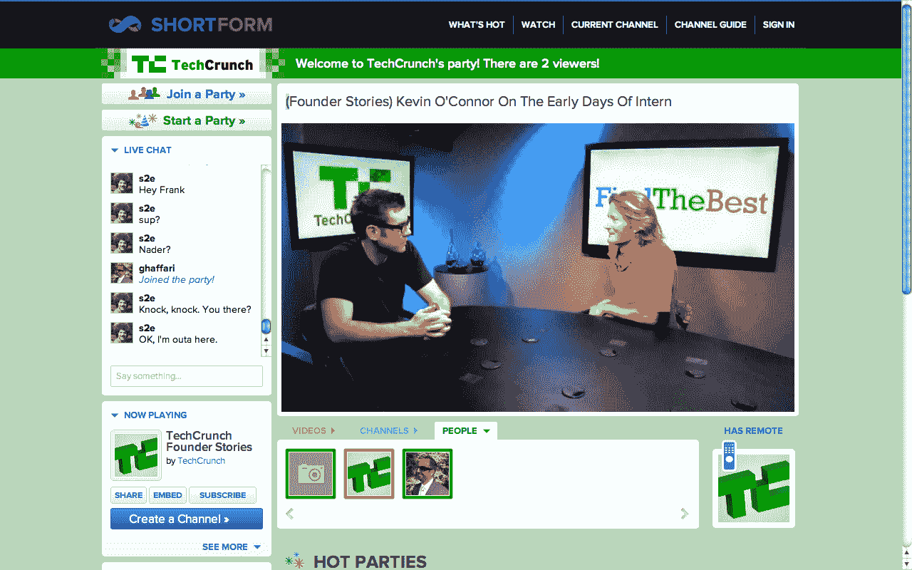

# Channeling Turntable.fm，ShortForm 展示现场 VJ 视频聚会(带有自定义 TechCrunch 社交)

> 原文：<https://web.archive.org/web/http://techcrunch.com/2011/08/25/channeling-turntable-fm-shortform-shows-off-live-vj-video-parties-with-a-custom-techcrunch-social/>

[Turntable.fm](https://web.archive.org/web/20230204164103/http://turntable.fm/) 现在这么火。事实上，当谈到推文时，同步社交音乐平台[甚至可能比 Pandora 或 Spotify](https://web.archive.org/web/20230204164103/https://techcrunch.com/2011/07/28/music-tweets-spotify-turntable-fm/) 有更多的 Klout。随着转盘越来越受欢迎，视频监管平台渴望从音乐舞蹈派对网站获得灵感，将迪斯科引入视频，这是很自然的。

[两周前，我们报道了](https://web.archive.org/web/20230204164103/https://techcrunch.com/2011/08/11/chill-yes-that-chill-is-a-turntable-fm-for-videos/) [Chill](https://web.archive.org/web/20230204164103/http://chill.com/) 的发布会，这在概念上几乎是转盘. fm 视频的直接模拟，只是在 Chill 的情况下，有“休息室”而不是转盘的 DJ 室。我知道，有点夸张。当然，当谈到社交视频体验时，有 Socialcam 和 Google+，它们都可以让你与朋友在线观看视频，但这里有更多的互动潜力，如转盘所示。

[简称](https://web.archive.org/web/20230204164103/http://www.shortform.com/)，这家成立一年半的初创公司旨在帮助视频狂热者创建个性化的网络视频内容频道，最近也开始同步社交视频体验，因为它最近推出了[直播视频聚会](https://web.archive.org/web/20230204164103/http://www.shortform.com/whatshot/parties)集成，允许视频骑师向现场观众广播视频内容。

[当我们在 3 月份第一次报道 ShortForm 时](https://web.archive.org/web/20230204164103/https://techcrunch.com/2011/03/31/video-curation-is-growing-up-shortform-hits-one-million-visitors/)，这家初创公司刚刚跨越了百万访客里程碑，而且这种采用还在继续，ShortForm 首席执行官 Nader Ghaffari 告诉我，仅在 7 月份，这家初创公司就吸引了 100 万独立访客。

这是 ShortForm 进入热门领域的关键一步，因为它的新视频派对功能是建立在成千上万个已经策划好的视频频道之上的，这些频道来自 YouTube、Vimeo 和几乎所有其他视频平台。

因为 ShortForm 已经推出，使他们的 VJs 可以轻松地将这些平台上的视频混合到他们自己的个性化频道中，以背靠背的格式播放，就像电视观看体验一样。因此，ShortForm 的 VJs 可以为他们的观众播放他们自己策划的视频频道，或者从初创公司的频道指南中选择数以千计的其他 VJ 频道。

当然，到目前为止，这家初创公司的 VJs 都是异步观看视频内容，但随着视频派对的推出，ShortFormers 现在可以与数百名其他朋友同时观看精选的视频内容，并在观看时与这些其他观众聊天——就像转盘一样。

ShortForm 方法的巧妙之处在于，它突出了现场视频聚会中所有观众的个人资料照片，从而在观众和 VJs 之间带来额外的社交互动。当然，在播放什么视频的问题上，主持人 VJ 控制着晚会和播放的内容。然而，主机可以在任何时候将“遥控器”传递给任何其他查看器，将该查看器变成新的 VJ。如果原主人不喜欢他们所看到的，他们总是可以从冒犯的 VJ 手中抢回遥控器，并恢复他们对正在播放的猫视频的控制。

Ghaffari 说:“我在这里看到的大愿景是，在线视频的第一波明星是内容创造者。现在，每天都有如此多的内容产生，有机会创造一个新的明星品种。这些明星是 VJs，他们可以将这些内容整理成频道，讲述惊人的故事，并与世界各地的朋友和观众分享这些频道。视频直播派对为这些 VJs 提供了一种社交和互动的方式来讲述他们的故事”。

现场视频派对确实有机会成为令人上瘾和引人入胜的体验，特别是通过聊天，因为观众可以实时讨论他们正在观看的内容，或者开始自己的派对。事实上，用户也可以传递接力棒，并把 VJing 的权力交给其他用户，这对建立一个真正的互动视频平台大有帮助。

为了让 TC 读者体验视频派对的体验，ShortForm 创建了一个专注于 TechCrunch 品牌体验的定制派对，在这种情况下，具体是克里斯·迪克森的“创始人故事”。观众可以和其他人以及工作人员一起同步观看迪克森的采访。当然，通常主持人可以将遥控器传给其他观众，但在这种情况下，这都是创始人的故事，所有的时间。这是一个很好的例子，说明 VJs、品牌和更多的人将能够定制他们的页面和视频体验，以吸引眼球、浏览，甚至可能获得金钱。

[点击这里查看创始人故事派对](https://web.archive.org/web/20230204164103/http://www.shortform.com/party/TechCrunch/techcrunchfounderstories)。

