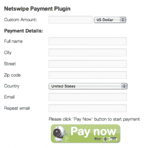

# Jumio 来到 WordPress，将博客读者的网络摄像头变成信用卡阅读器 TechCrunch

> 原文：<https://web.archive.org/web/https://techcrunch.com/2011/08/25/jumio-comes-to-wordpress-turns-webcams-into-credit-card-readers-on-blogs/>

# Jumio 来到 WordPress，把博客读者的网络摄像头变成了信用卡阅读器

Jumio ，这项将网络摄像头变成信用卡阅读器的新技术，现在为[提供 WordPress 网站的插件](https://web.archive.org/web/20230203130713/http://ctt.marketwire.com/?release=791792&id=671341&type=1&url=http%3a%2f%2fwww.jumio.com%2fwordpress)。新的 Jumio Netswipe 插件允许网站访问者快速轻松地支付产品或捐款，只需将信用卡放在电脑的网络摄像头上。

对于 WordPress 出版商来说，将 Netswipe 添加到他们的网站很简单——就像任何其他 WordPress 插件一样，只需下载、安装和激活。

有了这个新插件，WordPress 网站的所有者可以得到一个“Netswipe PayMe”按钮，可以放在他们网站的任何地方。所有的付款都通过你的 Jumio 账户管理，注册后是免费的。

在[这里](https://web.archive.org/web/20230203130713/http://jumio.com/plugins/wordpress/latest.zip)下载完 WordPress 插件后，只需解压并上传文件夹‘WordPress _ Jumio _ Payment _ Plugin’到“/wp-content/plugins/”目录。然后通过 WordPress 的“插件”菜单激活插件。然后你可以在 WordPress 的“设置”菜单中配置你的选项。(更详细的说明这里是[这里是](https://web.archive.org/web/20230203130713/http://jumio.com/products/start/wordpress/))。

Jumio [于上个月](https://web.archive.org/web/20230203130713/https://techcrunch.com/2011/07/26/jumio-turns-webcams-into-credit-card-readers-and-why-merchants-will-welcome-netswipers/)推出，为商家和开发者推出无缝的一站式解决方案，意图颠覆支付行业。这项技术不仅易于使用，还为数字交易增加了一层安全性，因为必须有物理卡才能使 Jumio 的网络摄像头解决方案工作。

最初，这项技术只适用于桌面网站，但是，今年晚些时候，一个由两部分组成的移动解决方案将会推出。Jumio 系统的这一部分将包括一个移动应用程序和开发者库。Jumio 的移动开发者工具是该解决方案中[最像 Card.io](https://web.archive.org/web/20230203130713/https://techcrunch.com/2011/06/23/card-ios-sdk-makes-entering-credit-card-information-as-easy-as-taking-a-snapshot/) 的方面，它提供了一个类似的工具包。

三月份，Jumio [从脸书联合创始人](https://web.archive.org/web/20230203130713/https://techcrunch.com/2011/03/17/exclusive-facebook-co-founder-eduardo-saverin-leads-6-5m-round-for-jumio/)[爱德华多·萨维林](https://web.archive.org/web/20230203130713/http://www.crunchbase.com/person/eduardo-saverin)和其他投资者那里获得了 650 万美元的资金。