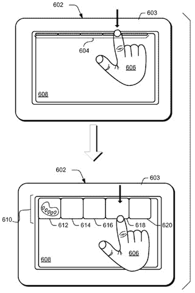
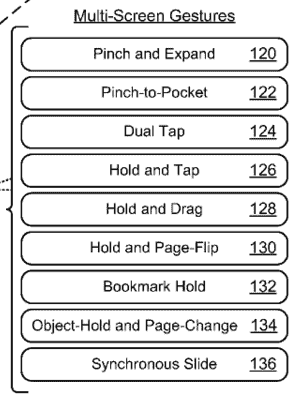
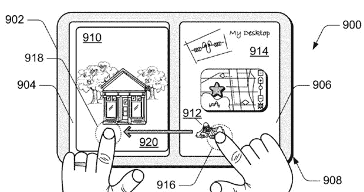

# 微软申请多屏多点触控手势专利 TechCrunch

> 原文：<https://web.archive.org/web/http://techcrunch.com/2011/08/25/microsoft-awarded-patents-for-multi-screen-multi-touch-gestures/>

(**更新**:所列专利并未获得授权，只是最近才公之于众。)

回到 2010 年 2 月，[微软](https://web.archive.org/web/20230203133531/https://techcrunch.com/tag/microsoft)申请了多项与平板电脑触摸屏手势相关的专利。其中许多都与双屏设备有关，让人想起曾经备受期待的信使候选人 T4 的形象。其他人主要关注边框手势。这些专利现在已经公开了，尽管事实上它们还没有被授权。

随着知识产权战争在全球范围内愈演愈烈，看一看微软试图宣称拥有的技术当然是值得的。所以我们出发了:

 ** [屏幕外手势创建屏幕内输入:](https://web.archive.org/web/20230203133531/http://appft1.uspto.gov/netacgi/nph-Parser?Sect1=PTO2&Sect2=HITOFF&p=1&u=%2Fnetahtml%2FPTO%2Fsearch-bool.html&r=1&f=G&l=50&co1=AND&d=PG01&s1=20110205163.PGNR.&OS=DN/20110205163RS=DN/20110205163)**

这个很有趣。就手势而言，它基本上将边框纳入了等式。该专利提供了单点触摸手势、多指同手手势和多指异手手势，所有这些手势都可以沿着边框从内向外或从外向内移动。现在，微软所需要的就是多脚趾不同脚的手势，边框就是他们的了。还提到了边框手势激发下拉菜单。

我们已经在[黑莓 PlayBook](https://web.archive.org/web/20230203133531/https://techcrunch.com/2011/04/13/blackberry-playbook-review/) 上看到了类似的东西。要唤醒设备，您可以将手指从底部挡板向上滑动到屏幕中。多任务处理需要同样的手势，但是是从写字板的两边到屏幕上。

**[带边框手势的放射式菜单:](https://web.archive.org/web/20230203133531/http://appft1.uspto.gov/netacgi/nph-Parser?Sect1=PTO2&Sect2=HITOFF&p=1&u=%2Fnetahtml%2FPTO%2Fsearch-bool.html&r=1&f=G&l=50&co1=AND&d=PG01&s1=20110209093.PGNR.&OS=DN/20110209093RS=DN/20110209093)**

这里我们有另一个与边框相关的专利，这次是关于放射式菜单的。它基本上描述了一种通过使用边框手势来访问、导航和使用屏幕上的放射式菜单的方法。除了在微软的 Surface 上和在 Honeycomb 的浏览器中，我们还没有看到太多的圆形/饼形菜单。蜂窝饼图菜单的工作原理是将半个手指放在屏幕上，另一半放在边框上，尽管屏幕是设备接收输入的唯一部分。

**[多指手势:](https://web.archive.org/web/20230203133531/http://appft1.uspto.gov/netacgi/nph-Parser?Sect1=PTO2&Sect2=HITOFF&p=1&u=%2Fnetahtml%2FPTO%2Fsearch-bool.html&r=1&f=G&l=50&co1=AND&d=PG01&s1=20110209088.PGNR.&OS=DN/20110209088RS=DN/20110209088)**

又一项表圈专利。但我保证是最后一个。这个确实和上面的第一个非常相似，但是涵盖了它的名字所暗示的:多手指手势。这一部分还介绍了与一个或多个可公开的(显然是可定制的)抽屉相关的多手指手势的使用。它还扩展了手势，可以在多屏幕设备上使用。

有了这些，我们就可以去看看另一批专利，都是关于多屏手势的。

**[多屏双击手势:](https://web.archive.org/web/20230203133531/http://appft1.uspto.gov/netacgi/nph-Parser?Sect1=PTO2&Sect2=HITOFF&p=1&u=%2Fnetahtml%2FPTO%2Fsearch-bool.html&r=1&f=G&l=50&co1=AND&d=PG01&s1=20110209102.PGNR.&OS=DN/20110209102RS=DN/20110209102)**

下一个专利主要关注经典的双击以及如何在双屏(或多屏)设备上使用它。从我收集的信息来看，这似乎是将双击视为进入全屏模式的一种方式，微软称之为“装入”被点击的对象。也就是当设备使用跨屏幕组合显示时。但是，如果设备处于分屏模式，双击会在一个显示器上全屏显示被点击的图像，而在另一个显示器上“压缩”。

 ** [多屏捏放手势:](https://web.archive.org/web/20230203133531/http://appft1.uspto.gov/netacgi/nph-Parser?Sect1=PTO2&Sect2=HITOFF&p=1&u=%2Fnetahtml%2FPTO%2Fsearch-bool.html&r=1&f=G&l=50&co1=AND&d=PG01&s1=20110209100.PGNR.&OS=DN/20110209100RS=DN/20110209100)**

另一个经典的触摸屏手势，但增加了多屏系统的神奇之处:缩放。与双击专利不同，这个专利似乎没有提到任何时髦的缩放分屏命令。除了引入多屏之外，真的没有什么超级新的东西。

**[多屏书签保持手势](https://web.archive.org/web/20230203133531/http://appft1.uspto.gov/netacgi/nph-Parser?Sect1=PTO2&Sect2=HITOFF&p=1&u=%2Fnetahtml%2FPTO%2Fsearch-bool.html&r=1&f=G&l=50&co1=AND&d=PG01&s1=20110209039.PGNR.&OS=DN/20110209039RS=DN/20110209039)**

这很有趣。该特定专利描述了一种通过在第一屏幕上按住“杂志页”的角，并在第二屏幕上执行滑动动作以指示它应该被书签标记，来在设备上标记某个“杂志页”的方式。我们假设术语“杂志页”指的是所有类型的内容。书签于是是第一屏幕上的可选择链接，并且可由显示为书签图标的杂志页面的一部分来标识。

**[多屏按住翻页手势:](https://web.archive.org/web/20230203133531/http://appft1.uspto.gov/netacgi/nph-Parser?Sect1=PTO2&Sect2=HITOFF&p=1&u=%2Fnetahtml%2FPTO%2Fsearch-bool.html&r=1&f=G&l=50&co1=AND&d=PG01&s1=20110209057.PGNR.&OS=DN/20110209057RS=DN/20110209057)**

保持和翻页专利与分屏观看有关。通过将一个手指放在您想要继续观看其内容的屏幕上，并在另一个屏幕上执行某种类型的未指定“输入动作”，第一个屏幕上的内容将“保持”，而另一个屏幕上的内容将发生变化，或“翻转”

**[多屏按住并轻击手势:](https://web.archive.org/web/20230203133531/http://appft1.uspto.gov/netacgi/nph-Parser?Sect1=PTO2&Sect2=HITOFF&p=1&u=%2Fnetahtml%2FPTO%2Fsearch-bool.html&r=1&f=G&l=50&co1=AND&d=PG01&s1=20110209058.PGNR.&OS=DN/20110209058RS=DN/20110209058)**

最后，但同样重要的是，我们拥有“保持并窃听”专利。这个是面向两个屏幕之间的通信。在一个实例中，在第一个屏幕上保持显示的对象并轻敲第二个屏幕会将所述对象从第一个屏幕移动到第二个屏幕，就在你轻敲的地方。在另一示例中，保持并点击手势可用于将保持的对象复制到第二屏幕上。如果第一个屏幕上显示的对象恰好是一个功能，按住该功能并轻敲第二个屏幕会将该功能应用于第二个屏幕上显示的对象。

谁知道这些专利什么时候会有结果呢？但随着微软试图控制这项技术，其他平板电脑设计师应该注意到这些专利。尤其是如果多屏设备正在研发中[(读作:索尼)](https://web.archive.org/web/20230203133531/https://techcrunch.com/2011/07/13/hands-on-with-the-sony-s1-and-s2/)。

[via [微软新闻](https://web.archive.org/web/20230203133531/http://microsoft-news.com/microsoft-awarded-with-patents-on-gestures-supported-on-windows-8/)