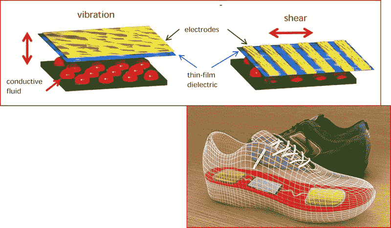

# “纳米动力”鞋可以在行走中产生 20W 的电力 TechCrunch

> 原文：<https://web.archive.org/web/http://techcrunch.com/2011/08/25/nanopower-shoes-could-generate-20w-of-electricity-during-walking/>

# “纳米动力”鞋可以在行走过程中产生 20 瓦的电力

这与昨天流行的其他电动鞋不同。压电材料很有趣，但就其尺寸而言，它并不能产生很大的能量。足以让低功率发射机喷出几个字节，或者点亮一个 LED。它们非常适合收集环境力，如声音和振动，如果你知道你想要收集的力的方向和类型，有更好的方法。

在从脚步中获取能量的情况下，你对这些力是如何工作的有一个很好的想法。来自威斯康星大学麦迪逊分校的一些研究人员正在研究一种系统，该系统可能能够从你的支柱上提取多达 20W 的能量。你为什么昂首阔步？你觉得你很酷。

是的，从理论上讲，你可以通过走动给你的 iPad 充电或者给一台低功耗的电脑供电。当然，你永远也不能停止走路，这可能是一件好事。研究人员已经私有化，以“脚背纳米动力”的名义研究和销售这项技术，他们说，大约 300 瓦的功率单独作为热量耗散，他们认为他们可以吸走一点，而不会影响你的步态。

他们所做的是将一种由微小金属微滴组成的液体引入一种特殊的基质中。当你的脚踩下它时，水滴被迫穿过基板，这通过一种被称为反向电润湿的方式产生电力(这可能正在申请专利，但你可以[阅读《自然》杂志](https://web.archive.org/web/20230205030942/http://www.nature.com/ncomms/journal/v2/n8/full/ncomms1454.html)上的论文)。

一旦能量被获取，它可以被保存以备后用，或者立即用于驱动设备。他们提出了一种中继，可以为手机进行高功率传输，同时使用低功率信号向手机发送信息，从而节省电池寿命。这是一个过于具体的应用，但你会明白的。

他们在 FAQ 中提到了几个潜在的问题[(压扁、泄漏、成本等)，但没有提到重量。我担心电池和液态金属会大大增加保险箱的重量。我自己也喜欢轻便的鞋子，我不确定我是否愿意为一个可疑的可获得的电源在每只脚上再增加四或五盎司。](https://web.archive.org/web/20230205030942/http://www.instepnanopower.com/9z_FAQ/FAQ.aspx)

【经由[UW·麦迪森](https://web.archive.org/web/20230205030942/http://host.madison.com/news/local/education/university/article_82a17e5c-cdec-11e0-a7b6-001cc4c03286.html)和[迪维斯](https://web.archive.org/web/20230205030942/http://dvice.com/archives/2011/08/liquid-metal-sh.php)