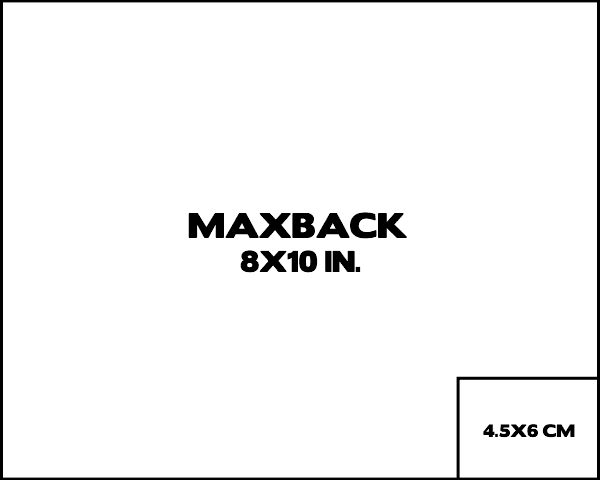

# 摄影师花费数十万打造 8x10 数字传感器 TechCrunch

> 原文：<https://web.archive.org/web/http://techcrunch.com/2011/08/25/photographer-spends-hundreds-of-thousands-creating-8x10-digital-sensor/>

米切尔·范伯格是一名摄影师，专门为非常昂贵的东西拍摄美丽的照片。汽车、奢侈品、手表之类的东西。他用 8×10 的胶片拍摄，这足够贵，以至于你通常希望第一次就拍对。因此，他用 8×10 的宝丽来胶卷进行试拍，以确保曝光和对焦正确。15 美元一张，每张照片 7 或 8 个测试镜头，宝丽来电影本身的供应越来越少(尽管不可能的项目是[寻求翻拍](https://web.archive.org/web/20230203100103/http://www.the-impossible-project.com/projects/8x10/))，对范伯格来说，很明显他不能继续这样做。

那么他做了什么？没有，他没买聆风，也没买哈苏。他决定[委托制作世界上最大的彩色数字后盖](https://web.archive.org/web/20230203100103/http://www.aphotoeditor.com/2011/08/23/mitchell-feinbergs-8x10-digital-capture-back/)。经过一番讨价还价，并得到他是认真的保证后，原型机于 2010 年 2 月组装完成，生产设备于 2011 年初交付。

他称之为 Maxback。足足有 8×10 寸；相比之下，哈苏最好的数码背板 [CFV-50](https://web.archive.org/web/20230203100103/http://www.hasselbladusa.com/products/digital-backs/cfv-50.aspx) 为 36.7×49.1 毫米。范伯格表示，最大的可用背板约为 4.5x 6 厘米。下面是一个对比，向你展示它与 Maxback 的对比:

是的，差别很大。然而，有趣的是，Maxback 并不是为产生很多像素而设计的。事实上，这个巨大的传感器只能输出 16 位 1000 万像素的图像。这是最高质量的 1000 万像素图像，当然，这是因为镜头的质量和像素井的大小，但仍然不足以在海报、杂志等上高保真打印。

他用数码相机拍了几张照片(他设计的数码相机正好适合他的大画幅设置)，然后当他满意时，就把它切换到 8×10 的胶片。

成本是…好吧，我让范伯格解释:“开发和生产两个背部(我想有一个备用的)等于一个好尺寸的房子的成本——在房地产崩溃之前。”所以我们说的可能是 50 万美元。

问题是，他每年花 5 万美元买宝丽来。他希望它能收回成本，现在设计和测试已经完成，制造更多的成本应该在“低六位数”因此，他甚至可以通过向其他大画幅摄影师出售几张照片来快速打破记录，因为他有大把的钱可以挥霍。

一个有趣的，虽然昂贵的，解决问题的方法，至少结果是令人印象深刻的。如果你有时间，[看看范伯格的一些照片](https://web.archive.org/web/20230203100103/http://www.mitch.fr/)——你可能会认出一些，但里面有一些我没见过的美景，尤其是《时尚先生》的腕表系列。

我也喜欢这地板。

[via [千万亿像素](https://web.archive.org/web/20230203100103/http://www.petapixel.com/2011/08/25/photographer-makes-his-own-8x10-digital-back-for-the-price-of-a-house/)