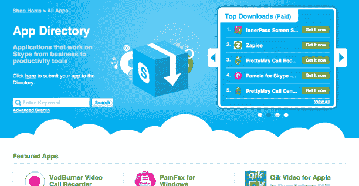

# Skype 推出第三方应用程序目录 TechCrunch

> 原文：<https://web.archive.org/web/http://techcrunch.com/2011/08/25/skype-launches-third-party-app-directory/>

Skype 似乎已经在云端推出了一个新的应用目录,允许用户访问所有基于 Skype API 的第三方应用，包括消费者应用和企业应用。

目前该网站的功能相当简单，但是 Skype 已经将消费者应用和商业应用按照类型(电话录音、视频、桌面共享等)进行了分类。)，并按类型列出了下载量最高的免费和付费应用、排名最高的应用和最新的应用。例如，Skype 录音应用 VodBurner 是所有类别中下载量最多的应用。

对于每个应用程序，Skype 都提供一个登录页面，提供有关该应用程序、发布日期、星级和评论、功能、要求、屏幕截图等更多信息。您可以选择下载该应用程序，Skype 将带您进入开发者登录页面。Skype 用户还可以按费用、语言、关键字、操作系统等搜索应用程序。

Skype 全球网上商店的负责人 Ash Valeski 说，该 VoIP 公司非常重视其 SkypeKit 下一代软件开发工具包，并希望为开发该平台的开发者建立一个合适的分销渠道。他指出，这是目录的试运行，将来还会添加更多的功能。在发布时，Skype 有 23 个应用程序作为试运行合作伙伴。

Valeski 说，将来允许用户使用 Skype 点数购买应用程序，并实际集成一个类似 iTunes 的电子商务平台，让 Skype 实际销售应用程序，这将是有意义的。目前，该目录将访问者带到开发者网站购买应用程序。

正如 VodBurner 首席执行官兼创始人 Jeremy Hague 告诉我们的那样，*让 Skype 用户能够评价应用程序，评论应用程序，这对 Skype 来说是全新的，将真正帮助应用程序开发者将其应用程序发布到庞大的 Skype 社区……拥有一个目录使我们的生活更加轻松。他说，到目前为止，还没有一个宣传第三方应用的好方法。*

该目录的另一个有用功能是 Skype 在 Skype 客户端内“显示”应用程序。因此，在最新版本的 Skype for Windows 中，您可以访问工具下的应用程序目录。该目录将在以后添加到 Mac 客户端。开发者也可以管理他们自己的列表。

很高兴看到 Skype 提供像应用程序目录这样的功能，这样第三方开发者可以展示他们的应用程序，使 Skype 变得更好。Skype 在过去并没有与开发者有过最好的历史记录，但这似乎是一个进步。或许即将成为母公司的[微软](https://web.archive.org/web/20230203051858/https://techcrunch.com/2011/05/10/microsoft-acquires-skype/)的影响正在帮助事情朝着有利于开发者的方向发展。