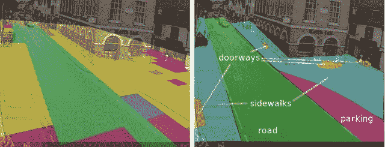
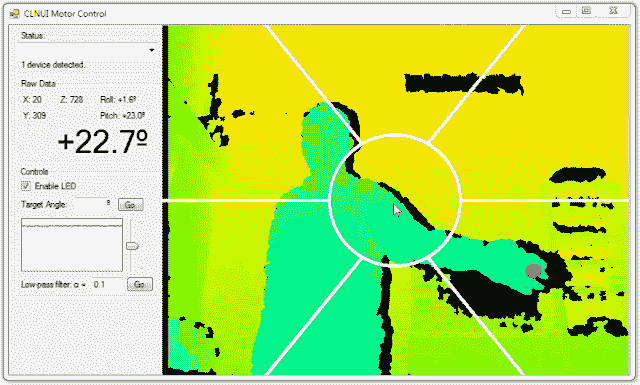

# 机器人和计算机视觉的下一步:行为分析、情境意识 TechCrunch

> 原文：<https://web.archive.org/web/http://techcrunch.com/2011/08/25/the-next-steps-in-robotics-and-computer-vision-behavior-analysis-situational-awareness/>

我们最近在机器人和计算机视觉领域看到了一些有趣的发展。它们并不像你想象的那样学术:像 Roomba 和 Kinect 这样的巨大技术成功依赖于智能算法和软件开发，正如它们依赖于营销和零售布局一样。那么，我们日益智能的相机、网络摄像头、电视和手机的下一步会是什么呢？

我与 Kitware 公司的计算机视觉研究负责人 Anthony Hoogs 博士进行了交谈，Kitware 公司是 DARPA、NIH 和其他你可能知道的缩写词的频繁合作伙伴。我们讨论了在这一不断发展的领域中，人们对未来几年的进展有什么合理的期望。

 Kitware 是我们有理由称之为科技第三方的一员，一个不常在聚光灯下的成员。Hoogs 的研究部门依靠政府合同和 DARPA 拨款。我们倾向于覆盖有风险投资支持或公司研发预算的私人投资公司和产品，这通常更加引人注目。

我们以前写过，有必要弄清楚战场上产生的所有数据，每个排、每辆车上的摄像机，以及从每架飞机上往下看。此外，还有国内监控产生的大量镜头:私人和公共的安全摄像头、交通摄像头等等。所有这些设备和网络产生的媒体数量太大，人类无法有效监控。这就是厨具的用武之地。

胡格斯博士说，计算机视觉的下一步是他们正在研究的东西:行为分析。就像 Kinect 这样的东西需要区分伸手拿芯片包和任何数量的手势一样，在监控录像中，它需要确定某个东西是否*有趣*。“有趣”是一个非常复杂的概念，然而，远不像设置运动和物体形状的阈值那么简单。

然而，Kitware 为军事和监视目的所做的工作在我们自己的设备中也同样适用。将数千小时的安全录像缩减为几分钟的相关录像，只是应用他们正在制作的算法和软件的一种方式。允许分析实时发生是将它带到客厅所需要的突破。我问更好和更流行的图像传感器是否使这变得更容易，但他认为主要的催化剂实际上是更好的处理器。我早该知道:更多的传感器意味着更多的数据，但不一定是有用的数据。与此同时，在较低保真度下已经有效的算法可以更快更频繁地运行。

这已经打击了像傻瓜相机这样的东西，这些相机正在努力将其应用到有用的功能上，最终只是增加了越来越多的面部检测数字。但是潜力巨大。最终结果是，每台摄像机都将有效地成为一个具有情景意识的机器人，能够跟踪和分类其附近的每一个对象，从挥舞的手或微笑的脸到横梁上的压力或停放不当的车辆。

在这个问题上，隐私成为一个问题。到目前为止，Kitware 的研究主要依赖于公共数据库:图像和视频，这些都是合法的。但是正如我在 [Surveillant Society](https://web.archive.org/web/20230204132950/https://techcrunch.com/2011/06/17/surveillant-society/) 中所写的，法律和公共教条总是落后于技术，这也不例外。家庭安全摄像头是否应该维护一个非现场的“可信”人脸数据库？附近的摄像头应该记录频繁出入的人，但标记陌生的人和车辆吗？当人们知道他们的电视在“看”他们时，他们的行为会有所不同吗？这是一个复杂的问题，幸运的是，有一位霍格斯博士避开了这个问题。他们的工作是实现技术，而不是谨慎地应用它。

Kitware 也公开发布其大部分作品，并被广泛使用；其他公司如 [PrimeSense](https://web.archive.org/web/20230204132950/https://techcrunch.com/2010/12/21/primesense-co-creator-of-kinect-to-lead-open-source-gesture-tech-organization/) 也希望成为深度控制和物体识别等新兴界面的事实上的标准。

( [图片来源](https://web.archive.org/web/20230204132950/http://www.gauravmanek.com/blog/?p=33) )

我问在接下来的一两年里，我们对真正的产品有什么实际的期望。胡格斯博士认为，虚拟化和增强现实将是下一波使用它的消费产品。你的手机已经知道自己在哪里，面向哪个方向，附近有什么商家等等。像 Google Goggles 和 Layar 这样的早期项目显示出了潜力，但在它大获成功之前，处理和基础设施都需要升级。

当公司需要缩小学术发现和产品之间的差距时，这种巨大的推动力就来了。这意味着结束开发和特性，纯研究人员可能会有麻烦(“它还没有完成！”).但正如微软用 Kinect 展示的那样，以及许多其他公司用智能图像处理技术展示的那样，产品的可能性与简单推进该领域的可能性一样大。