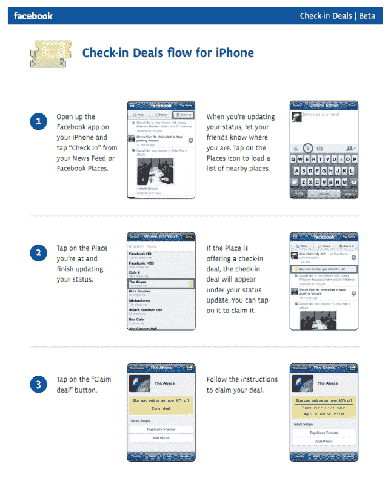

# 脸书取消日常交易，但保留签到交易

> 原文：<https://web.archive.org/web/http://techcrunch.com/2011/08/26/facebook-daily-deals-check-in-deals/>

# 脸书取消了日常交易，但保留了签到交易

今天下午，脸书悄悄地宣布他们正在扼杀新生的 Deals 产品，这给 T2 造成了一些混乱。你看，随着[在本周早些时候](https://web.archive.org/web/20230205035201/https://techcrunch.com/2011/08/23/facebook-location-tagging/)取消脸书位置的决定，每个人都想知道这对他们同时推出的基于位置的交易意味着什么？脸书当时表示，这些人将继续活着。但是今天的处决改变了什么吗？

不，脸书说。每日交易与入住交易是分开的。签到交易的工作方式将会有所不同，但是公司将会继续支持和增强这个产品。每日交易已死——我的电子邮件账户为此感谢他们。

脸书对此事的声明:

> 经过四个月的交易测试，我们决定在未来几周内结束我们的交易产品。我们认为，通过社交方式推动人们进入本地企业有很大的力量。我们仍然致力于开发产品来帮助本地企业与人们联系，如广告、页面、赞助故事和签到交易。我们从测试中学到了很多，我们将继续评估如何更好地为当地企业服务。

用更暴力的术语来说，可能更容易理解:他们杀死了 Groupon 杀手，但保留了一半 Foursquare 杀手，同时杀死了另一半 Foursquare 杀手。

以下是脸书 iPhone 应用程序上仍然有效的签到交易的提示:

