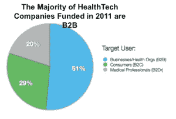

# 健康科技失败:创业者从健康创业失败中吸取的教训

> 原文：<https://web.archive.org/web/http://techcrunch.com/2011/08/28/healthtech-fail-lessons-for-entrepreneurs-from-health-startups-gone-awry/>

**编者按:** *这篇客座博文是由[Avado.com](https://web.archive.org/web/20230209191516/https://avado.com/)的首席执行官戴夫·蔡斯撰写的，这是一家患者关系管理公司，曾[入围 TechCrunch Disrupt 决赛](https://web.archive.org/web/20230209191516/https://techcrunch.com/2011/05/24/avado-is-the-mint-for-your-personal-health-records/)。此前，他是埃森哲医疗实践咨询公司的管理顾问，为 25 家医院提供咨询服务，并且是微软医疗业务的创始人。你可以在推特上关注他。*

健康科技是一个不断增长的行业，但在去年风投注入初创公司的 10 亿美元资金中，健康公司只获得了其中的 3%。没有多少健康科技初创公司能够获得这些大型风险投资；然而，上周，我强调了一家似乎做得不错的健康科技公司:Zocdoc，该公司本月早些时候从 DST 获得了 5000 万美元的融资，并为希望学习 Zocdoc 经验的初创公司提供了一些借鉴。([查看这里的帖子](https://web.archive.org/web/20230209191516/https://techcrunch.com/2011/08/05/lessons-healthtech-startups-can-take-from-zocdoc/))。

正如前面提到的来自 Rip post 的风险数据所显示的，许多创业公司确实没有展示出 Zocdoc 所展示的智慧，这导致了过去几年越来越多的健康技术失败。最近的一项研究特别强调了这一现象。在采访了 110 名数字健康企业家后，RockHealth 最近发布了一项研究结果，表明实际获得资金的公司和许多空手而归的公司之间的脱节。

这种脱节揭示了为什么如此多的健康科技公司未能产生影响，或者为了生存不得不经历重大转变。下面你会发现一些导致 healthtech 创业失败的主要原因:

 **缺乏特定关注点或领养点**

有充分的证据表明，不管初创公司是否从事医疗行业，缺乏专注都会扼杀它们，但这在医疗行业尤其普遍。医疗保健行业面临着大量的痛点，迫切需要中断，因此新成立的公司很容易试图解决所有这些痛点，以产生最大的影响。然而，这些初创公司忽视了关于如何吃大象的老话——一次一口。太多的初创公司吃不消了。最好选择一个主要的痛点来解决，然后继续下去。

**消费者预期赔付**

除了减肥计划之外，消费者直接为医疗服务付费的例子并不多。随着时间的推移，这种情况可能会改变，因为越来越多的医疗费用负担转移到了消费者身上，这在《医疗服务中断》系列的第二部分中得到了强调(请参阅下面的链接)。然而，对于任何希望消费者在短期内付款的业务，我都会非常谨慎。

**预计消费者会录入大量信息**

虽然我认为谷歌健康失败有一个更大的原因，但期望消费者输入信息是个人健康记录未能获得有意义的吸引力的一个重要因素。大多数 phr 依赖个人输入信息，很少有人愿意这样做。

**需要巨额资金**

这往往发生在泡沫时期，有一个宏伟的愿景，泡沫融资市场抛出巨额资金。归根结底，它们不是可持续的特许经营。

**需要多重复杂的伙伴关系**

依赖太多伙伴关系的初创公司很可能会遇到问题，因为这些伙伴关系经常涉及到老牌公司。不幸的是，老牌企业有着截然不同的紧迫感。许多好主意都在等待业务发展和法律部门的时候夭折了，因为这些老牌公司没有分享初创公司的紧迫感。

**缺乏对报销动态的了解**

这是迄今为止健康科技初创公司失败的头号原因。【RockHealth 的研究结果强调了这个问题的一个重要方面。积极的一面是，77%的风投认为 2011 年医疗 IT 投资将会增加。2011 年，已经有 35 家数字健康公司获得了 2M+的投资。重要的一点是，80%接受资助的是 B2B(即，向医疗保健提供商、企业等销售)。)然而，大多数接受调查的数字健康企业家认为，消费者会为他们的产品或服务付费。尽管如此，大多数早期数字健康企业家正在建立 B2C 公司。

在为时已晚之前，希望这些公司能找到让消费者以外的人付费的方法。这可以通过广告模式或向组织授权技术来实现。在这种情况下，消费者是产品，而不是顾客。客户就是组织。

您可以在下面找到 RockHealth 的完整研究，以获得浏览乐趣:

以下是上面提到的医疗保健中断系列:

[医疗保健中断:制药 3.0 将推动从生命科学到健康技术投资的转变](https://web.archive.org/web/20230209191516/https://techcrunch.com/2011/07/23/healthcare-disruption-pharma-3-0-will-drive-shift-from-life-science-to-healthtech-investing-part-i-of-iii/)
[医疗保健中断:提供商将利用健康技术实现差异化并产生更好的结果(第二部分)](https://web.archive.org/web/20230209191516/https://techcrunch.com/2011/07/25/healthcare-disruption-providers-will-use-healthtech-to-differentiate-and-produce-better-outcomes-part-ii/)
[医疗保健中断:提供商正在犯报业的错误(第三部分)](https://web.archive.org/web/20230209191516/https://techcrunch.com/2011/07/31/healthcare-disruption-healthcare-providers-repeating-newspaper-industry-mistakes-part-iii/)

图片节选由维基共享提供