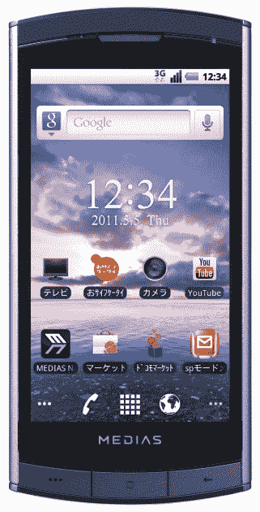

# NEC Medias:报告称世界上最纤薄的智能手机即将登陆美国

> 原文：<https://web.archive.org/web/http://techcrunch.com/2011/08/29/nec-medias-report-says-worlds-slimmest-smartphone-is-on-the-way-to-the-us/>

# NEC Medias:报告称世界上最纤薄的智能手机即将登陆美国

回到春天，我们花了[几篇](https://web.archive.org/web/20230204143730/https://techcrunch.com/2011/02/21/first-pics-of-the-worlds-thinnest-smartphone-the-nec-medias-leak/) [的帖子](https://web.archive.org/web/20230204143730/https://techcrunch.com/2011/02/24/nec-medias-docomo-to-offer-the-worlds-thinnest-smartphone-in-3-weeks/)来报道来自 [NEC Casio Mobile](https://web.archive.org/web/20230204143730/http://www.nec-casio-mobile.com/) 的 N-04C，这是一款 Android 手机，该公司称之为“世界上最纤薄的智能手机”。例如，它的厚度只有 7.7 毫米，比 Galaxy S II 轻得多，重量只有 105 克，也非常轻。

NEC Casio 在今年 2 月发布的这款手机[在几周后进入日本市场时，销量很好](https://web.archive.org/web/20230204143730/https://techcrunch.com/2011/04/01/nec-medias-worlds-slimmest-smartphone-tops-japanese-cell-phone-sales-charts/)(迄今为止，已售出 50 万部)。

据日本最大的商业日报《日经新闻》报道，该公司现在准备将媒体带到美国，这一[举措不知何故已经在去年](https://web.archive.org/web/20230204143730/https://techcrunch.com/2010/05/27/new-japanese-cell-phone-behemoth-nec-casio-mobile-to-go-america-soon/)宣布(NEC 卡西欧移动公司是在 2009 年 NEC、卡西欧和日立[合并其手机业务](https://web.archive.org/web/20230204143730/https://techcrunch.com/2009/09/15/nec-casio-and-hitachi-make-cell-phone-op-merger-official-want-to-go-international/)后成立的)。

目前细节还不多，但看起来美国人将会得到这款手机的改良版。在日本本土，NEC Casio 今年夏天推出了 N-06C，这是一款略厚(7.9 毫米)但防水的型号。

日本模式:

《日经新闻》称，在美国，媒体可能会通过威瑞森(卡西欧过去的合作伙伴)和“其他运营商”提供。NEC Casio 的目标是在 2012 财年将日本以外的手机出货量翻一番，达到 180 万部。

概括地说，Media N-04C 提供了一个分辨率为 480 x 854 的 4 英寸液晶触摸屏，Android 2.3，一个 510 万像素的 CMOS 摄像头，一个 microSDHC 卡插槽，Wi-Fi 等。然而，预计数字电视调谐器、电子钱包功能和红外端口将在美国版本中被取消。