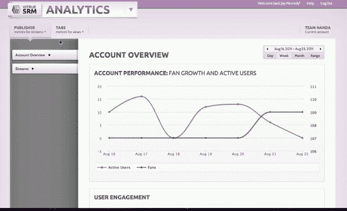

# Vitrue 通过更深入的分析和更多 TechCrunch 更新品牌社交媒体管理平台

> 原文：<https://web.archive.org/web/http://techcrunch.com/2011/08/29/vitrue-updates-social-media-management-platform-for-brands-with-deeper-analytics-and-more/>

# Vitrue 通过更深入的分析更新品牌社交媒体管理平台

社交媒体营销公司 Vitrue 正在推出其品牌社交媒体管理平台的 3.0 版本。新功能包括本地化以及在一个控制面板界面中增强的分析和指标。

正如我们[在过去](https://web.archive.org/web/20230203053006/https://techcrunch.com/2010/10/15/vitrue/)所写的，Vitrue 的 SaaS 平台允许品牌和营销机构
通过 YouTube 和 Twitter 账户、基于位置的服务以及移动应用程序与脸书各地的粉丝和消费者沟通。该公司的 SRM(社交关系管理)平台正在被许多知名品牌使用，包括哈雷戴维森、曼妥思、迪克体育用品、鳄鱼、埃迪鲍尔、美宝莲、普瑞纳、麦当劳、YouTube、福特、AT & T、迪士尼和百思买。

Vitrue 软件的最新版本带有新的仪表板和用户界面，允许营销人员在一个界面中查看、访问和管理所有可用的功能、工具和模块。该公司还增加了增强的分析和指标，为营销人员提供关于其社交页面和用户的人口统计数据和参与度的具体指标，包括对流量来源、整体用户人口统计数据、热门粉丝档案、粉丝增长细分、热门位置快照、每次发布的指标以及按行为(如喜欢、评论、分享、播放等)进行的用户参与度统计。)和一周中的某一天以及一天中的某个时间。

其他功能包括向特定用户发布目标内容的能力，向活动添加优惠券、测验等内容的能力，以及全天候客户支持。

Vitrue 已经筹集了[3200 万美元，](https://web.archive.org/web/20230203053006/http://www.crunchbase.com/company/vitrue)
面临来自 Buddy Media 的竞争。

