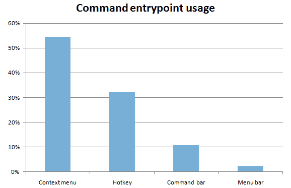

# Windows 8 的新浏览器:这一个去 11 TechCrunch

> 原文：<https://web.archive.org/web/http://techcrunch.com/2011/08/29/windows-8s-new-explorer-this-one-goes-to-11/>

[构建 Windows 8](https://web.archive.org/web/20230204122244/http://blogs.msdn.com/b/b8/) 开发博客一直是一个有趣的读物。直接从开发人员那里听到，然后看到来自用户和二级开发人员的未经过滤的回应，这是令人耳目一新的，即使主题不是特别引人注目，或者我不同意他们的设计选择。今天可能是迄今为止最极端的例子。关于他们[新的 Windows 8 文件管理器](https://web.archive.org/web/20230204122244/http://blogs.msdn.com/b/b8/archive/2011/08/26/improvements-in-windows-explorer.aspx)的讨论值得一读——但是文件管理器值得使用吗？

浏览器窗口的新功能区 UI 充斥着不同大小的按钮、标签、多部分图标和标签，我几乎无法解析它。它更像一个镜子大厅，而不是一个面向任务的工作空间。这真的是新的流线型窗户吗？

微软似乎同时朝着两个方向前进。随着今年早些时候展示的圆滑的地铁界面，他们正在向全屏、超自然、基于手势的导航推进，这是人们在某种程度上对平板电脑的期望。但是在引擎盖下，看起来 Windows 越来越像 Windows 了。我曾经写道 Windows 是操作系统中的凯迪拉克，这篇文章似乎也支持了这一点。

与此同时，苹果正舒舒服服地朝着一个方向前进，并不是说这样更好。Lion 中的 UI 变化效率令人质疑，而强大的文件管理根本不是重点。我不想过多地将我的个人偏好注入其中，但我认为无可争议的是，对于一些用户来说，这是好的，而对于另一些用户来说，这是令人沮丧和反直觉的。

但是，有人认为这种大量的按钮是向没有经验的用户传达选项和呈现动作的有效方式吗？关于丝带的争论已经持续了一段时间，而且，对一些人来说，这确实是个好主意，但对另一些人来说就不那么好了。但是这个看起来特别拥挤。这主要是因为微软设计功能区的方式——它不是分组按钮想法本身的限制，这是我每天在其他地方看到的实现得很好的东西。看看*箭的数量！就在窗口的顶部，我数了三个向上，十个向下，一个向上*和*向下，四个向右，两个向左。具有不同的上下文、重量、图形、颜色和目的。*

公平地说，我应该补充一点，还有其他真正的改进，其中一些在博文中有详细介绍。一定要读一读，这样你就能对我批评的部分有所了解。

**两条路径**

他们对用户行为的研究提出了一种基本选择，这说明了微软和苹果之间的差异。微软发现，超过 85%的用户使用上下文菜单和键盘快捷键执行最常见的操作(剪切、粘贴、重命名)。只有大约 10%的人使用命令栏，几乎没有人使用顶部菜单。

关于未来发展，你认为重要的教训是什么？对这些数据有两种截然不同的解释。

*微软*得出结论，命令栏没有被充分利用，因为它不够健壮，经过进一步调查发现，命令栏中几乎没有常见的动作。他们正在寻找他们需要添加的内容。显然，解决方法是提升命令栏，直到它变得同样可用。这意味着把每一个流行的命令放在那里，分类并标记它们，用他们认为可能有用的东西填充空白空间，并在其他标签中隔离不常用的选项。结果就是你所看到的:按钮沙拉，每样东西都在你的指尖，其中有很多是数百万用户永远不会碰的。

苹果会认为命令栏没有被充分利用，因为它没有效果。他们在寻找他们需要减去的东西。无论必要的项目是否在其中，用户对上下文菜单和键盘快捷键的偏好似乎是清楚的。解决方案是完全消除命令栏，并找到一种方法使更流行的访问方法更容易访问。结果是一个简化的界面，选项更少，用户永远注定要遵循苹果选择的道路。

哪一课是正确的？显然都不是。这就是为什么我们有两种对立的操作系统风格，都很成功，都很强大，但它们之间有着严重的差异。但苹果对微软的一点是，它致力于它强加给用户的想法，并且通常有风格和品味地执行它们(大声念错单词的 Strunk 风格)。你不能用风格和品味来更快地完成一个项目，但是你可以让那些不能通过双击或 ctrl-drag 来理解的祖父母理解它。

Metro UI 对微软来说是一股新鲜空气，因为它看起来不错，这不是表面上的赞美。它看起来不“令人印象深刻”或“强大”，它看起来很好。它看起来像是人们可以使用的东西。对于微软来说，这将是一个尴尬的时刻，因为这种新的用户界面将与旧的竞争(不管你怎么说，我保证他们是在竞争)，但他们需要开始做出真正的设计决策，提高 Windows 的可用性。这种浏览器界面将是所有 Windows 8 电脑上最常用的界面之一，对新用户来说会很可怕，并忽略了许多微妙和不那么微妙的设计准则。如果有更好的艺术和执行，这个 UI 可能会取得成功，但是它与关于 Windows 发展方向的高层决策完全不兼容。这些工程师不必担心哪个从未使用过的按钮应该伴随着“新文件夹”这是浪费他们的时间和微软的钱。

微软需要像苹果一样做出承诺。有时这意味着把东西留在身后，这从来都不是 Windows 的强项。如果他们希望留住现有的用户，甚至从苹果那里赢回一些，他们需要做的不仅仅是在现有的方法中加入漆器。这并不意味着只是模仿苹果，犯和他们一样的错误，但他们需要在新的领域战斗，做出艰难的决定。ARM、Metro 和 WP7 是好的但困难的决定，因为它们*质疑以前被认为成功的决定*——这些东西对许多人来说是有用的！但是当他们让这样的事情像藤壶一样粘在他们的新操作系统上时，他们就让他们的遗产干扰了需要做的事情。

**更新**:辛诺夫斯基[发布了一个后续](https://web.archive.org/web/20230204122244/http://blogs.msdn.com/b/b8/archive/2011/08/31/designing-for-metro-style-and-the-desktop.aspx)，描述他们融合地铁和传统用户界面的方法是“毫不妥协的”取决于你如何定义，他要么是对的，他们采取的方法确实没有妥协……要么是完全的妥协。