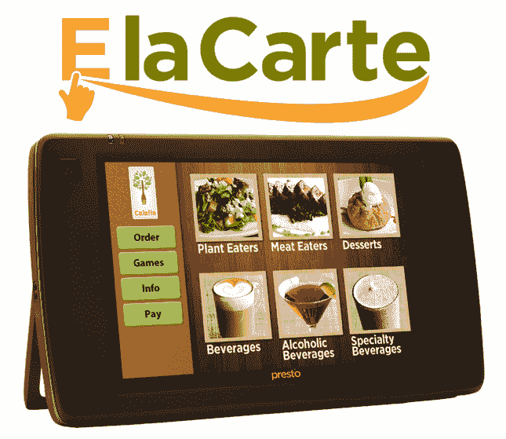

# E La Carte 从 Groupon 联合创始人那里筹集了 400 万美元，将平板电脑带到餐厅的餐桌上 TechCrunch

> 原文：<https://web.archive.org/web/http://techcrunch.com/2011/08/30/e-la-carte-raises-4m-from-groupon-co-founders-to-bring-tablets-to-the-restaurant-tableside-experience/?utm_source=twitterfeed&utm_medium=twitter>

E la Carte 是一家为餐馆和相关酒店行业开发餐桌平板电脑的公司，已经从 Lightbank 获得了[400 万美元](https://web.archive.org/web/20230204171211/http://www.marketwatch.com/story/lightbank-leads-4-million-investment-in-e-la-carte-2011-08-30)的资金，Lightbank 是由 Groupon 联合创始人埃里克·莱夫科夫斯基和布拉德·基威尔创建的风险基金。Y Combinator 支持的初创公司之前从天使投资人那里筹集了超过 100 万美元的资金，这些天使投资人包括 SV Angel，Dave McClure，Joshua Schachter，Roy Rodenstein，以及 Applebee 连锁餐厅的前董事会成员和 SVP Skip Sack。

正如我们[过去所写的，](https://web.archive.org/web/20230204171211/https://techcrunch.com/2011/04/19/e-la-carte-table-top-computers-bring-restaurants-to-the-future-with-bonus-trivia/) E la Carte 今年早些时候推出了“Presto”，将用户友好的平板电脑带到餐厅，提高餐桌旁和点餐体验的效率。这款 7 英寸的平板电脑包括一个数字菜单，通过照片和触摸屏界面的详细描述，你可以筛选餐厅的食物和饮料选择。还有一个游戏区，包括琐事和绘图应用程序。最后，还有一个支付标签。

Presto 平板电脑有一整天的电池寿命，一个信用卡读卡器，可以舒适地坐在餐厅的桌子上。这些平板电脑也是为桌边体验而设计的，比 iPads 更坚固。

与在网上商店购物类似，Presto 的菜单功能允许食客选择他们想要订购的商品，并使用购物车系统，因此您可以一次订购多种商品。你也可以通过饮食偏好(素食、只吃鸡肉、食物过敏)来过滤菜单，你也可以手动输入食物说明。Presto 显示每一道菜的营养信息。

一旦你在平板电脑上点击“点菜”，你的选择将被无线发送到厨房(E la Carte 与主要的 POS 系统集成)，它甚至会给你一个估计，你需要等待多长时间你的食物。与此同时，你可以开始玩游戏或和朋友聊天，这在你和孩子在餐馆吃饭时尤其有用。

一旦到了付款的时候，E la Carte 的软件允许用户分摊账单，为某些商品付款等等。这款平板电脑配有刷卡器，所以你只需刷一下卡，输入你想留下多少小费(有 15%、20%等按钮)，Presto 就会把收据用电子邮件发给你。

创始人 Rajat Suri 告诉我们，自 4 月份推出以来，E La Carte 已经与近 100 家餐馆签约，还有 150 家在等待名单上。早期安装 E la Carte 的餐厅销售额增长了近 12 %,像 Pizzeria Venti 和 Umami Burger 这样的全国连锁客户已经在车上了。这家初创公司还在进行其他高调的交易。

苏瑞说，E la Carte 的目的不是取代服务员，而是让整个体验更有效率，并填补餐厅餐桌服务的空白。苏瑞说，安装费用(大约需要一周)可能低至每家餐厅 200 美元，也可能高达 600 至 700 美元，这取决于桌子的数量。他补充说，Presto 符合休闲餐饮的模式，也许不太适合“白色桌布”餐厅。

至于 E la Carte 为什么不开发一个具有类似功能的 iPad 应用程序，Suri 说，这个设备并不适合该公司的目标，即开发一个更小、更轻、更丰盛的餐桌用餐设备。有趣的是，这家初创公司在决定是使用 iPad 还是开发硬件时，实际上与史蒂夫·乔布斯交换了电子邮件，不出所料，乔布斯建议他们开发 iPad 和 iOS 平台。

Lightbank 的合作伙伴 Paul Lee 谈到 E la Carte 时说:*“这个来自麻省理工学院的团队采用了我们正在寻求合作的产品创新类型……E la Carte 已经获得了好评，因此我们很高兴有机会帮助扩大其商业化规模。”*

新资金将用于扩大产品规模、产品开发以及销售和营销支持。

