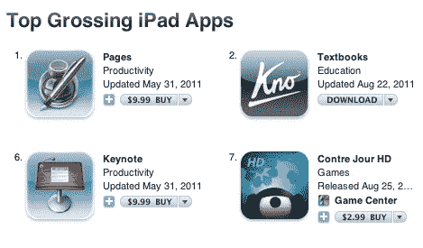

# Kno's Textbooks 是顶级返校 iPad 应用程序，每 8 秒下载一次 TechCrunch

> 原文：<https://web.archive.org/web/https://techcrunch.com/2011/08/30/kno-textbooks-ipad-top-school/>

# Kno 的教科书是最好的返校 iPad 应用程序，每 8 秒钟下载一次

随着学生们开始重返校园，他们正成群结队地下载 Kno 的新[教科书](https://web.archive.org/web/20230203062118/http://itunes.apple.com/us/app/textbooks/id424280183?mt=8)iPad 应用程序。它目前是排名第一的 iPad 教育应用，总收入排名第二的 iPad 应用，以及排名前 25 的免费应用(甚至比 Kindle iPad 应用更受欢迎)。该应用程序每 8 秒下载一次。上面的地图描述了过去 24 小时的下载量。

该应用本身是免费的，但 Kno 将数字大学教材作为应用内购买出售。Know 目前提供超过 100，000 种教科书，这些教科书可以被注释、突出显示，也可以在网络或脸书上阅读。在放弃了自己超大的教科书平板电脑后， [Kno](https://web.archive.org/web/20230203062118/http://www.kno.com/home) 在去年六月发布了它的数字教科书阅读器，并在 [iPad](https://web.archive.org/web/20230203062118/https://techcrunch.com/2011/06/04/kno-ipad/) 上存储。最近几周，Kno 增加了一系列新的[功能](https://web.archive.org/web/20230203062118/https://techcrunch.com/2011/08/09/kno-facebook-quizme-journal/)，如自动问答、笔记活动流、与 Khan Academy 在线视频的集成，以及动态生成分子的 [3D 模型](https://web.archive.org/web/20230203062118/https://techcrunch.com/2011/08/22/kno-turns-textbooks-3d-video/)。

到目前为止，拥有最多 Kno 学生的大学是亚利桑那州立大学、哈佛大学和德克萨斯大学奥斯汀分校。

早期的数字表明 Kno 在本学期有一个强劲的开端，这是学生中第一次真正的可用性。将教科书下载到你的 iPad 上，而不是在你的背包里带着纸质书，这种吸引力是显而易见的。下载这款应用程序不需要任何成本，而且对于大多数学生来说，支付一两本教科书来试用它的风险相当低。然而，Kno 的真正考验将在本学期晚些时候到来，那时早期用户将决定是下载更多 Kno 教科书还是回到校园书店。

下面是几个展示 Kno 最新功能的演示视频: