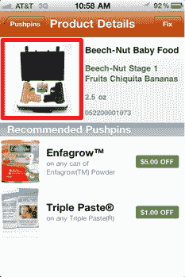

# 图钉推出 SimpleUPC:产品信息即服务 TechCrunch

> 原文：<https://web.archive.org/web/http://techcrunch.com/2011/08/31/pushpins-launches-simpleupc-product-information-as-a-service/>

Pushpins，Inc,[是一款用于节省杂货的移动应用](https://web.archive.org/web/20230204180512/http://www.pushpinsapp.com/)的制造商，已经推出了一项名为 [SimpleUPC](https://web.archive.org/web/20230204180512/http://www.simpleupc.com/) 的新服务，面向移动应用开发者。SimpleUPC 以 API(应用程序编程接口)的形式提供产品信息，作为在移动应用程序中使用的服务，如条形码扫描仪、购物清单和营养跟踪器。

API 包含来自 15，000 多个品牌和近 5，000 家制造商的 120，000 多种食品、饮料、个人护理和家居用品的数据。

图钉首席执行官杰森·葛文解释说，当公司开发移动优惠券应用[图钉](https://web.archive.org/web/20230204180512/http://www.pushpinsapp.com/)时，每个月都会收到数百个请求，要求提供类似这样的简单网络服务。因此图钉小组决定满足这一需求。

“还有其他东西——比如谷歌产品搜索，但它们返回的都是垃圾信息，”葛文嘲笑道。“我不知道他们在嘉宝婴儿食品中放枪，”他说，指的是在他的竞争对手提供的数据中发现的这个明显的错误，那里没有婴儿食品的照片，而是一箱手枪。

Gurwin 谈到建立准确的产品信息数据库的困难时，谈到了他的个人经历，这要归功于他与图钉的工作。现在，其他开发人员不必经历他做过的事情——他们可以直接插入 RESTful [SimpleUPC API](https://web.archive.org/web/20230204180512/http://www.simpleupc.com/) 来代替。

新的 API 包括传统的产品信息(UPC、制造商、品牌、尺寸、容器)，以及营养成分(整个产品标签)和制造商认可的图片。从其他来源获得这些数据的许可，成本通常很高(例如，Gurwin 说 [一家公司](https://web.archive.org/web/20230204180512/http://www.gladson.com/)想要 10 万美元购买其 UPC 数据库)。一般来说，这些数据也不包括营养信息或图片。

然而，SimpleUPC 现在为小企业提供了更实惠的选择，起价为每月 99 美元，提供 50，000 次搜索和产品信息。每月 249 美元，你可以获得 30 万次搜索，外加营养信息；每月 499 美元，你可以获得 50 万次搜索，外加营养信息和图片。

为了展示 API 的能力，该公司开发了一个名为 [Food Fight 的 iOS 应用程序！](https://web.archive.org/web/20230204180512/http://www.foodfight.it/)哪个在等 App Store 审批。你也可以点击查看 SimpleUPC 演示。

要注册 SimpleUPC，[请访问公司网站上的页面](https://web.archive.org/web/20230204180512/http://www.simpleupc.com/price.php)。