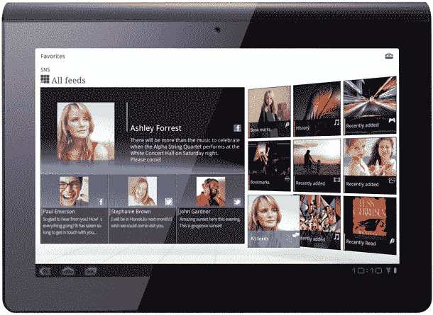
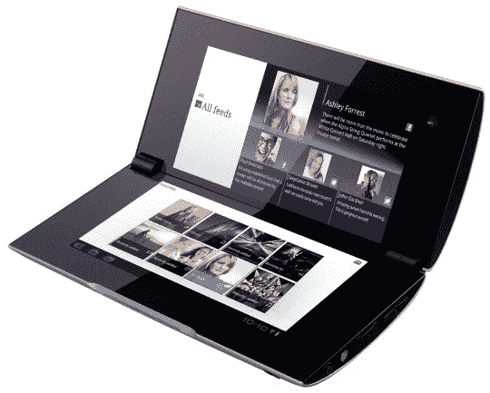

# 索尼终于全面推出了它的 Android 平板电脑，索尼 S 和 P TechCrunch

> 原文：<https://web.archive.org/web/https://techcrunch.com/2011/08/31/sony-s-p-tablets/>

“不是谁先做出来的，而是谁把它们做得更好。”索尼的霍华德·斯金格爵士就是这样宣布他即将推出的平板电脑的。赞。

各位，来见见标准普尔。索尼刚刚在 2011 年 IFA 新闻发布会上发布了第一代安卓平板电脑。但是，正如这些天大多数非苹果产品的发布一样，没有太多可报道的，因为索尼在过去几个月里使用了预告和[种植泄漏](https://web.archive.org/web/20230205012818/http://news.cnet.com/8301-17938_105-20086420-1/exclusive-new-information-about-sony-tablets/)来制造轰动，这反过来使今天的发布会有点虎头蛇尾。

索尼以两种型号打入平板电脑市场:曲面 S 和翻盖 p。平板电脑不仅仅根据规格销售。触摸板和所有的蜂窝平板电脑已经证明了这一点。索尼围绕其强大但有点模糊的 Qriocity 媒体分发服务开发了他们的平板电脑，这似乎表明索尼的铁杆粉丝是目标人群。

S 提供 9.4 英寸 IPS 显示屏，采用索尼 TruBlack 和 Bravia 技术，并提供 16GB 和 32GB 尺寸的标准 WiFi 版本，AT & T 还提供 4G 型号。索尼没有提到 S 的核心是什么硬件平台，双核芯片来自几家不同的制造商，这很难说。(更新:Terga 2)它确实有全尺寸 SD 存储卡读卡器、蓝牙和长寿命电池。

索尼就是吃自己的狗粮。这种对跨设备连接的强调导致了背面包含一个 IR 端口，可用于控制索尼 Bravia 电视。然后，通过蓝牙，平板电脑可以控制 PS3，并与 PS3 进行交互，这两种平板电脑都经过 Playstation 认证。

P 略有不同，但不完全唯一。翻盖便携式电脑已经存在多年了，京瓷 Echo 是第一个尝试双屏安卓设计的手机。当然，这可能不是最原始的设计，但 P 的两个 5 英寸 1024 x 480 显示屏协同工作，提供了令人信服的 Android 体验。这两个屏幕可以独立工作，也可以一起工作:一个可以充当键盘，另一个可以收发电子邮件。不过，在某些应用中，两个屏幕可以同时使用，比如电子书阅读器。

索尼平板电脑 S 和 P 将于“9 月底”在欧洲上市，售价分别为€479 英镑和€599 英镑。其他地区的价格或可用性还没有消息，但我们听说(不是通过官方渠道)16GB 和 32GB 的 S 型号将在“几周内”以 499 美元和 599 美元的价格在美国上市。更新:是的，航运窗口和价格点是正确的。

就像斯特林格在 IFA 新闻发布会开始时所说的，成为第一并不一定是成功之路。索尼的平板电脑至少与竞争对手不同。这些激进的设计可能不会流行，但它们感觉就像过去的索尼。制造随身听的索尼公司。制造特丽珑的索尼。没错，是制造了 Betamax 的索尼，这是一个像傲慢的男性少年一样不怕冲击市场的索尼，充满了睾丸激素和虚张声势。太棒了。