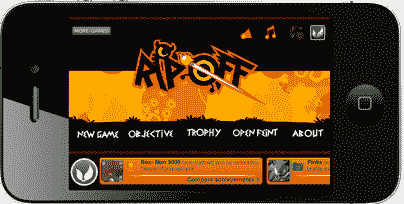

# 移动社交游戏平台 OpenFeint 在 iOS 和 Android 上推出 game feed TechCrunch

> 原文：<https://web.archive.org/web/http://techcrunch.com/2011/09/01/mobile-social-gaming-platform-openfeint-brings-gamefeed-to-ios/>

# 移动社交游戏平台 OpenFeint 在 iOS 和 Android 上推出 GameFeed

拥有 1.15 亿玩家的即插即用移动社交游戏网络 OpenFeint 正在将其广受欢迎的功能 GameFeed 扩展到其 iOS SDK。

OpenFeint 面向智能手机的即插即用移动社交平台和应用包括一套在线游戏服务，如排行榜、虚拟货币和在基于云的网络环境中运行的成就。

GameFeed 是一个集成到平台中的社交游戏新闻源，旨在通过提升 OpenFeint 网络在游戏中的社交活动来提高玩家的参与度。该饲料将流信息，如更新的球员简介，球员的成就和更多。

OpenFeint 声称，通过将 GameFeed 插件添加到他们现有的 OpenFeint 集成中，24 个测试版参与者将每个用户的会话数平均提高了 25%。一些开发商正经历高达 60%的增长。

OpenFeint 还宣布，游戏开发商 Big Blue Bubble(Burn the Rope 的制造商)、Get Set Games(Mega Jump 的制造商)、pik pok(Flick Kick 系列的制造商)和 Sibblingz(Island Tycoon 的发行商)将集成 GameFeed。

有趣的是，OpenFeint [实际上首先将](https://web.archive.org/web/20230204191008/http://www.intomobile.com/2011/06/09/openfeints-gamefeed-crossplatform-news-feed-realtime-game-updates-your-network/)game Feed 扩展到了 Android，现在 feed 是跨平台的，支持 iOS。

