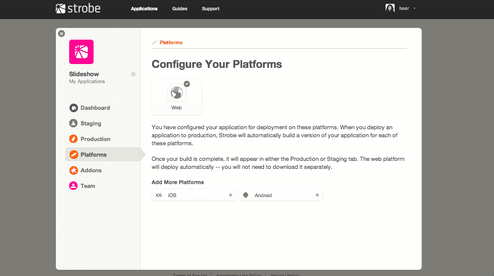
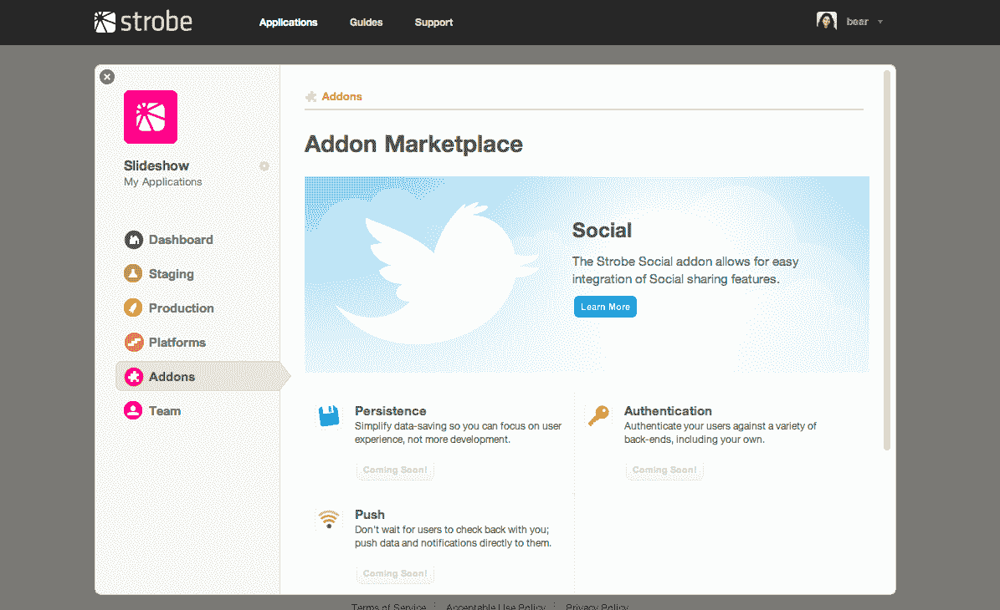

# Strobe 推出改变游戏规则的 HTML5 应用平台 TechCrunch

> 原文：<https://web.archive.org/web/https://techcrunch.com/2011/09/01/strobe-launches-game-changing-html5-app-platform/>

今天， [Strobe Inc.](https://web.archive.org/web/20221208173809/http://www.strobecorp.com/) 推出了[新平台](https://web.archive.org/web/20221208173809/http://www.strobecorp.com/products-platform/)，帮助开发者为桌面、智能手机和平板电脑构建基于 HTML5 的网络应用，并从单一界面集中管理它们。

此次发布是 HTML5 应用开发的一次重大飞跃。从一个界面，团队可以管理代码(测试代码和生产代码)，配置跨平台(Web、Android、iOS 等)的应用部署。)，添加附加服务(社交、推送通知、认证等)。)，甚至在易于使用的仪表板中跟踪分析。

简而言之，这是一个全面的平台，它使使用 HTML5 和 JavaScript 等 Web 技术构建应用程序不仅成为可能，而且简单、直接、快速。

该公司是由 [Ruby on Rails](https://web.archive.org/web/20221208173809/http://www.rubyonrails.org/) 核心团队成员 Carl Lerche、 [jQuery](https://web.archive.org/web/20221208173809/http://www.jquery.com/) 和 [SproutCore](https://web.archive.org/web/20221208173809/http://www.sproutcore.com/) 核心团队成员 Yehuda Katz 和前苹果 JavaScript 框架经理 Charles Jolley 共同创立的。在苹果公司，乔利从事苹果的网络产品，如 MobileMe 和 iCloud。他还是开源 JavaScript 框架 [SproutCore](https://web.archive.org/web/20221208173809/http://www.sproutcore.com/) 的创始人，该框架为苹果的网络服务提供动力，现在是 Strobe 平台的关键部分。

除了 SproutCore，Strobe 还使用了流行的 HTML5 应用平台 [PhoneGap](https://web.archive.org/web/20221208173809/http://www.phonegap.com/) 。PhoneGap 允许开发者使用网络技术创作应用程序，然后用原生包装器将它们发送到 iTunes 应用商店、Android Marketplace 和其他应用商店。它也恰好与[和](https://web.archive.org/web/20221208173809/http://blog.sproutcore.com/sproutcore-and-phonegap/)[的 SproutCore](https://web.archive.org/web/20221208173809/http://www.sproutcore.com/) 很好地集成在一起。

**更新**:需要澄清的是，Strobe 可以与任何*html 5 框架一起工作，而不仅仅是 SproutCore。*

**Strobe 目前提供的服务与即将推出的服务**

虽然 [Strobe 平台](https://web.archive.org/web/20221208173809/http://www.strobecorp.com/products-platform/)旨在提供一套完整的工具来构建应用程序并跨平台部署它们，但在 beta 测试中，Strobe 的一些功能仍然有限。例如，分析产品将在几周内推出，目前支持的移动平台只有 iOS 和 Android。此外，社交插件是目前唯一可用的，它允许开发者将脸书和推特分享功能添加到他们的应用程序中。

但这些只是暂时的限制。

Strobe 的路线图上已经有了更多平台的计划，并将很快推出认证、推送通知和持久性(数据保存)插件。在某些情况下，Strobe 会自己编写插件，但在其他情况下，它会与服务提供商合作。尽管目前还没有交易被确认，后端即服务提供商如 [Parse](https://web.archive.org/web/20221208173809/https://beta.techcrunch.com/2011/08/04/yc-funded-parse-a-heroku-for-mobile-apps/) 和 [StackMob](https://web.archive.org/web/20221208173809/https://beta.techcrunch.com/2011/08/24/stackmob-heroku/) 很适合 Strobe 集成。

**使用 Strobe 改进应用程序发现**

通过将应用程序的桌面网络版本与其本地版本(使用网络技术构建)相结合，Strobe 不仅简化了应用程序的开发、部署和跟踪，还开辟了更多的发现机制。

Strobe 开发者可以将应用的网页版本配置为指向原生应用，以帮助将应用的临时用户转化为更具参与性的原生应用用户，这些用户更有可能在虚拟商品和升级上花钱。

此外，通过将本地和网络的两种体验结合在一起，Strobe social 插件可以被配置为帮助用户在移动游戏中分享*确切的积分*，例如，网络上的任何人都可以通过共享链接点击该积分，并立即开始游戏。这可能是一个比排名、新闻稿、博客文章、推荐引擎或货币化计划更强大的发现工具。

Discovery 是应用行业有史以来面临的最严峻的挑战之一，也是 Strobe 及其帮助构建的 HTML5 应用的终极游戏。

[Strobe 开发者预览版现已开放](https://web.archive.org/web/20221208173809/http://www.strobecorp.com/products-platform/)，价格信息可从[这里](https://web.archive.org/web/20221208173809/http://www.strobecorp.com/products-platform/#pricing)获得。

Strobe 之前在 12 月份筹集了 250 万美元的 A 轮融资，由 O'Reilly AlphaTech 和 Hummer Winblad 领投。它将在今年秋季晚些时候上市时进行新一轮融资。