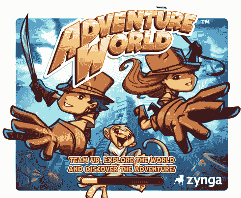
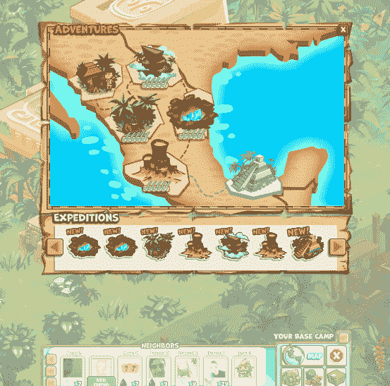
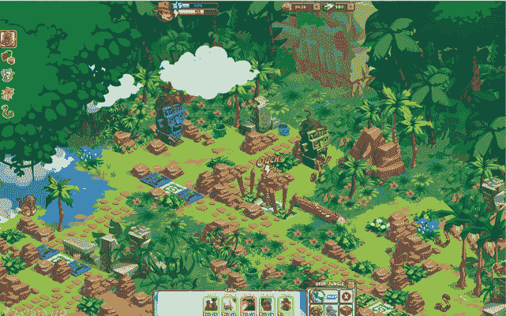
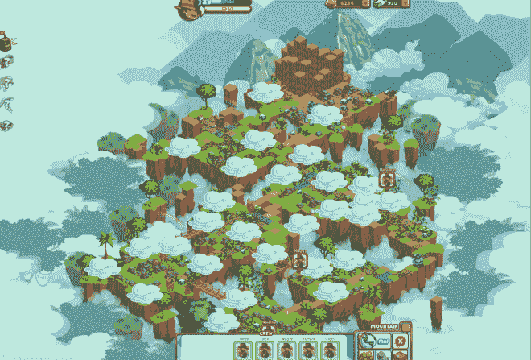
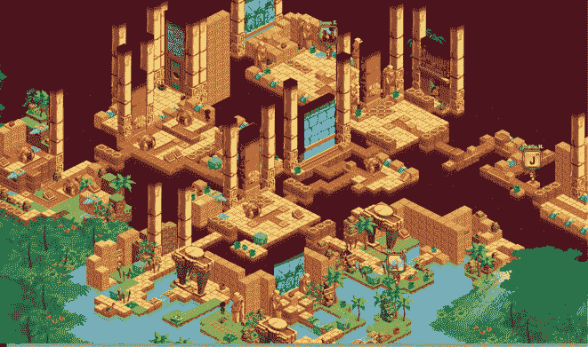

# Zynga 首次推出迄今为止功能最丰富的多维度脸书游戏:冒险世界 TechCrunch

> 原文：<https://web.archive.org/web/http://techcrunch.com/2011/09/01/zynga-debuts-largest-most-feature-rich-multi-dimensional-facebook-game-to-date-adventure-world/?utm_source=feedburner&utm_medium=feed&utm_campaign=Feed:+Techcrunch+(TechCrunch>)

本周早些时候，Zynga 用其最新脸书游戏[冒险世界](https://web.archive.org/web/20230204112712/http://www.facebook.com/adventureworld)的宣传短片戏弄了我们，该游戏允许用户“组队，探索失落的世界，发掘冒险”现在我们有了这场比赛的所有细节，它将在未来几周内在脸书直播。

冒险世界是在 Zynga Boston 开发和孵化的，这里[曾是 Conduit Labs](https://web.archive.org/web/20230204112712/https://techcrunch.com/2010/08/17/zynga-buys-bostons-conduit-labs/) 。Conduit 的创始人和 Zynga 波士顿总经理 [Nabeel Hyatt](https://web.archive.org/web/20230204112712/http://www.crunchbase.com/person/nabeel-hyatt) 告诉我们，支持《冒险世界》的核心技术(一种基于 flash 的游戏引擎)在过去的一年里从零开始开发。Hyatt 补充说，这是 Zynga 公司历史上迄今为止最大、画面最丰富、功能最丰富的游戏。事实上，冒险世界里有超过 20，000 种不同的物品。

《冒险世界》设定在 Zynga 所谓的“探索黄金时代”，玩家可以在这里探索、发现和解谜。想想印第安纳·琼斯-遇上超级马里奥兄弟遇上法姆维尔。社交冒险类型偏离了 Zynga 最近游戏中普遍存在的“城市”和“战争”主题。

这个游戏是这样的。冒险者在“Mezo-America”(深丛林、高山、洞穴、火山和黄金国)中访问五个世界，并将进入 30 多个不同的动态环境，在游戏过程中进行 200 个不同的任务，同时遇到古老的谜题，与讨厌的动物战斗，并解开探索黄金之城黄金国秘密的线索。玩家可以定制一个 3d 角色，并通过金币购买虚拟商品，方法是储存专门的冒险工具和小工具(包括砍刀、镐、鞭子、炸药和抓钩)来帮助他们探索游戏。

游戏从玩家飞往中美洲的大本营开始，并加入冒险协会去揭开黄金国。玩家进入丛林，面对坏脾气的毒蛇，解除诱杀装置和智取古老的谜题。然后，他们沿着雾蒙蒙的山崖遇到了公羊，在洞穴中躲避疾走的蜘蛛和失控的矿车，摇摇晃晃地穿过摇摇晃晃的桥，逃离火山，最终发现了黄金国的秘密。

游戏总规模是过去 Zynga 游戏的 40 多倍，包括 1000 多种不同的艺术资产(如五种蛇、四种蜘蛛、两种或公羊)，以及无尽的角色定制，玩家可以在发布时从 10，000 多种不同的化身中进行选择。

为了构建这些巨大的交互式环境，Zynga 波士顿团队创建了下一代 flash 引擎，它包括两个主要部分。首先，先进的渲染技术提供了更快的性能、更高的帧速率和类似 3D 的世界。第二，一个世界编辑器允许团队为玩家建立一个更大、更详细的世界和高度互动的环境，包括基于谜题的游戏。

Hyatt 告诉我们，这是 Zynga 游戏库中第一款大型益智游戏。Hyatt 解释说，这也是第一场比赛，球员们有一种“重要感”。基本上，玩家可以用好的方式或坏的方式做事，这取决于他们的行动。当你在游戏中旅行时，你在每个世界和环境中完成某些事情(例如，用炸药炸毁火山的山顶)。

那么社交呢？嗯，Hyatt 说 Zynga 为冒险世界创造了一个独特的社交功能，允许玩家在游戏板上邀请多达 12 个脸书朋友来分享他们的冒险。然后，您可以使用朋友的特殊工具和能力来派遣敌人，解开谜题，并在冒险世界的危险土地上前进。

对于 Zynga 来说,《冒险世界》是朝着更大、功能更丰富的游戏迈出的一大步(有点偏离 FarmVille 风格)。Hyatt 这是 Zynga 第一次将多维深度整合到一个游戏中。头像以 3D 渲染，游戏本身以 2D 渲染。Hyatt 补充说,《冒险世界》将是 Zynga 游戏库中许多大型的“社交冒险”游戏中的第一款。

当然，看看脸书 Zynga 玩家的反应应该会很有趣。Zynga 最近一直在大量生产游戏，发布了 [The Pioneer Trail、](https://web.archive.org/web/20230204112712/https://techcrunch.com/2011/08/12/after-frontierville-zynga-channels-the-wild-west-again-for-facebook-game-the-pioneer-trail/)[&Empires【盟友】](https://web.archive.org/web/20230204112712/https://techcrunch.com/2011/05/31/zynga-channels-settlers-of-catan-in-new-social-combat-game-empires-allies-debuts-in-12-languages/)、[一个中国版的 CityVille、](https://web.archive.org/web/20230204112712/https://techcrunch.com/2011/07/25/zynga-partners-with-tencent-to-launch-localized-chinese-version-of-cityville/)一个 [CityVille iOS 应用程序](https://web.archive.org/web/20230204112712/https://techcrunch.com/2011/06/15/zynga-wants-you-to-build-your-neighborhood-with-cityville-hometown-ios-app/)、 [Words With Friends on 脸书、](https://web.archive.org/web/20230204112712/https://techcrunch.com/2011/08/01/zynga-brings-scrabble-like-words-with-friends-to-the-web-with-new-facebook-game/)和[hang With Friends。](https://web.archive.org/web/20230204112712/https://techcrunch.com/2011/06/06/zynga-turns-hangman-into-a-social-ios-game-with-the-debut-of-hanging-with-friends/)但是《冒险世界》花了一年的时间来制作，公司实际上投资了一个全新的游戏引擎，所以很明显，公司希望这款游戏能大获成功。

[YouTube http://www.youtube.com/watch?v=wlkZLfMpak4&w=560&h=345]