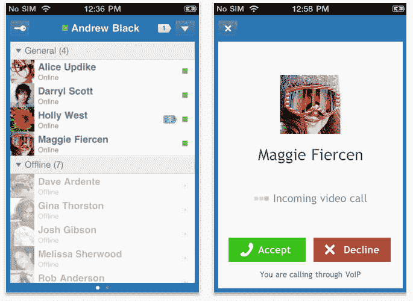

# 新推出的 IM+ Video 让您可以与脸书朋友进行视频聊天 TechCrunch

> 原文：<https://web.archive.org/web/http://techcrunch.com/2011/09/02/newly-launched-im-video-lets-you-video-chat-with-facebook-friends/>

流行的跨平台 IM+移动即时通讯应用程序的制造商 SHAPE Services ，今天发布了它的第一款视频聊天应用: [IM+视频](https://web.archive.org/web/20230203055853/http://www.shapeservices.com/en/products/details.php?product=imvideo&platform=none)。iTunes 上的新应用[可以让你与脸书的朋友进行视频和语音通话，而不仅仅是那些使用 IM+的朋友。](https://web.archive.org/web/20230203055853/http://itunes.apple.com/us/app/im-video/id448615811?l=fr&ls=1&mt=8)

使用 IM+进行的 VoIP 通话不像苹果自己的 FaceTime 视频通话功能那样仅限于 Wi-Fi，而是可以通过 Wi-Fi、3G 或 Edge 进行。此外，浏览脸书网站的朋友，包括那些没有使用 IM+应用程序的朋友，都可以收到这些电话。

安装该应用程序后，你必须使用脸书连接进行认证，然后你会看到一个屏幕，显示你的脸书朋友列表，包括在线和离线。若要拨打电话或开始聊天会话，只需轻按列表中您朋友的姓名，然后轻按“通话”或“聊天”

如果朋友是 IM+用户并且正在移动，则发送推送通知来发起视频呼叫。否则，IM+使用脸书聊天发送一个链接到一个 IM+视频“网络电话”(一个在线视频通话界面)。

IM+还提供了一些不同的主题来定制应用程序的外观，但没有一个真正吸引人。甚至默认界面本身也非常平淡无奇和简单。

但这款应用提供了脸书自己尚未涉足的东西，尽管它整合了 Skype:在自己的脸书品牌移动应用 Facebook Messenger 中支持视频通话。虽然在这个应用[中发现的代码似乎表明视频聊天即将到来](https://web.archive.org/web/20230203055853/https://techcrunch.com/2011/08/09/suck-it-sms/)，但它还没有到来，这给了像 IM+这样的第三方建立用户群的时间。

IM+视频 app 免费，app 内通话免费。也不提供广告或应用内升级。或许 IM+视频一开始是免费的，以便向用户介绍 IM+家族中的其他应用程序，其中一些应用程序通过付费下载或应用内购买来赚钱？也许吧。但据 SHAPE 首席执行官伊戈尔·别列佐夫斯基(Igor Berezovsky)称，如何利用新应用赚钱的决定仍有待做出。

我们被告知，该应用的安卓版本也正在开发中。

今天的视频通话应用之所以成为可能，要感谢[SHAPE Services 7 月份收购了总部位于香港的 CrispApp](https://web.archive.org/web/20230203055853/https://techcrunch.com/2011/07/04/shape-services-acquires-developer-of-fone-to-release-im-video-app/) ，后者是另一款 iOS 设备视频聊天应用 [fone app](https://web.archive.org/web/20230203055853/http://www.crispapp.com/) 的开发商。