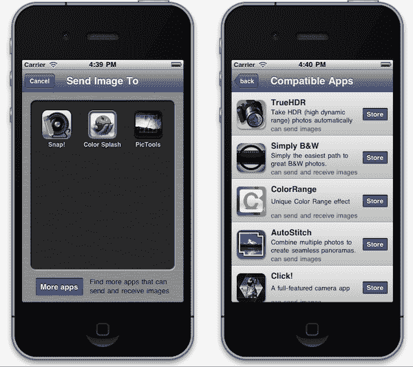
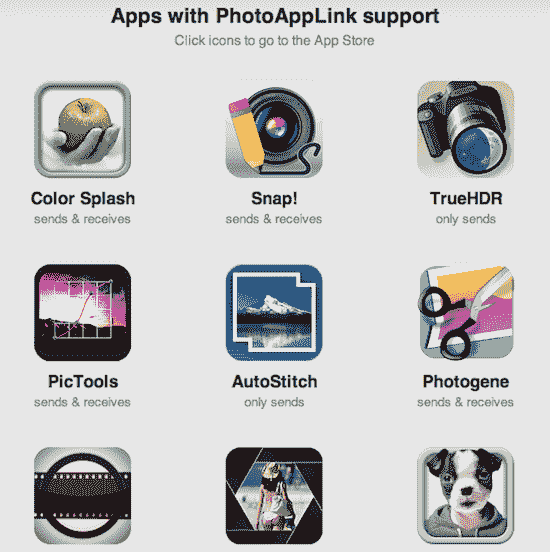

# PhotoAppLink 将 iPhone 照片应用程序捆绑在一起，简化多应用程序编辑 TechCrunch

> 原文：<https://web.archive.org/web/http://techcrunch.com/2011/09/02/photoapplink-ties-iphone-photo-apps-together-to-make-multi-app-editing-simple/>

几个 iPhone 应用程序开发者已经合作推出了 [PhotoAppLink](https://web.archive.org/web/20230205002055/http://www.photoapplink.com/) ，这是一个新的开源项目，旨在通过将多个照片编辑应用程序捆绑在一起来简化照片编辑。

如你所知，如今 iTunes 中有数量惊人的照片编辑应用，而且通常每个都在某个特定领域表现出色。例如，将照片转换为黑白、裁剪、合成或在照片上书写都是流行的独立应用程序的功能。

但是，当你想使用多个应用程序进行多次编辑时该怎么办呢？这是一个复杂得多的过程。这正是 [PhotoAppLink](https://web.archive.org/web/20230205002055/http://www.photoapplink.com/) 想要解决的问题。

目前，为了在多个应用程序中编辑照片，每次在应用程序之间移动时，都必须将编辑过的照片存储到相机胶卷中。但有了支持 PhotoAppLink 的应用，你只需从当前应用中选择另一个应用即可。从 PhotoAppLink 界面，你点击你想移动到的应用程序，它就会为你启动，照片编辑完好无损。

当您继续处理图像时，您也可以在照片编辑应用程序之间来回移动。

为了让这项功能发挥作用，一群照片应用程序开发人员聚集在一起，同意在他们的应用程序中实现 PhotoAppLink。最初由应用程序开发商店 PocketPixels 和 CodeCrop 构想，该功能现在在 Snap 中直播！，颜色飞溅，简单的 B&W，图片工具，自动缝合，TrueHDR，并列，点击！还有 Photogene。

一些著名的开发者已经承诺在即将到来的更新中加入 PhotoAppLink 支持。已确认的应用包括:PaperCamera、PhotoToaster、ColorBlast！、颜色范围和 MobileMonet。

其他感兴趣的开发者可以选择通过在 GitHub 上获取源代码库[来参与这项计划。](https://web.archive.org/web/20230205002055/https://github.com/pocketpixels/photoapplink#readme)

除了让最终用户在应用程序之间轻松切换(这肯定是照片爱好者的一个痛点)，新功能还将增加通过其他兼容应用程序发现的机会。为此，PhotoAppLink 还包括一个面向开发者的佣金计划，该计划为通过 PhotoAppLink 界面发现和购买的新应用支付一定比例的销售额。

除了便于最终用户使用和应用程序开发人员发现之外，第三个好处是该功能在利基应用程序中增加用户参与的潜力。为了简单起见，用户以前可能会跳过使用功能更好的应用程序，而青睐更基本的“一体化”应用程序，以避免麻烦。但通过像这样将应用程序菊花链在一起，更容易使用最好的应用程序来完成工作，同时还能节省时间。

你可以在这个项目的主页上看到 PhotoAppLink 支持的所有应用:[http://www.photoapplink.com](https://web.archive.org/web/20230205002055/http://www.photoapplink.com/)。

http://www.youtube.com/watch?v=2fCMVHohgGo&feature=youtu.be