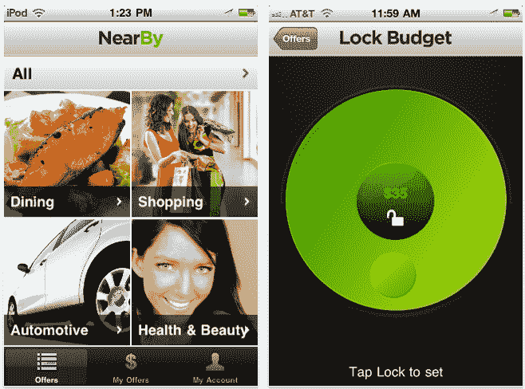

# 总部位于芝加哥的 Bidmyway 推出超本地移动交易应用 TechCrunch

> 原文：<https://web.archive.org/web/http://techcrunch.com/2011/09/05/chicago-based-bidmyway-launches-hyperlocal-mobile-deals-app/>

# 总部位于芝加哥的 Bidmyway 推出超本地移动交易应用

Bidmyway 是一款新推出的本地交易应用，在芝加哥市场运营。与 Groupon 或 Living Social 等更受欢迎品牌的交易聚合器不同，该应用提供与当地商家达成的独家交易。

[Bidmyway](https://web.archive.org/web/20230204214515/http://www.bidmyway.com/) 的独特之处在于它的界面以及交易如何呈现给最终用户。消费者使用点拨轮“拨号”当地交易，这让人想起老式 iPods 上的点拨轮。

滚轮用于选择您可用于交易的预算。旋转以选择金额，锁定金额，Bidmyway 会向您显示指定半径内的最佳交易，并在地图上进行排名和列出。然后，您可以直接从移动应用程序购买交易。

这是一个有趣的关于移动交易应该如何工作的观点——不是呈现给你一个给定地理区域(如一个城市)的单个交易，而是过滤一个更大的超本地交易列表，寻找那些既在你的预算内又在你附近的交易。这个概念可以很容易地帮助用户更好地整理越来越多的可用交易，所以 Bidmyway 作为独立的交易经纪人而不是聚合器推出，这实际上有点遗憾(至少对我们其他人来说)。

Bidmyway 首席执行官 John T. Shave 表示，他认为“超本地移动”是交易行业的未来。因此，毫不奇怪，他觉得有必要从头开始建立一个新系统，一直到新的交易过滤机制。

他还指出，对于需要立即启动移动交易的商家来说，Bidmyway 是更好的选择——例如，一家餐馆晚上生意清淡。通过该应用程序，零售商或小企业主可以立即提供交易并发布，使他们能够立即吸引客户，最重要的是，当这些客户外出寻找事情做时。

尽管 Bidmyway 现在可以在 iPhone 和 Android 上下载，但如上所述，只有芝加哥地区可以买到(顺便说一下，芝加哥也是 Groupon 的诞生地。)将来，公司希望扩展到其他市场。

Bidmyway 由当地商业公司 [Elite Media Worx](https://web.archive.org/web/20230204214515/http://www.elitemediaworx.com/) 所有和运营，该公司还运营着每日交易网站[elitecityedeals](https://web.archive.org/web/20230204214515/http://www.elitecitydeals.com/)。早在四月份，Elite Media Worx [就已经筹集了 135 万美元的资金。](https://web.archive.org/web/20230204214515/https://techcrunch.com/2011/04/18/bidmyway-raises-1-35-million-in-funding-to-build-an-ebay-for-local-deals)