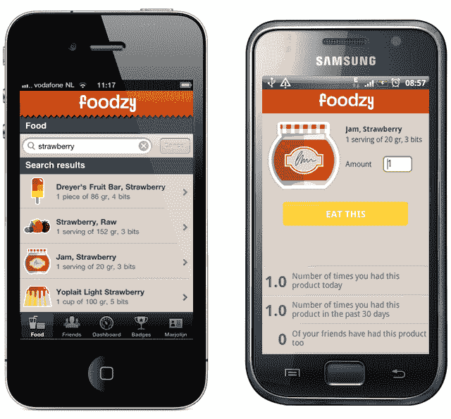

# Foodzy 将健康饮食变成游戏，推出 iOS 和 Android 应用 TechCrunch

> 原文：<https://web.archive.org/web/http://techcrunch.com/2011/09/05/foodzy-turns-healthy-eating-into-a-game-launches-ios-and-android-apps/>

# Foodzy 将健康饮食变成游戏，推出 iOS 和 Android 应用程序

关于游戏化已经说了很多，被一些人称为 badgification，似乎人们仍然对它是一种时尚还是未来存在分歧。

尽管如此，我认为有一个领域可能会奏效，那就是健康和健身。

进入 [Foodzy](https://web.archive.org/web/20230205035146/http://foodzy.com/) ，这是一项让用户能够随时记录他们吃了什么和吃了多少的服务，以便为他们提供一些关于如何吃得更健康、生活更健康、减肥或简单地将他们的饮食习惯与朋友相比的见解。

如今，这项服务背后的羽翼未丰的阿姆斯特丹公司(顺便说一句，不要与 [Foodzie](https://web.archive.org/web/20230205035146/http://www.crunchbase.com/company/foodzie) 混淆)正在为 [iOS](https://web.archive.org/web/20230205035146/http://itunes.apple.com/us/app/foodzy/id455943534?mt=8) 和 [Android](https://web.archive.org/web/20230205035146/https://market.android.com/details?id=com.foodzy) 推出免费应用程序，尽管人们需要一个 [Foodzy Pro 账户](https://web.archive.org/web/20230205035146/http://foodzy.com/pricing)(每年 15 美元)才能登录。

该应用程序可以帮助人们跟踪他们吃了什么，即使他们在移动中。使用 Foodzy，人们可以访问深入的统计数据和解锁徽章(这就是我们！)为了健康的饮食习惯，也为了好玩——想想当你在一个晚上喝了太多酒时的宿醉徽章，或者一个夏天烧烤超过 5 次的烧烤徽章。

Foodzy 使用超过 58 个国家的本地化食品数据库，目前有英语、法语、德语和荷兰语版本。

你可以免费查看 Foodzy，但你可以获得的徽章数量有限，你的饮食记录不会超过 30 天。此外，正如我之前提到的，你需要为服务的高级版本支付现金，并能够使用移动应用程序。

Foodzy 是今年 TNW 会议初创企业拉力赛的 18 名决赛选手之一，在那里它被“试运行”——他们大约两个月前开放了[公测](https://web.archive.org/web/20230205035146/http://thenextweb.com/apps/2011/07/04/tnw-2011-startup-rally-finalist-foodzy-exits-beta-launches-worldwide/)。

[YouTube http://www.youtube.com/watch?v=hybVUHycfGg&w=640&h=390]