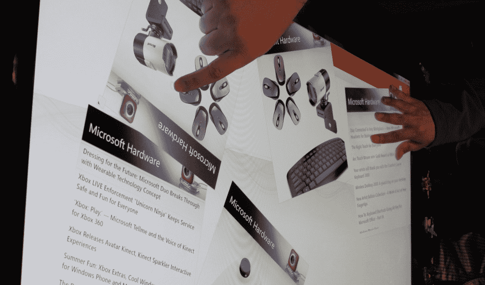
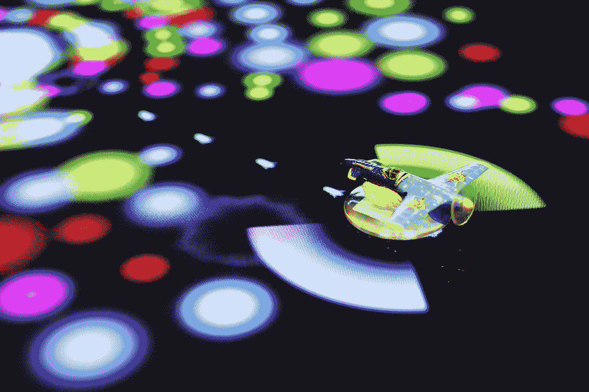
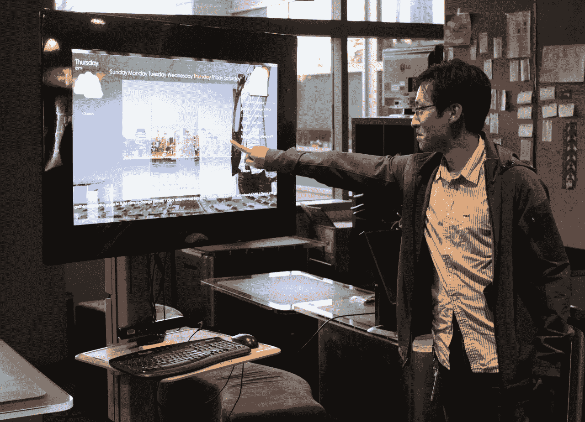
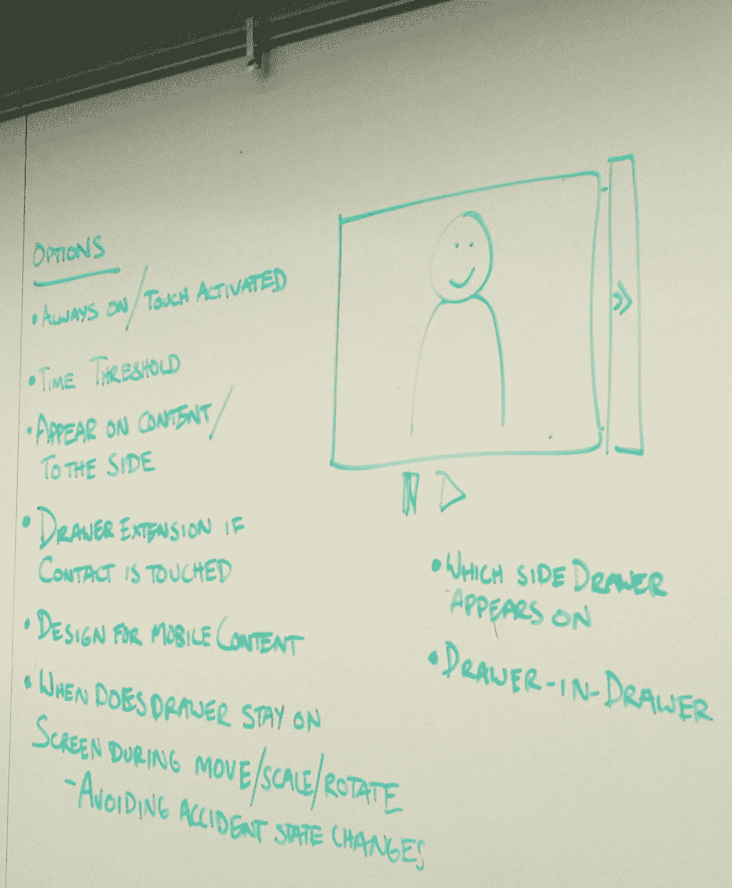
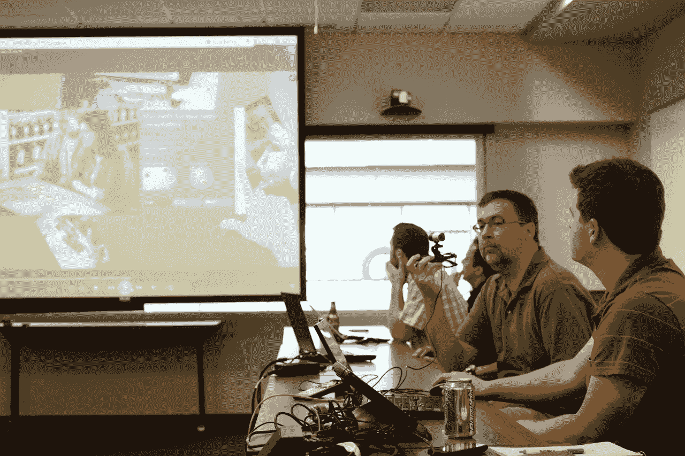
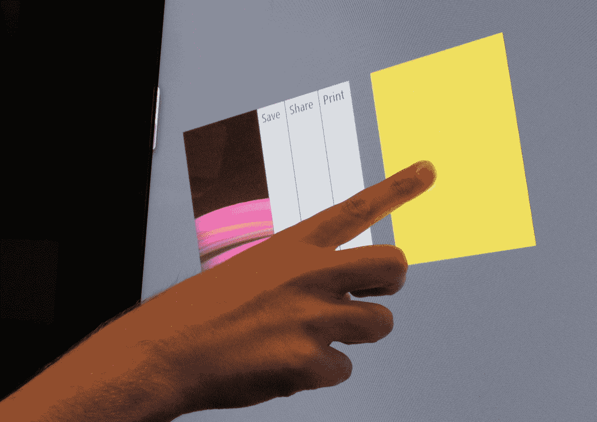

# 微软的 Surface Garage:跨部门开发团队，有披萨和啤酒 TechCrunch

> 原文：<https://web.archive.org/web/http://techcrunch.com/2011/09/05/microsofts-surface-garage-a-cross-department-development-team-with-pizza-and-beer/>

尽管我是西雅图唯一的 TechCrunch 撰稿人，但我并不像人们想象的那样经常接触微软。事实上，它在一个大湖的另一边，到达那里通常需要很多交通。但是当我收到邀请，就像我最近收到的那样，参加一个非官方的 Surface 开发者俱乐部的会议，我很难拒绝。免费披萨的承诺与我的热情无关。我*喜欢*表面。

就这样，我加入了一个来自微软的开发团队，在我的观察下，他们讨论想法，比较新项目，开发新功能。他们没有向我介绍这款设备的奥秘，也没有让我发誓对统治世界的计划保密，但我看到了一些很酷的新 Surface 应用程序，并为新功能的开发做出了贡献。此外，他们还有阿拉斯加琥珀。

我在 6 点左右到达了微软园区(至少是其中的一个),在毫无结果地徘徊了一会儿之后(浏览企业架构不是我的强项),我被带到了一个会议室，十几个人围着桌子排列，好像在开每周一次的会议。经过一番介绍，解释了这个秘密社团的目的。

事实证明，有些人真的只是喜欢和表面打交道。以至于他们在工作时间都吃不够！所以这个重复的活动被创造出来，有披萨和点心，让它值得花额外的时间。有来自游戏、Windows、Kinect、市场营销的人，这是微软生活的真实写照。

然后，我参观了这个团队中的人在业余时间开发的一些东西，大部分是他们自己开发的。一个简单但功能多样的小册子演示应用程序，一种无纸咖啡桌，可悲地证明了 Surface 只能用于商业用途:

但是一个开发者，像我一样是“shmups”的粉丝，已经组装了一个基本但有前途的射击游戏，使用现实生活中的令牌来控制你的船。你可能还记得不久前我们去看了一场地表的龙与地下城游戏，游戏中有雕像、咒语和狗头人。正如你在下面和这篇文章的顶部看到的，这个游戏有点疯狂。

这些点来自不同的位置，你的工作就是导航它们。你移动你的飞船，把它指向你想射击的地方，等等。拥有一个可以玩的实体项目有助于解决触感缺乏的问题，这种情况偶尔会让触摸屏游戏变得不那么令人满意。

最后是微软两个创新产品的有趣融合:Surface 和 Kinect。这是一种“早间简报”应用程序，旨在运行在客厅的闲置电视上，人们可以想象有一天可能会内置触摸屏和深度感应摄像头。今天，它是一个直立的 Surface 2.0 和一个普通的 Kinect:

你总是在电影中看到设定在未来的人与他们的电脑交谈，用手势控制他们，等等。这是一个小规模的尝试，人们可能会实际使用。当你在远处时，它显示大粒度的信息，如天气、即将到来的约会等。你可以说“邮件”，它会切换到电子邮件，或者“日历星期三”，它会切换到那个。当你靠近时，它会感应到你与 Kinect 的接近，并切换到触摸屏模式，你可以触摸新闻和电子邮件项目并阅读它们。

所有这些都是由一个人放在一起的，不可否认使用了数百人开发的 API，但这是一个有趣的演示，展示了这个项目目前可能实现的功能。

* * *

 然后我们选择了一个提议的 UI 元素，今晚或多或少地从头开始编码。在这种情况下，需要一种抽屉菜单，可以在屏幕上显示某个项目的元数据或属性，比如照片。它需要某种 UI 提示来让人们知道它在那里，需要一个手势来激活和停用它，还需要一些基本参数来使它与其他元素配合良好。

像这样简单的事情，仍然有大量的设计决策。马上，有一个“及时”的问题。抽屉的“把手”应该随时可见吗？当您点击、拖动或按住对象时，它应该显示出来吗？它应该在多长时间后消失？我问我们是否可以利用 Surface 2.0 的能力，在它们接触屏幕之前看到东西，并“神奇地”让手柄出现，但没有足够的时间来创建我心目中的基于亮度的斑点创建。

然后还有一个问题，我们想在多大程度上规定如何使用该项目。我们不应该把它做成右侧的——例如，只有在开发人员想让它变得双手并用的情况下，我们才决定把句柄的可见性变得灵活，留给软件设计人员。正是在这种情况下，你可以看到微软和苹果在工作方式上的一些根本差异。诚然，这是一个很小的样本量，但它符合我上周在探索丝带灾难中观察到的工作理念。

首先我们讨论，然后我们写白板，然后我们开始编码。我说的“我们”是指“他们”，因为我对此一无所知。我确实提出了一些关于如何监控某些类型的触摸的建议，并且我认为我有一个关于如何组合打开和关闭抽屉的手势的相当聪明的想法(尽管它很聪明，但我们没有实现它)。一点一点地，经过一些令人捧腹的挫折(包括一个不那么令人捧腹的披萨相关的挫折)，我们的 UI 元素成形了。

晚上结束时，我们可以自豪地说，我们创造了一个盒子，你可以从另一个盒子下面滑出。但其简单的操作掩盖了其构造中的许多细节:它与其他 UI 元素对齐并一起移动，它只拉出一定的距离，并且它可能非常容易地填充内容。我们为它留下了各种配置方式，尽管有一些错误，但它是一个工作元素——从概念到执行只用了两个小时。

这就是地面车库存在的原因。因为创造这样的东西很有趣，在短暂的间隔后看到一些协作和工作的结果，并知道它是这样创造的，因为每个人都希望这样。在这之后，有人会为抽屉捡起代码，清理干净，给它几个参数，谁知道呢，也许下一次你看到一个 Surface，我们的抽屉就会在屏幕上分散在虚拟堆中的虚拟照片下休眠。也许你甚至会在 Windows 8 中看到类似的东西。

我经常写微软如何倾向于[将好的想法](https://web.archive.org/web/20230205021211/https://techcrunch.com/2010/03/06/its-time-for-microsoft-to-turn-itself-upside-down/)扼杀在摇篮里，或者[用内部冲突扼杀它们](https://web.archive.org/web/20230205021211/https://techcrunch.com/tag/kin/)。像这样的小组(肯定是许多小组中的一个)的存在是件好事，对于只对创造感兴趣的开发人员来说，它是一个放泄阀。他们可能不会产生价值数十亿美元的想法，但啤酒、披萨和与志同道合的同事共度时光本身就是一种奖励。