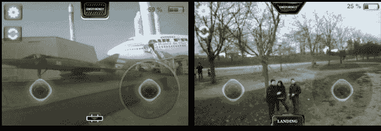

# 鹦鹉的 AR。自由飞行四轴飞行器驾驶应用程序现已在 Android TechCrunch 上免费发布

> 原文：<https://web.archive.org/web/http://techcrunch.com/2011/09/05/parrots-ar-freeflight-quadricopter-piloting-app-is-now-free-on-android/>

# 鹦鹉的 AR。自由飞行四轴飞行器驾驶应用程序现在在 Android 上是免费的

如果你跟上 TC/Gadgets 的工作人员，你知道我们无法抗拒一个好的 R/C 任何东西。我们已经回顾了 AR 遥控车，以及最近的一款[司马 S107 遥控斩波器](https://web.archive.org/web/20230204135352/https://techcrunch.com/2011/09/01/syma-s107-review/)，但与今天推出的相比，那些都是玩具:AR。安卓版免费飞行。AR。FreeFlight 是一个免费的增强现实驾驶应用程序，可以与 Parrot AR 一起使用。无人驾驶四轴飞行器，它会让你成为这个街区最酷的孩子。可能也是最酷的成年人。

AR。无人机在 2010 年的 CES 上首次亮相，从那以后，iOS 用户成了唯一有幸享受乐趣的人。但是今天，一个 Android 版本找到了市场，同时还有一个[免费 SDK](https://web.archive.org/web/20230204135352/https://projects.ardrone.org/) 供开发者制作他们自己的 AR。无人机游戏。FreeFlight 是 Parrot 的 AR 的主要驾驶应用程序。无人机平台，但 iOS 上已经有一些其他游戏，如 AR。雷斯河。飞行和追击

是什么让 AR？无人机比普通的飞行模拟器或遥控直升机更糟糕的是，它通过 WiFi 连接到你的手机，并转发来自四轴飞行器本身的图像。所以，换句话说，你不仅可以通过在你的 iOS/Android 设备中输入方向来驾驶这个小直升机，而且你实际上可以看到四轴飞行器在你的手机/平板电脑屏幕上看到的东西。

像这样:

该应用支持任何 iOS 设备或 Android 2.2 Froyo 驱动的设备，具有至少三英寸大小的多点触摸屏。正如多段视频所证明的那样，四轴飞行器在户外工作得很好，并且配备了两个而不是一个摄像头。一个面向前方，可以在一个手指的控制下四处平移，而另一个面向地面。界面上的一个小按钮可以让你在向前视图和地面视图之间来回切换。

但是只有一个问题:尽管这个应用程序本身是免费下载的，Parrot AR。无人驾驶四轴飞行器价格不菲。Parrot 可以以 300 美元的价格买到这款直升机，完整的经销商名单可以在[这里](https://web.archive.org/web/20230204135352/http://www.parrot.com/catalog/pos/parrot/ar-drone/US/stores)(实体)和[这里](https://web.archive.org/web/20230204135352/http://www.parrot.com/catalog/pos/parrot/ar-drone/US/e-commerce)(在线)找到。

休息之后请看视频。

[YouTube http://www.youtube.com/watch?v=z8YeE9fUT7w&w=640&h=390]