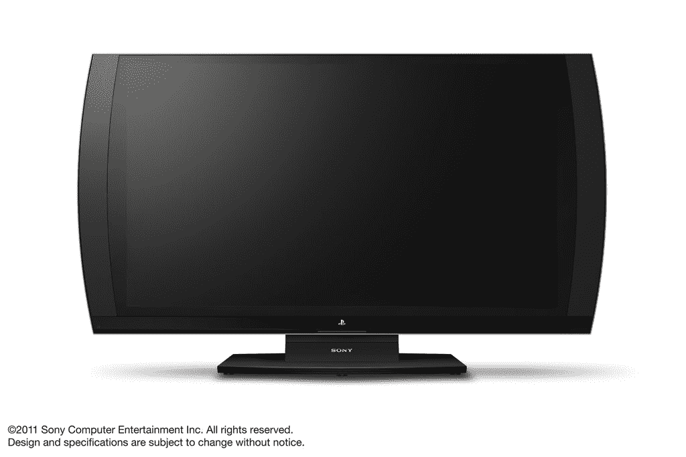

# 索尼面向游戏玩家的 3D 显示器将于 11 月登陆日本 TechCrunch

> 原文：<https://web.archive.org/web/http://techcrunch.com/2011/09/06/sonys-3d-display-for-gamers-to-arrive-in-japan-in-november/>

# 索尼面向游戏玩家的 3D 显示器将于 11 月在日本上市

你还记得索尼电脑娱乐公司六月份在 E3 发布的专为游戏设计的 3D 高清显示器吗？他们花了一段时间，但现在日本的大 s[宣布](https://web.archive.org/web/20230205005301/http://www.jp.playstation.com/ps3/3ddisplay/index.html)【JP】该设备在日本市场的最终发布日期:11 月 2 日。购买者将获得相当于 582 美元的 24 英寸显示器、一根 HDMI 电缆和一副 3D 眼镜。

日本套餐中不包括游戏——一套独立的(主动快门)3D 眼镜售价 78 美元。PSP 游戏以全屏显示，而一个名为 SimulView 的系统允许两个用户在一个显示器上玩 3D 游戏，但每个人都可以看到全屏图像。

该显示器以 1，920×1，080 的分辨率生成图像，配有 LED 背光，提供 5，000:1 的对比度，3W×2ch+5W 扬声器和两个 HDMI 接口。

当索尼宣布为日本以外的市场推出 3D 显示器时，我们会通知您。