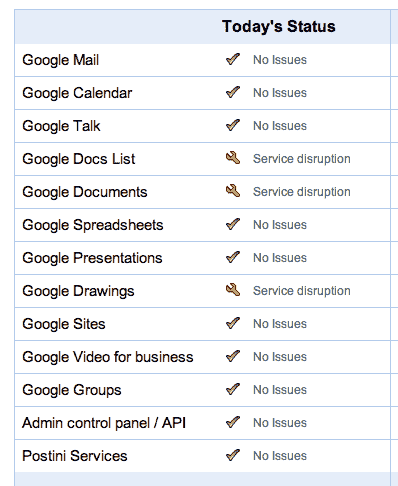

# 谷歌文档跌跌撞撞，倒闭 TechCrunch

> 原文：<https://web.archive.org/web/http://techcrunch.com/2011/09/07/google-docs-stumbles-goes-down/>

# 谷歌文档跌跌撞撞，倒下了

是的，谷歌文档关闭了，至少在过去的 30 分钟里一直如此。我一直试图用 Chrome 访问该网站，结果遇到了白屏和状态栏中没完没了的“等待”消息(刷新后我看到了 404 页面，我认为这是一个进步)。谷歌的[状态](https://web.archive.org/web/20230203051545/http://www.google.com/appsstatus#hl=en)网站显示“服务中断”正在影响谷歌文档列表、谷歌文档和谷歌绘图。**更新:**当我写这篇文章的时候，Docs 又开始为我工作了，但是根据 Twitter 的消息，很多其他用户仍然有问题。

这个[不是](https://web.archive.org/web/20230203051545/https://techcrunch.com/2010/04/21/google-docs-just-picked-a-bad-time-to-fail-but-theres-a-fix/)第一次 Docs 宕机，但总体来说是可靠的。

但是，当谷歌试图让所有人，尤其是企业，离开他们的原生文档编辑器，转而使用谷歌文档时，“总体可靠”还不够好。对于 Chromebook 用户来说，这些问题尤其糟糕，他们完全依赖网络应用来完成工作，并且没有文档的本地副本。

更新:谷歌文档现已恢复。谷歌发言人有这样的声明:

> 今天早些时候，我们遇到了一个涉及谷歌文档的问题，并尽快解决了这个问题。更多详情可在[应用状态面板](https://web.archive.org/web/20230203051545/http://www.google.com/appsstatus#hl=en)上找到。我们对由此带来的不便表示歉意。

