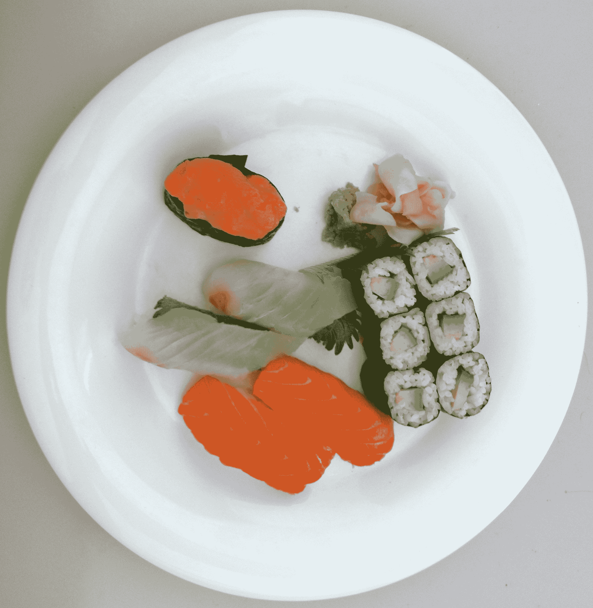
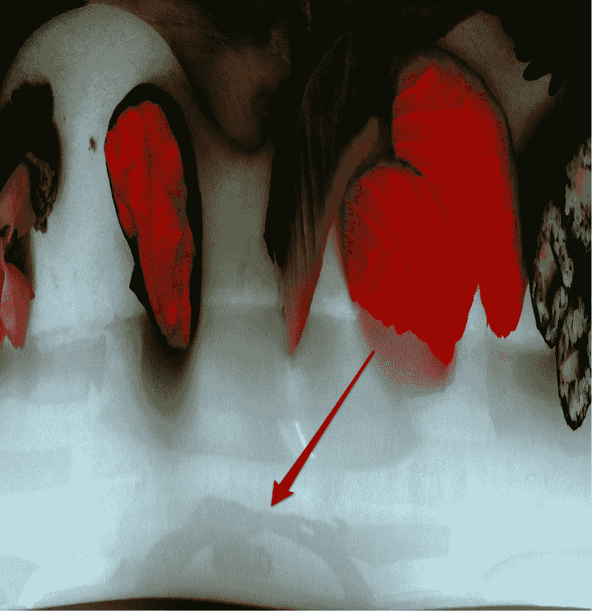

# 变焦！增强！iPhone 5(或一艘帆船)可能会出现在照片中 TechCrunch

> 原文：<https://web.archive.org/web/http://techcrunch.com/2011/09/07/iphone-5-reflection-photo/>

# 变焦！增强！iPhone 5(或一艘帆船)可能在倒影中被发现

有些人在薯片中看到猫王。有人在[水渍](https://web.archive.org/web/20230203133642/http://www.cbsnews.com/stories/2005/04/22/earlyshow/main690089.shtml)中看到圣母玛利亚。

与此同时，其他人看到 iPhone 5 藏在一个盘子的倒影里。

你还记得今天早上的[寿司照片吗？那张可能-但是-可能-不是-但是-很严重-可能是用 iPhone 5 拍的？](https://web.archive.org/web/20230203133642/https://techcrunch.com/2011/09/07/the-mystery-of-the-8mp-iphone-4-sushi-picture/)

我们非常满意地快速浏览了一下照片，[权衡了各种可能性](https://web.archive.org/web/20230203133642/https://techcrunch.com/2011/09/07/the-mystery-of-the-8mp-iphone-4-sushi-picture/)，然后继续前进。也许是用 iPhone 5 拍的——也许不是。见鬼，也许根本不是用 iPhone 拍的——EXIF 的数据就像纸巾筑成的大坝一样可信。只有一件事是确定的:伙计，那是一盘令人倒胃口的寿司。

然而，互联网..互联网是*硬核*。下次你去嘲笑犯罪现场调查的时候。增强！”在狗眼的反光中找到罪犯的窍门，记住这个帖子。

在 [ThisIsMyNext](https://web.archive.org/web/20230203133642/http://thisismynext.com/2011/09/07/iphone-5-test-photo-leaked/) 的一名读者将下面的照片放入 Photoshop，发现了一点反射，然后*将盘子*打开，以便更好地观察上面发生的事情。

换句话说，巫术。

**原文如下:**

**这是打开的照片:**

点击查看大图。

老实说，我什么也没看见。当然，我看到似乎是一双手形成了一个帮派标志或什么的——或者，如果我更符合逻辑一点，什么可能是某人的手握成标准的风景拍照姿势。不过，在这两个数字之间，我分不清上下。与此同时，互联网上的其他人似乎表现得像是在一条神奇的不失真的彩虹尽头发现了一罐金子。

我将留给你们这个让我想起来自*小野鼠*的场景:

【YouTube = http://www . YouTube . com/watch？v=BDoC8BhtUyo&w=640&h=390]