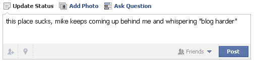

# 劳工委员会:因 Facebooking 被解雇的员工必须被重新雇用 TechCrunch

> 原文：<https://web.archive.org/web/http://techcrunch.com/2011/09/07/labor-board-fired-for-facebooking-employees-must-be-rehired/>

# 劳动局:因脸谱网被解雇的员工必须被重新雇用

众所周知，雇主可以，也可能应该，在雇佣你之前，甚至之后，对你的网络形象做一些调查。但是正如几个不快乐的人发现的那样，有时他们看起来很辛苦，可以接触到你认为是隐私的信息。这可能会导致一时失言，有时还会招致惩罚。五名员工因在脸书的行为而被解雇，这无疑就是一个例子。

有问题的帖子是关于某人*对其他人*投诉的投诉，其他员工也加入进来，包括被投诉的人。几天后，他们被解雇了；他们的雇主说这些帖子构成了骚扰。

工人们感到他们的权利受到了侵犯，并向国家劳工关系委员会提出申诉。令人难以置信的是，[一名 NLRB 法官刚刚裁定这五个人必须被重新雇用。我说“难以置信”是因为对技术问题的司法理解是一个严重的问题。不过，亚瑟·j·阿姆昌法官似乎很有头脑。他表示，员工的言论并没有失去法律的保护，这完全是在正常讨论工作场所条件的范围之内，因此不会轻易被解雇。](https://web.archive.org/web/20230204232706/http://www.inc.com/news/articles/201109/judge-says-workers-cannot-be-fired-for-facebook-complaints.html)

这一先例的规模尚不清楚。这当然是一个胜利，但过分夸大它将是一个错误。这是一次在喝咖啡休息时闲聊的违法行为——对法官来说很容易看到。但是问题比比皆是。如果是系统性的呢？如果是私信呢？如果已经持续几周了呢？几个月？被骚扰的人已经离职了怎么办？

一家公司完全有可能制定一项合同政策，在这项政策中，员工基本上丧失了私人交流的权利。越过这条线，行为不仅不受欢迎，还会成为可被解雇的罪行，这一点也不清楚。像许多其他领域一样，沟通正在转向新的平台，边界必须得到测试，这一裁决将安全区扩大了一点。