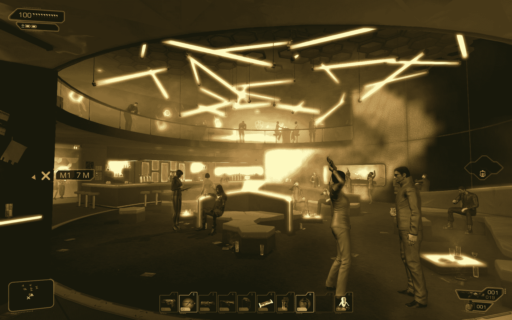
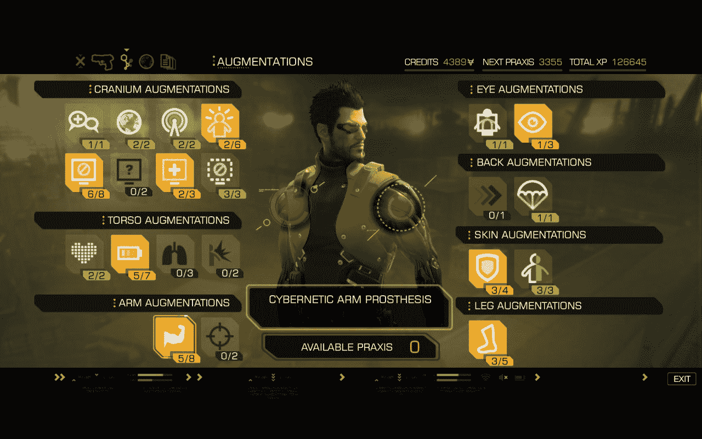
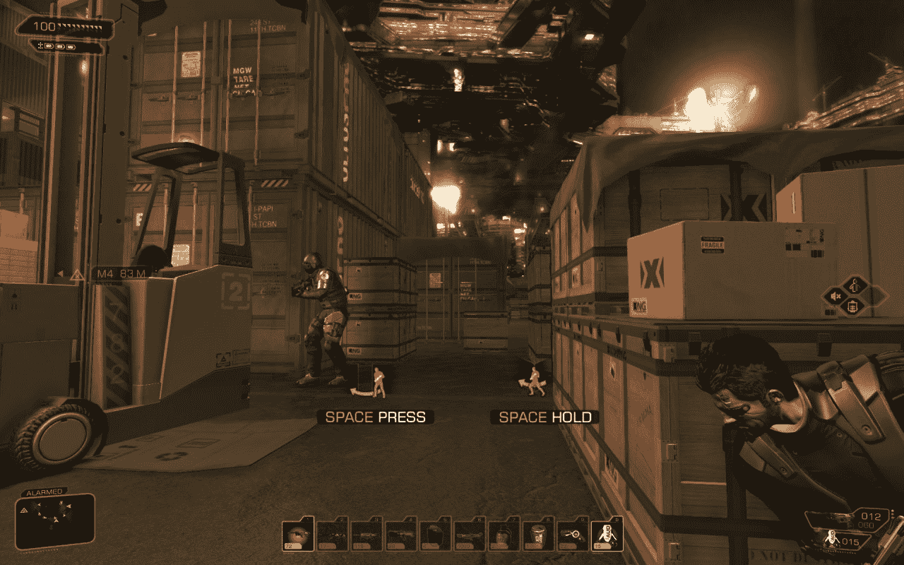
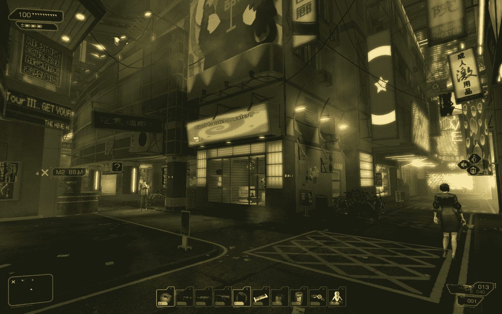
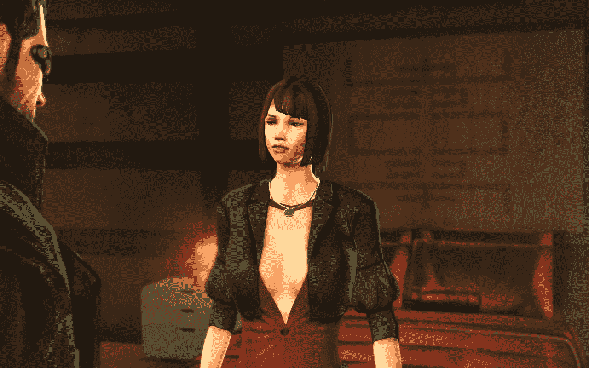
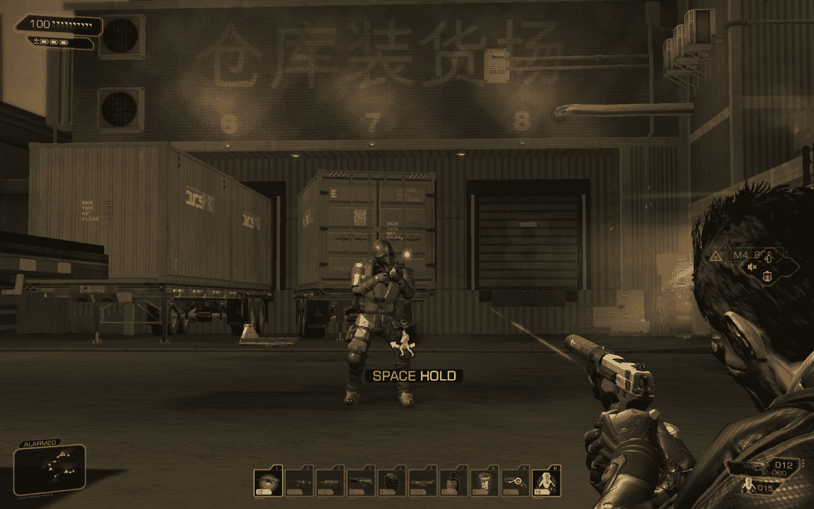

# 点评:两个前人类革命

> 原文：<https://web.archive.org/web/http://techcrunch.com/2011/09/07/review-deus-ex-human-revolution/>

**短版**:绝对值得一玩，但是有很多瑕疵导致 *DEHR* 达不到伟大。老板们,“国内”环境，以及某些关于关卡设计的*我不知道该说些什么，但也没什么好的。它远非完美，但核心的游戏性，一秒一秒地，是有趣和令人兴奋的。*

## 什么管用

《杀出重围》的世界是一个泛着柔和光芒的琥珀色世界，有许多布景。你可能认不出底特律，但我不确定现在是否还有人认得出来。这是一个相当标准的赛博朋克风格的环境，但大部分都是精心制作的。这里和那里有许多与游戏无关的小细节，但仍然增添了趣味。许多地点实际上感觉像真的一样:Sarif 感觉像一个真实的办公区；联邦应急管理局似乎是正确的，其他几个也很好地达到了目标。

你做了几乎所有的事情都会得到奖励，除了真正搞砸了。我以一个半和平主义者的身份玩游戏，不杀任何不需要的人。我因“仁慈”而得到加分，然后当我不得不真正干掉一个家伙时，我因爆头而得到“神枪手”的荣誉。也就是说，它确实能让你更好地做事情。我的目标是在每次任务中获得幽灵和平滑操作员奖金，这意味着我永远不会被警卫或摄像机完全看到。这并不是说，在关键时刻，我不屑于干掉一些傻瓜。这很有趣，因为实际上，你在挑战自己*去做你认为*应该*做的事情。*

 *

充实自己感觉很棒。在大多数情况下，你真的看到了好处。“该死，如果我升级了我的手臂，我就可以把那东西移开，进入那个通风口。”或者“是啊，再有两秒钟的隐身时间或者一个额外的电池，我就可以直接走过那个摄像头了。”升级真正增强了游戏性并使其多样化，你将面临一些艰难的决定。

游戏本身大部分是秘密行动，而且通常玩得很好。你大多觉得自己是个坏蛋，从第一人称到第三人称，再到黑客攻击再到射击，不费吹灰之力。你也觉得有义务尝试不同的东西，或者做得更好，所以多次试玩是一种选择。在游戏中不杀死任何人(除了老板，不管你喜欢与否，老板都会死)是一个成就，这需要一些努力。尤其是当…嗯，你会看到的。

【T2

这个故事是一个大杂烩，但它在某些方面雄心勃勃，写得相当好。具有讽刺意味的是，它依赖于“杀出重围”的比喻，像往常一样，在结尾有一个你看到的大启示。至少不是外星人。

## 什么不会

在这种状态下，在掩护物之间打滚，偷偷地干掉坏人，并真正做好自己的工作，你感觉很棒。**然而,“中枢”区域的图形和导航限制让人想起 2000 年代中期的射击游戏。**你走过的地方对我来说不像是生活街，更像是廉价游戏关卡。公寓大楼只不过是光秃秃的走廊，通常有几层楼，根本没有门，不管是不是假的。大多数房间，甚至是以情节为中心的房间，都是剪切粘贴的。世界上的 NPC 们只是装点门面，很少或根本没有什么事可做或可说。你可以从他们眼皮底下偷东西或者读他们的邮件。

人物模型也像是上一代的遗留物。主要角色和警卫之类的东西通常看起来很棒，动画制作也很好，但**NPC 感觉像是前*半衰期*无所事事的动画，呆滞的双眼，以及残暴的配音**。更不用说游戏中的每个女人似乎都有着相同的解剖学上的攻击性模型，乳房比她们的头大，有着蜂腰。真的，伙计们，你们就不能让一个实习生做几个变种吗？在演奏了《黑色歌剧》之后，糟糕的模特、糟糕的配音和糟糕的对口型更加令人失望。

关于老板们已经说了很多，所以我只指出我同意普遍的看法，那就是**他们烂**。事实上，它们是由一个独立的公司开发的，这是显而易见的。幸运的是，他们只占游戏的一小部分，所以你最好的办法是吃一些止痛药，浪费一些弹药，然后结束游戏。

**行为和暗示不一致**。为什么敌人可以精确定位一个脚印，但自动解锁装置的刺耳声音却不会触发警报？为什么敌人可以听到打开储物柜的声音，但我的战斗步枪重新上膛的嘶嘶声却是“无声”的？为什么我隐形的时候地雷能看到我？为什么封面有时有效得可笑，有时却相反？

这个世界的设置和你通过它的方式似乎非常武断。这并不总是有损于游戏的乐趣，但对我来说非常清楚的是，我选择了，比如说，开发者为游戏设定的三条道路中的一条。令人难以置信的是，大量未上锁的通风管道直接通向敌人总是视而不见的关键区域**，这让你觉得自己不像一个忍者，而更像一个走“b 路”的人。**很多时候你仍然可以用自己的方式处理事情，但不像在*孤岛危机*中那样偷偷摸摸，你不会觉得这是因为你的任何优点。

最后，**加载时间是一个真正的问题**，即使是在像我这样的全新电脑上。如果你像我一样是一个完美主义者，就要准备花很多、*很多*分钟的空闲时间盯着毫无意义的游戏提示，即使你只是在几秒钟前才从一个保存中载入。在 30 秒或更长的加载时间里，我和朋友们聊了很多。

**是什么**:好游戏。把它想象成一个橘子:当然，它有一些苦涩的部分和种子，但大部分都很美味。当你置身其中，你就置身其中，有许多精彩的部分和琐碎的事情等待你去探索。这有点像金属齿轮，没有所有常见的小岛康誉服饰。

**不是什么**:沙盒游戏。你如何一个房间一个房间地前进取决于你，但是这个世界很少甚至没有提供自由。有一些支线任务，但在大多数情况下，这是一个非常线性的操作。不像*的《隐形战争》*那么线性，但也不是*的《GTA》*。

## 结论

*Deus Ex: Human Revolution* 并非没有缺点和不足，但总的来说，它是 Deus Ex 名称的一个值得继承的名字，真正重要的部分工作良好。尽量减少你与可悲的外围世界的接触将有助于保持你对这个游戏的高评价。还有加载时要读的东西。*