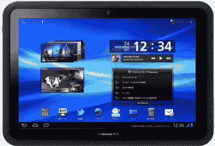

# 富士通防水 LTE F-01D 安卓平板电脑下月登陆日本 TechCrunch

> 原文：<https://web.archive.org/web/http://techcrunch.com/2011/09/08/fujitsus-waterproof-lte-f-01d-android-tablet-to-land-in-japan-next-month/>

# 富士通防水 LTE F-01D 安卓平板下月登陆日本

日本最大的移动运营商 [NTT Docomo](https://web.archive.org/web/20230203051744/https://techcrunch.com/tag/docomo) 正在加紧努力将 [Xi](https://web.archive.org/web/20230203051744/https://techcrunch.com/2010/08/02/under-xi-brand-docomo-to-invest-3-4-billion-in-japanese-lte-infrastructure/) 及其 [LTE 服务](https://web.archive.org/web/20230203051744/https://techcrunch.com/2010/12/27/xi-ntt-docomo-rolls-out-japans-first-lte-service/)推向大众:今天，该公司[宣布了](https://web.archive.org/web/20230203051744/http://www.nttdocomo.com/pr/2011/001542.html)两款兼容日本市场标准的[平板电脑](https://web.archive.org/web/20230203051744/https://techcrunch.com/tag/tablets)，Galaxy Tab 10.1 和富士通的一款新设备，即所谓的 ARROWS Tab LTE F-01D。

这两款平板电脑都将于下月发布，搭载 Android Honeycomb，并预装日文版的 [Hulu](https://web.archive.org/web/20230203051744/https://techcrunch.com/2011/08/31/hulu-japan-subscription-only/) 和 Qik。虽然 Galaxy Tab 10.1 在很大程度上与其他地方出售的相同(只是支持 LTE)，但富士通平板电脑更有趣。

它有一个防水的机身(所以你可以带着它去浴缸——这是一个卖点，特别是在日本),并具有一个特殊的手势控制功能，允许你滑动屏幕而不用用手指触摸它(例如，当你做饭时，这很重要)。

以下是富士通箭的主要规格:

*   安卓 3.2 蜂巢
*   LTE 和 FOMA 3G 支持
*   10.1 英寸屏幕，分辨率为 1，1,280 x 800)
*   510 万像素 CMOS 摄像头(内置摄像头:130 万像素)
*   微型同步插槽
*   GPS 模块
*   蓝牙 3.0
*   无线保真
*   数字电视调谐器
*   1GB 内存
*   16GM 内存
*   双核 1 GHz OMAP 4 CPU
*   尺寸:181 x 262 x 11.3 毫米，重量:597 克