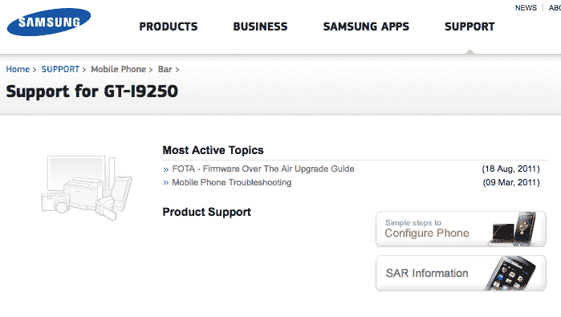

# 三星 Nexus Prime 支持页面弹出，传言规格泄露 TechCrunch

> 原文：<https://web.archive.org/web/http://techcrunch.com/2011/09/08/samsung-nexus-prime-support-page-pops-up-rumored-specs-trickle-out/>

# 三星 Nexus Prime 支持页面弹出，传言规格涓涓细流

如果型号 GT-i9250 对你来说毫无意义，那你最好先温习一下你的手机新闻。它应该是下一代谷歌手机 Nexus Prime，也是第一款运行备受期待的冰淇淋三明治的手机。但是谣言工厂已经有了自己的方式。我们听到了一些看似完全合理的有趣信息，但也听到了一些完全错误的信息。今天的位将是一个虚拟的支持页面的 i9250 共享的一个身份不明的 GSM 竞技场情报。

该页面本身相当贫瘠，只有几个甚至不属于 Prime 的操作方法和常见问题链接。但是情报提供者似乎对这部手机相当了解，包括粉碎早期谣言的信息。这是我们拿出盐瓶，小心前进的地方。

我们需要知道的第一件事是，每个人都认为是 Prime 的[泄露的用户代理档案](https://web.archive.org/web/20230203145117/http://wap.samsungmobile.com/uaprof/nexusprime.xml)实际上是 Nexus S 的 UAP。这并不是说 Prime 不存在或类似的任何激烈事情，但更有可能的是，他们正在使用 Nexus S 的档案作为 Prime 的占位符。也就是说，消息人士声称“Nexus Prime”只是一个代号，这款手机的官方谷歌手机名称将是三星 Galaxy Prime。

当用户代理档案泄露时，每个人首先愤怒的是 800×480 的屏幕分辨率。别担心伙计们。首先，旗舰冰淇淋三明治手机肯定会比过去两年推出的手机有更令人印象深刻的分辨率。但除此之外， [GSM Arena](https://web.archive.org/web/20230203145117/http://www.gsmarena.com/support_page_for_samsung_i9250_is_up_we_get_tips_from_an_insider-news-3105.php) 的消息人士还提到，Prime 将配备 4.65 英寸的 Super AMOLED 高清显示屏，这可能意味着我们将看到与 Galaxy Note 相同的分辨率:1280×800。

消息人士还提到，Prime 将采用与 Nexus S 相同的轮廓显示屏，腰围仅为 8.8 毫米。奇怪的是，消息人士表示，三星在这个小家伙身上选择了完全金属的底盘，这与其通常的塑料外壳有很大的不同。我们不确定这将对重量产生多大影响，但如果他们能保持重量轻，这可能是一个很好的进步。

最后，情报人员预计在 10 月底左右发射。这与 [Eric Schmidt 承诺的 10 月/11 月冰淇淋三明治时间框架](https://web.archive.org/web/20230203145117/https://techcrunch.com/2011/09/07/googles-eric-schmidt-pegs-ice-cream-sandwich-for-mid-fall-release/)非常吻合，这很可能是最好的一部分。流口水吧，手机爱好者们。流口水了。