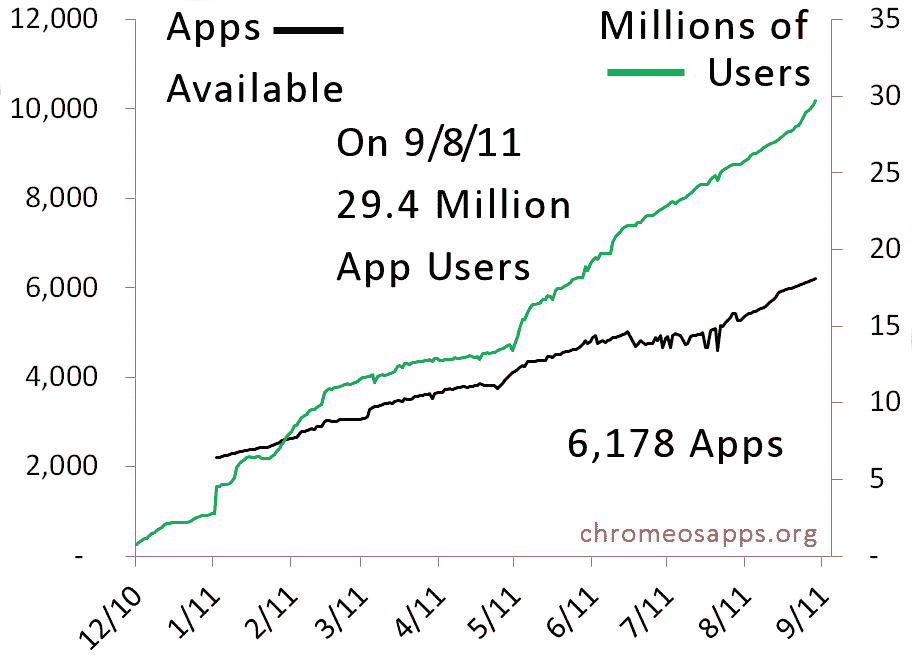

# Chrome Web Store 过 3000 万用户，但未来有多光明？TechCrunch

> 原文：<https://web.archive.org/web/http://techcrunch.com/2011/09/09/chrome-web-store-passes-30-million-users-but-how-bright-is-the-future/>

9 月 1 日，谷歌广受欢迎的浏览器 Chrome[迎来了它的三岁生日](https://web.archive.org/web/20230203153927/https://techcrunch.com/2011/09/01/google-chrome-celebrates-its-third-birthday-by-browsing-down-memory-lane/)。在相对较短的时间内，Chrome 已经吞噬了 22%的浏览器市场份额，相比之下，Firefox 和 IE 的份额分别为 28%和 42%。浏览器继续迭代，现在以六周一次的快速发布周期工作，其生态系统在过去的一年中取得了一些长足的进步。就我个人而言，我每天使用多种浏览器，但 Chrome 已经成为我的首选。

12 月，[谷歌推出了 Chrome 操作系统和 Chrome 网上商店](https://web.archive.org/web/20230203153927/https://techcrunch.com/2010/12/07/live-from-googles-chrome-event-chrome-os-web-store-and-more/)，随后在 6 月推出了[Chrome book。但是，正如 Jason 在上周的帖子中指出的那样，](https://web.archive.org/web/20230203153927/https://techcrunch.com/2011/05/15/samsung-series-5-chromebook/)[以及我们在 1 月份的早期报道](https://web.archive.org/web/20230203153927/https://techcrunch.com/2011/01/04/sales-have-slowed-to-a-trickle-on-googles-chrome-web-store/)，Chrome 网上商店似乎起步缓慢，可能没有在发布前吸引到预期的那么多流量(更重要的是，销售额)。一些更大胆的博客圈成员甚至在 CWS 发布后说，“嘿，等等，这难道不是一个蹩脚的书签系列吗？”

然而，监测 CWS 应用程序性能数据的独立网站[ChromeOSApps.org](https://web.archive.org/web/20230203153927/http://www.chromeosapps.org/)的创始人克里斯·索伦森今天与我们分享了一些统计数据，让我们看看网络商店自推出以来的增长情况，这些数字并不像早期那样“涓涓细流”。根据索伦森的数据，1 月 13 日(开业约一个月后)，Chrome 网络商店推出了 2195 款应用，吸引了 450 万用户。

到 9 月 1 日，CWS 已经发展到超过 6000 个应用程序，用户总数接近 2800 万。9 月 9 日，根据我们看到的数字，CWS 已经突破 3000 万。至于下载量:Chrome 网上商店在 5 月 15 日才开始记录下载量，但是来自 Sorensen 的最新数据表明 CWS 吸引了超过 250 万的每周下载量。

如下图所示，大约从 6 月份开始，谷歌网络商店的应用数量和(更重要的是)聚合用户数量出现了大幅增长。该商店迄今为止看到的增长可能是谷歌 Chromebooks 早期预售的结果，该产品不允许用户下载原生应用程序。

但是销售呢？今年 1 月，app store 总用户中有 2.8%在使用付费应用。索伦森说，到 9 月 1 日，3000 万用户中有 2.1%使用“非免费”定价的应用程序。根据应用程序总数，6 月份，CWS 的应用程序中有 9.1%的定价不是免费的，而在 9 月 1 日，这一数字下降到了 5.7%。这表明，自推出以来，付费应用在 CWS 上的使用总体上一直在减少——付费应用的数量也是如此(至少自 6 月以来)——而免费应用的使用和数量则增加得更为显著。尤其是那些书签应用和免费扩展，它们已经变得炙手可热。

虽然 CWS 的数字看起来比 6 个月前更好，但网络商店的问题是，开发者活动的增长速度不如 Android Marketplace 或苹果应用商店，这仍然阻碍了网络商店的发展。谷歌对开发者提供付费应用有很大的激励，为付费应用定价向开发者提供 70%的收入分成，为应用内购买提供 95%的收入分成。这对开发者创造付费应用来说是一个很大的激励，但用户似乎并不买账。

根据 Ovum 的研究(虽然网络商店产生的总收入还不知道)，与苹果相比，苹果的应用程序收入将达到 28.6 亿美元，Android 商店到 2016 年将达到 15 亿美元，[，CWS 显然还有很长的路要走。](https://web.archive.org/web/20230203153927/http://news.cnet.com/8301-1035_3-20103230-94/android-to-overtake-apple-in-app-downloads/)

更不用说，[脸书的斯巴达项目](https://web.archive.org/web/20230203153927/https://techcrunch.com/2011/06/15/facebook-project-spartan/)的威胁，这是社交网络的秘密政变，旨在打破谷歌/苹果在本地移动应用世界的至高无上地位。对于那些不熟悉的人来说，Project Spartan 是 HTML5 驱动的移动应用平台，据称是脸书与一群第三方应用程序开发者一起建立的——其最初的目标是 Safari，而不是 Chrome。

如果 Chromebook 的销量真的起飞(就目前的硬件状况而言，这还远远不是必然的)，网络应用商店的发展可能会因此受益，因为索伦森告诉我，他预测对深度、全功能企业桌面应用的需求将大幅上升——但这仍有待观察。谷歌可能也有合并 Android 和 Chrome 的计划，但就该公司如何展望其网络和移动平台的未来而言，还有许多问题没有答案。就目前而言，不管相关性如何，谷歌将不得不从免费用户数量的上升中寻求安慰，但危险肯定是迫在眉睫。

