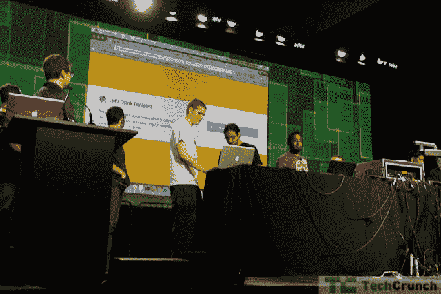
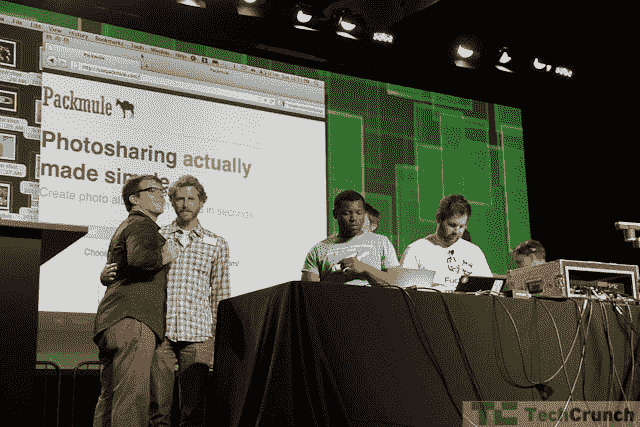

# 黑客马拉松集锦:来自 Disrupt SF 黑客马拉松 TechCrunch 的员工最爱

> 原文：<https://web.archive.org/web/http://techcrunch.com/2011/09/11/hackathon-highlights-staff-favorites-from-the-disrupt-sf-hackathon/>

距离黑客马拉松开始已经将近 24 个小时了，hax0rs 有 hax3d 了。我们已经看到了 130 个项目，每个项目都在 60 秒内完成，而且都是在 24 小时内完成的。

虽然所有的项目都很精彩(真的——这可能是我们迄今为止最好的黑客马拉松)，但其中一些项目确实击中了观众中 TechCrunch 作者的要害。没有特定的顺序(也没有任何迹象表明谁会成为赢家)，一些员工最喜欢的是:

[club report](https://web.archive.org/web/20230205023448/http://clubreport.herokuapp.com/)——为你提供城市中俱乐部的实时音频流，帮助你找到你想去的俱乐部。

[差不多](https://web.archive.org/web/20230205023448/http://justabout.co/)——一个关于我的商务。简单，30 秒的企业网站，主要是为了将他们的社交网络帐户集中在一个容易找到的地方。

**天气检查器**——地下天气和谷歌日历的混搭。自动扫描您日历中即将发生的事件，并在天气预报变坏时提醒您。

**SportBot:** 监控和分析关于体育赛事的推文，并根据热门推文生成赛事的实时博客式文本摘要。

**评价过的:**让你对前任进行评价，并仔细阅读潜在追求者的评价。

**[今晚一起喝酒吧](https://web.archive.org/web/20230205023448/http://www.letsdrinktonight.com/) :** 输入你的手机，回答几个问题，当附近有人在找陌生人喝酒时，它会提醒你

**[@ shopr](https://web.archive.org/web/20230205023448/http://www.atshopr.com/)**——匹配 Twitter 上的买家和卖家。这有点像 Twitter 的 Craigslist。基本上，@shopr 使用 Gnip 来挖掘卖东西和想买东西的人的 Twitter firehose。

SharedRoll.com**[:让你随时创建群组管理的相册。](https://web.archive.org/web/20230205023448/http://www.sharedroll.com/)**

**[pack mule](https://web.archive.org/web/20230205023448/http://usepackmule.com/)**——又一个简单易用的合影分享工具。

沃尔蒂在哪里？–《沃尔多在哪里》实拍。自动选择照片中的人脸，并让用户找到它。

**PassMyWill** :“你对线上资产的意愿”。在你死后将你的社交网络密码分发给你信任的亲人。你是否死了是由社交网络活动决定的，其次是一个死人的开关电子邮件。

**Diskly:** 在真实世界的场地直接反馈给 DJ。在您的 iPod 库中搜索与当前正在场地播放的歌曲相似的歌曲，并让您向 DJ 推荐这些歌曲。

**耻辱中士**:你为自己创造任务，然后给耻辱中士在你的脸书墙上张贴的权限。无法完成你的任务(取决于你是否已经检查你的任务预定的次数)？羞耻中士在公共场合叫你。

  **[【SlideJoin.com](https://web.archive.org/web/20230205023448/http://slidejoin.com/)**——一项可以让你在手机上观看幻灯片演示的服务。

**Karpool:** “组织与朋友拼车的最简单方法。”使用您的号码登录，添加您的骑手，开始旅行。Karpool 将显示您的骑手的当前位置，以及他们是否准备好离开。

**[MilkMe.co:](https://web.archive.org/web/20230205023448/http://milkme.co/)** 哎呀——你的牛奶快没了！向提供的电话号码发送“添加牛奶”的短信，牛奶将在第二天到达。仅在英国，因为它依赖乐购的 API。

**Facefuse:** 使用 iOS 5 的人脸检测系统，结合 Face.com 的面部识别 API。一旦检测到一张脸，它就会返回一个类似 Wiki 的可公开编辑的页面，与这个人相对应。

**[AirCart](https://web.archive.org/web/20230205023448/http://aircartapp.com/) :** 杂货店通过手机自助结账，而不是标准的专用结账台。扫描项目的 UPC，将其添加到您的“空中卡”。

**[Thirsty.com](https://web.archive.org/web/20230205023448/http://thirsty.com/)**——号称“人类的 AirBnB”，口渴可以让你短期雇佣人。卖家公布一天能做什么(给车打蜡？清理 3 个房间的地毯？)及其每日费率。

**音乐对战:**一场即时的，玩家对玩家的音乐对战。每个播放器站点读取音乐，用最近的乐器演奏音符。他们的移动设备检测他们正在演奏的音符。你做得越好，对对手的伤害就越大。

**Zom-Beat 防御:**僵尸防御游戏。用箭头键移动，用鼠标瞄准。一波又一波的僵尸是根据音乐的节拍产生的。

在你要去的地方寻找你的朋友可能会介绍给你的人。去巴黎吗？SocialBee 会扫描您的社交网络，寻找在巴黎有联系人的朋友，并生成一个介绍请求。