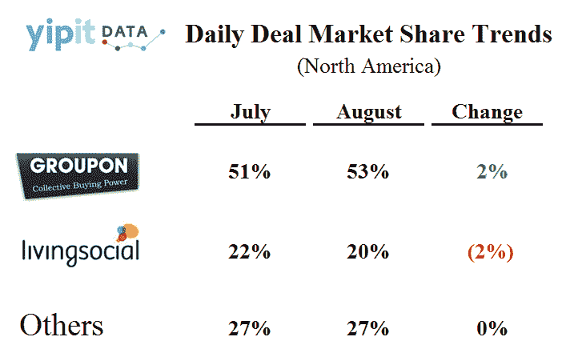

# 报告:Groupon 月份收入增长 13%，市场份额增长 2%

> 原文：<https://web.archive.org/web/http://techcrunch.com/2011/09/11/report-groupon-grew-its-revenues-13-in-august-gained-2-marketshare/>

# 报告:Groupon 月份收入增长 13%，市场份额增长 2%

鉴于有报道称该公司[取消了投资者路演，并推迟了首次公开募股](https://web.archive.org/web/20230203141042/http://online.wsj.com/article/SB10001424053111904537404576554812230222934.html)，每日交易聚合网站 [Yipit](https://web.archive.org/web/20230203141042/http://www.yipit.com/) 对[Groupon](https://web.archive.org/web/20230203141042/http://www.groupon.com/)8 月份的发展轨迹有一些积极的信息，即它在收入方面是一个出色的月份。

daily deals 领跑者在夏季最后一个月增长了 13%，收入从 7 月份的 1.06 亿美元增加到 1.207 亿美元。

这种增长象征着每笔交易售出的 Groupon 数量增加了 10 %, Groupon 平均价格增加了 5%,这两种增长都弥补了 Groupon 交易数量的下降。

Groupon 的新生旅游交易产品 Groupon Getaways 提振了该公司的销售，8 月份的收入为 960 万美元，而 7 月份为 570 万美元。390 万美元的 Groupon 度假差价占该月 Groupon 总增长的 27%。

根据 Yipit 的数据，该数据来自对 8 月份超过 3 万个每日交易报价的跟踪，Groupon 的两位数收入增长与竞争对手 LivingSocial 的收入连续第二个月下降形成鲜明对比。

living social 8 月份的收入为 4510 万美元，比 7 月份的 4640 万美元下降了 3%。这种下降可以分解为每笔交易售出的优惠券数量下降 6%，每张优惠券的平均价格下降 1%。然而，LivingSocial 的交易数量却增加了 4%。

8 月份，每日交易行业整体收入增长 9%，从 7 月份的 2.09 亿美元增长至 2.28 亿美元。

Yipit 的报告认为，Groupon 的整体市场份额在过去一个月增长到 53%，而 LivingSocial 的估计市场份额下降到 20%，Groupon 从 7 月份的 51%份额上升了 2%，而 LivingSocial 在同一个月从 22%的份额下降了同样的数量。

 
您可以阅读下面的报告节选。

[scribd id = 64647590 key = key-9 ov 0 eyg 0y 9 wnr 0778 JF mode = list]