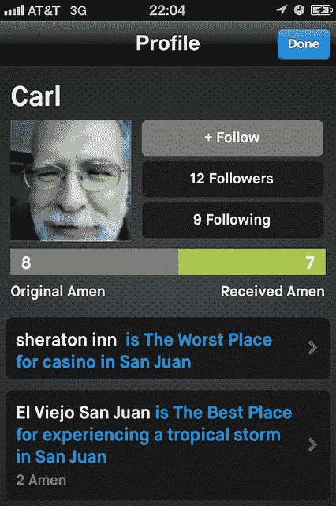
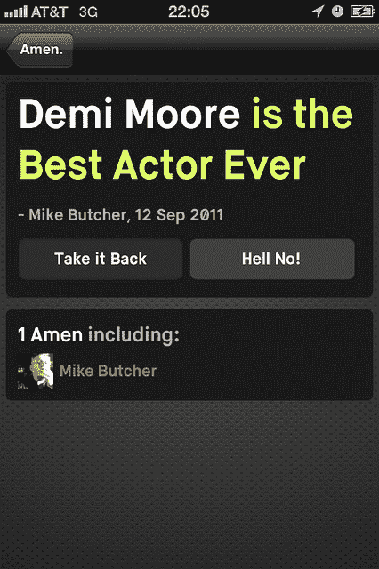
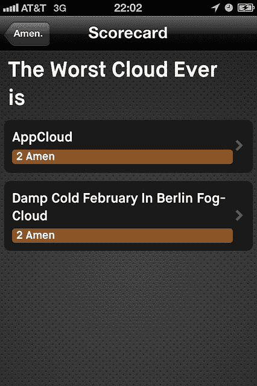

# 阿门的目标是通过智能界面找到最好的东西 TechCrunch

> 原文：<https://web.archive.org/web/http://techcrunch.com/2011/09/12/amen-aims-to-find-the-best-of-everything-with-a-smart-interface/>

我们已经很久没有对 Twitter 的完全简化感到高兴甚至有点困惑了。让我们面对现实吧，从那时起，就有很多人觊觎这种简单的界面。但是阿门公司似乎对移动服务有了一个流畅的新想法，这个想法简单得让人难以置信，但是它的目的是创造大量关于人们喜欢的东西的数据。

简而言之，阿门是关于寻找最好的一切，通常是通过对最坏的争论。要获得该应用程序，请在 iPhone 上的 Safari 中前往[getamen.com/tc](https://web.archive.org/web/20230205042856/http://getamen.com/tc)，注册并通过无线下载。Techcrunch Disrupt 大约有 2000 名注册用户。

它是这样工作的。你在 iPhone 或网络浏览器上启动应用程序，然后说一个人、一个地方或一件事是“最好的”或“最差的”，就像有史以来最好的 Dubstep 曲目一样。或者，正如女演员[黛米·摩尔](https://web.archive.org/web/20230205042856/https://getamen.com/users/87)(测试版用户)[所说](https://web.archive.org/web/20230205042856/https://getamen.com/topics/4111)，“做爱之后是有史以来最好的状态。”投资人哈比·阿什顿·库彻——“齐柏林飞船是有史以来最好的摇滚乐队。”你可以用一个“阿门”来赞同这种说法。但是如果回答“绝对不行”，你就必须给出另一个答案。这是一个僵化的结构，但你可以张贴任何你想要的。

抛开黛米文章的言外之意(虽然很诱人)，创建简单的“阿门”或“不”机制意味着阿门可以创建大量关于某个事物的确定数据。例如，现在阿门说“在圣马特奥吃墨西哥食物最好的地方是 Taqueria La Cumbre。当然，你可能不同意…

任何阿门语句的位置也被内置到应用中，意味着阿门将开始告诉你身边最美好的事情。

但更有趣的是，它从那些从朋友那里看到大量潜在分裂言论的用户那里产生了反馈。

这是游戏元素开始发挥作用的时候，因为你可以权衡并强烈反对一个人。这不仅仅是一个 Dilike 按钮-你只能不同意，键入“地狱没有”-通过建议一个职位的替代者。

这意味着阿门每一次都不断地得到更精细的数据。至关重要的是，每条语句都是一个数据点。

因此，当 Twitter 和它的数以千计的第三方开发者不得不将曲折的自然语言算法应用到消防水管上，以弄清楚到底发生了什么时，阿门已经将所有这些数据和结构预建到了它的系统中。这就像是一场寻找最好的东西的大战，但这次规则太简单了，你甚至不会注意到它们。

因此，整个系统是从头开始构建的，旨在吸收世界上最好的东西。

Founderr Felix 说，封闭测试版的用户一直在发布关于电视节目、咖啡馆、最差的航空公司、最佳性爱位置的帖子。几乎所有的东西。此外，人们使用它来创建一种状态更新，他们的朋友可以同意或不同意，例如，“这个酒吧是会见迈克的最佳场所。”

然后，它可能是一些更微妙的东西，如…

或更多棒球内幕:

或更多游戏:

这家初创公司上个月一直处于封闭的私人测试阶段，现在有 3500 名用户，产生了相当多的参与。在一个月内，这些用户创建了 30，000 份报表，创建了 15，500 张记分卡，点击了 80，000 次修改按钮。

一个意想不到的用途是使用 is 作为问答平台，然后找到你想要的东西，就像问“谁是柏林最好的牙医”，人们争论这个问题并输入他们的建议。

人们也一直在谈论从品牌到什么是最好的笑话，再到最好的播放列表。

当然，它的品牌元素有很大的潜力。品牌可以获得关于人们对他们的评价的反馈，肯定是实时的，而且准确度很高，因为这都是结构化的数据。这在 Twitter 中要困难得多，因为没有结构化的数据可以挖掘，只有人们随机的词汇。

另外，阿门是德杜平所有的词和列表，所以没有重复，没有脂肪在系统中。

因为它开始向你建议东西，它可以开始预测你打算打什么。这同样适用于阿门 iPhone 可能已经知道你在某个酒吧的位置。

列表不会只产生一个答案——在最高结果后面有一条长长的答案尾巴。所以他们得到了结果的头部和长尾。即使只有两票的答案，系统里还是会出现。

是的，有史以来最好的电影贝最终获得了一致同意。

阿门的游戏计划是先订婚，然后做大。然后启用发现和实用程序。随后是商业化，可能包括列表中的广告购买，比如 AdWords。

这家初创公司已经从 Index Ventures 和 Kutcher 那里筹集了种子资金。

这个团队本身就是优秀的。首席执行官兼创始人 Felix Petersen 曾创建 Plazes，该公司于 2008 年被诺基亚收购。还有 Caitlin Winner(麻省理工学院，诺基亚)和 Ricki Vester Gregersen(Input Squared)，还有 Florian Weber， [Twitter 的第一个](https://web.archive.org/web/20230205042856/https://techcrunch.com/2011/05/25/amen-plazes-founder-and-first-twitter-engineer-team-up-for-mysterious-startup/)工程师[在这里采访](https://web.archive.org/web/20230205042856/http://eu.beta.techcrunch.com/2011/05/09/exclusive-the-story-of-the-almost-forgotten-european-behind-twitter-%E2%80%94-and-his-new-startup/)。

但最后，这里有一个问题。理论上，阿门是可以复制的，假设有人能想出如何组织这些数据。因此，它的准入门槛可能会更低。但是，有多少创业公司已经把黛米·摩尔作为私人——准备公开——测试用户了呢？

**演示:**

**Backstage interview:**