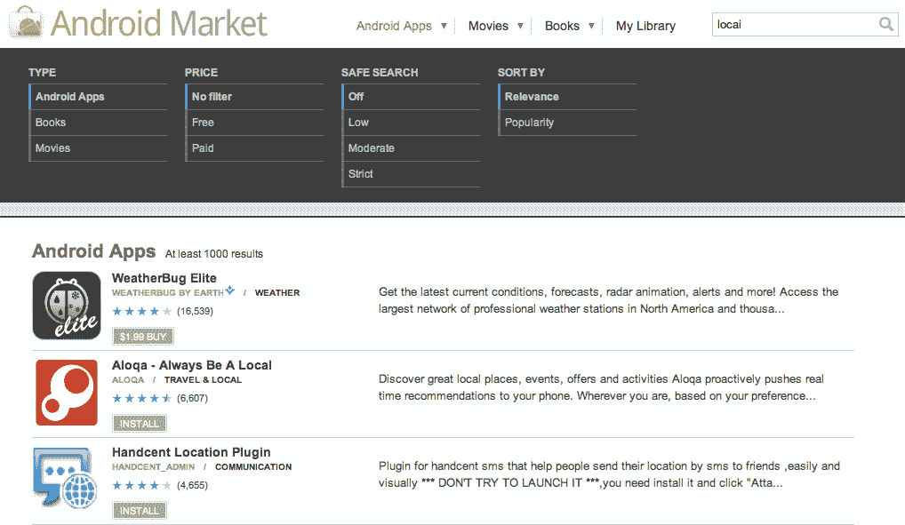
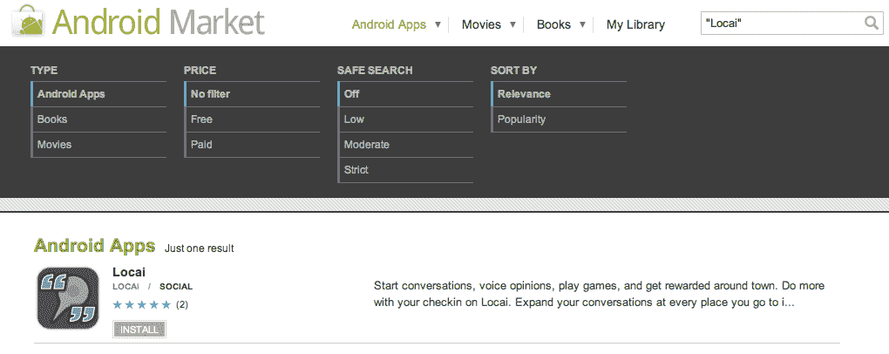

# “谷歌的自动更正功能扼杀了我们安卓应用的发布”TechCrunch

> 原文：<https://web.archive.org/web/http://techcrunch.com/2011/09/12/googles-auto-correct-killed-the-launch-of-our-android-app/>

我们都经历过自动纠正的挫折，从无意中宣布你要离婚，到你痛苦、愤怒的谩骂突然演变成许多“回避”。

幸运的是，这些不必要的自动修正通常只是带来不便。你笑了笑，尽快打退堂鼓([“我是说 porkkk”](https://web.archive.org/web/20230205015442/https://techcrunch.com/2011/07/20/damn-you-auto-cucumber/))，然后继续前进。

然而，对于达拉斯的一家初创公司来说，一个相当偷偷摸摸的自动更正问题是所有最终可发现性问题的原因:没有人能找到他们的新应用程序。

几周前，Locai 推出了一款 iPhone 应用。它的目的是沿着 Foursquare 的路线，更注重对话，它取得了相当大的成功——至少，足以鼓励他们推出一个 Android 端口。

这就是事情变得棘手的地方。Locai 推出了他们的 Android 应用程序…但即使几天后，在 Android 市场上也找不到它的踪影。经过一些调查，Locai 发现了问题:在后端的某个地方，谷歌的 Android Market 会自动将所有搜索“Locai”的结果修正为“Local ”,而不会提醒用户。因此，潜在的安卓用户似乎找不到这款应用。

**更新:谷歌似乎在这篇文章发布后的 48 小时内修复了这个问题。当你搜索它的名字时，有问题的应用程序现在显示为仅*的*应用程序。**

泰勒·卡瓦纳·洛卡伊的创始人说:“因为每个人都是通过搜索来下载应用，所以这对我们来说是一个巨大的打击。”“我们已经为未来几个月的一系列合作、活动和促销活动准备好了品牌和业务。现在，我们面临着失去大量用户和投资的局面，因为人们开始下载这款应用，但却找不到它。”

如果你有安卓设备，你可以自己运行搜索；即使有 500 个条目，在搜索自己的名字时也找不到 Locai。手边没有安卓设备？你可以在基于网络的 Android market [测试搜索。](https://web.archive.org/web/20230205015442/https://market.android.com/search?q=Locai&so=1&c=apps)

当然，有一些技巧可以迫使 Android Market 搜索一字不差的术语(例如，搜索“Locai”[引号]或+Locai)——但这是大多数用户想尝试的事情吗？

现在，在发布一周后，下载量持平，Locai 陷入了一个小小的困境:他们是改变名称(从而放弃他们迄今为止在品牌方面取得的任何进展)，还是只是坐以待毙，希望谷歌愿意实施一项修复措施(比如在显示自动更正结果之前优先考虑精确匹配)？

与此同时，任何实际上正在为 Android [寻找 Locai 的人都可以在这里找到。](https://web.archive.org/web/20230205015442/https://market.android.com/details?id=com.development.locai&feature=search_result)

**更新:谷歌似乎在这篇文章发布后的 48 小时内修复了这个问题。当你搜索它的名字时，有问题的应用程序现在显示为仅*的*应用程序。**

**搜索 Locai:**

**搜索“Locai”(带引号):**

