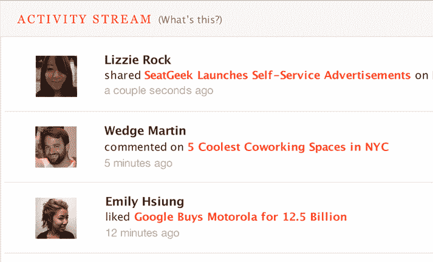
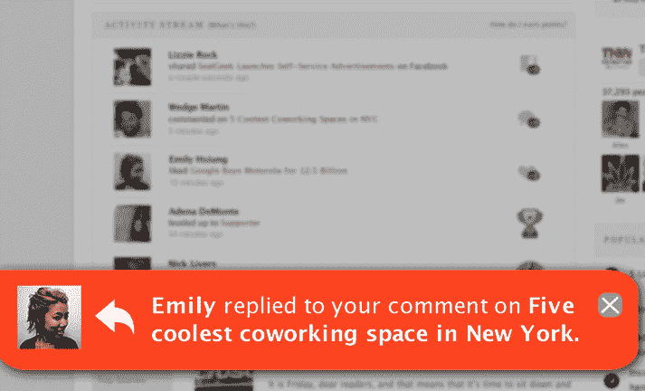
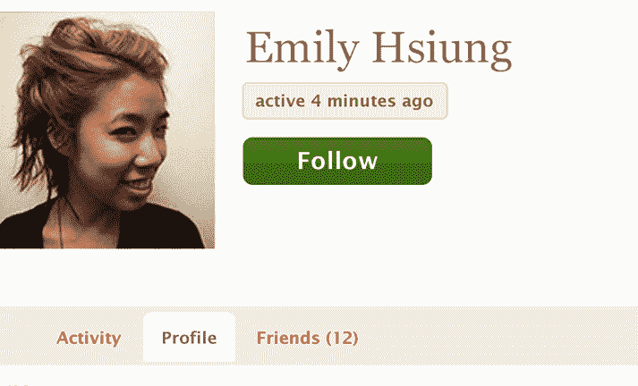

# 在其一周年之际，Badgeville 推出了一款名为 Social Fabric TechCrunch 的新产品

> 原文：<https://web.archive.org/web/http://techcrunch.com/2011/09/12/on-its-one-year-anniversary-badgeville-launches-a-new-product-called-social-fabric/>

一年前，社交奖励和分析公司 [Badgeville](https://web.archive.org/web/20230203140300/http://www.badgeville.com/) 在 [TechCrunch Disrupt 2010](https://web.archive.org/web/20230203140300/https://techcrunch.com/2010/09/27/badgeville/) 上为[观众选择奖得主](https://web.archive.org/web/20230203140300/https://techcrunch.com/2011/02/12/techcrunch-disrupt-badgeville-lessons/)颁奖。今天，创始人兼首席执行官克里斯·达根在今年的 Disrupt 上发言，谈论公司在过去的 12 个月里取得了多大的进步。他说，当 Badgeville 成立时，它有 4 个人，30 万美元的种子资金和 10 个测试客户。现在它有 35 名全职员工，筹集了 1500 万美元的资金，有 85 名付费用户，包括 NBC、Discovery 和环球音乐等知名公司。达根指出，它还带来了 500 万至 1000 万英镑的销售额。仅仅一年就不错了。

但更大的新闻是，Badgeville 现在正在推出其最新产品: [Social Fabric](https://web.archive.org/web/20230203140300/http://www.badgeville.com/platform/social-fabric.php) ，一种基于用户在线行为的新技术。

Duggan 称之为“行为图”，它不同于脸书和 Twitter 上的“社交图”，后者仅限于用户的朋友网络。它也比脸书的“兴趣图”更先进，在那里反馈循环就像一个“喜欢”列表一样简单

相反，行为图是通过跟踪用户的现场活动来构建的，这些活动可以包括发布者想要跟踪的几乎任何内容，例如点击链接、阅读文章、评论、喜欢、回复另一条评论或分享。但它不仅限于生产内容的网站。零售商也可以使用社交网络来跟踪与购买、推荐、推荐等相关的活动。即使是企业应用程序开发者也可以利用社交网络来跟踪内部活动，比如一张关闭的支持票或在帮助网站的问答部分添加答案的用户。

社交网络有三个主要组成部分:活动流、社交通知和提醒，以及跟踪人和物的能力。

活动流的功能有点像基于行为的网站特定版本的脸书新闻。它向用户展示了一系列与其兴趣相关的活动，包括你的朋友在网站上做了什么——他们读了什么，评论了什么，喜欢什么等等。它可以告诉你谁回复了你的评论，或者哪些用户和你一样喜欢相同的内容。选择还是取决于出版商自己。

[Badgeville](https://web.archive.org/web/20230203140300/http://www.badgeville.com/) 目前正致力于改进该流的过滤算法，以更好地突出给定用户最感兴趣的活动。负责算法改进的是 Tim Piatenko，这位开发人员对此略知一二，之前曾在社交游戏公司 Zynga 从事分析工作。

新的[社交结构](https://web.archive.org/web/20230203140300/http://www.badgeville.com/platform/social-fabric.php)系统的另一部分是实时提醒，当你浏览网站时，它会弹出(通常在页面底部)向你显示相同的活动。最终结果是为用户提供更吸引人的体验，同时也为网站的发布者提供了更详细的用户行为分析。

社交结构的第三个也是最后一个部分是“关注”按钮，与社交网络不同，它可以应用于除人以外的其他事物。用户可以关注话题、视频、文章或任何可以跟踪的对象。

那么为什么一个游戏化公司要钻研社会机制呢？徽章不足以吸引用户吗？事实证明，这不是一个简单的非此即彼的情况。将社交活动添加到 Badgeville 核心产品中已经存在的游戏机制中，有助于提供更好、更令人上瘾的现场体验，因为与游戏相关的活动变成了另一种可以跟踪的兴趣。

Duggan 说 Badgeville 已经有六家公司计划在接下来的一两周内实现社交网络，所以请继续关注。