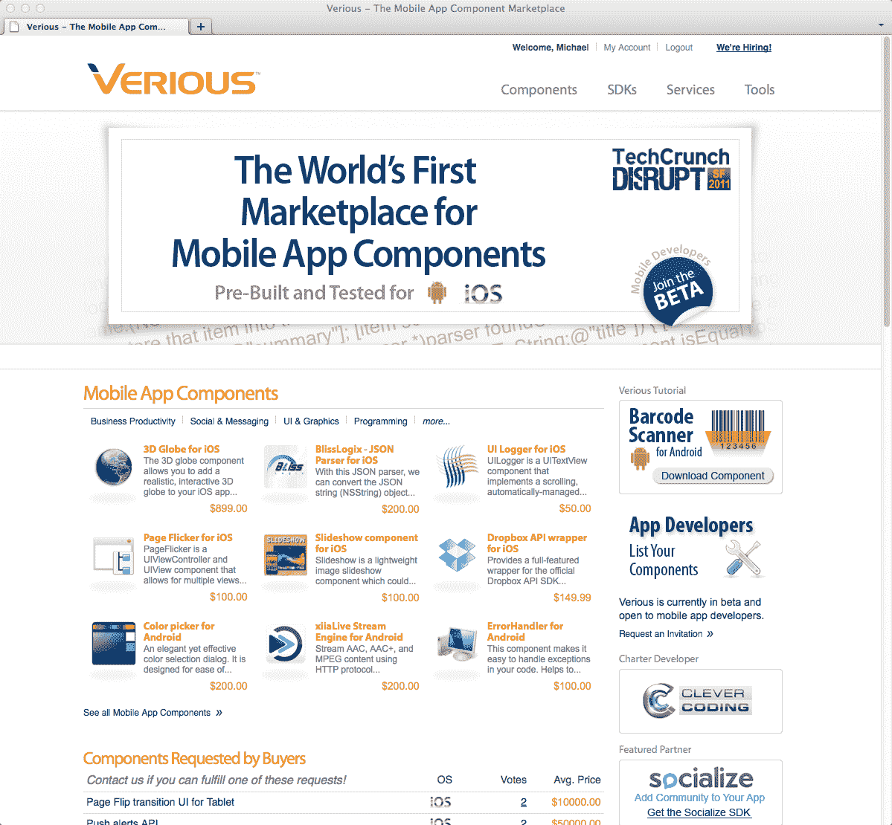
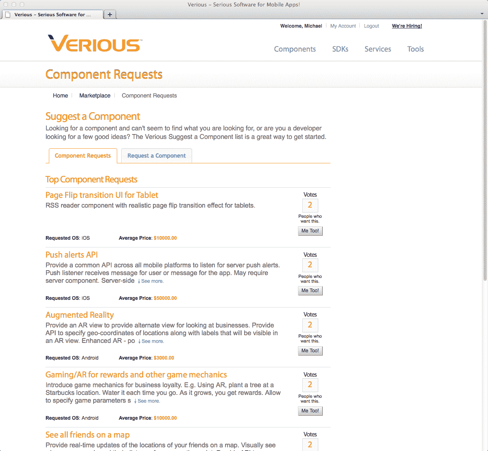
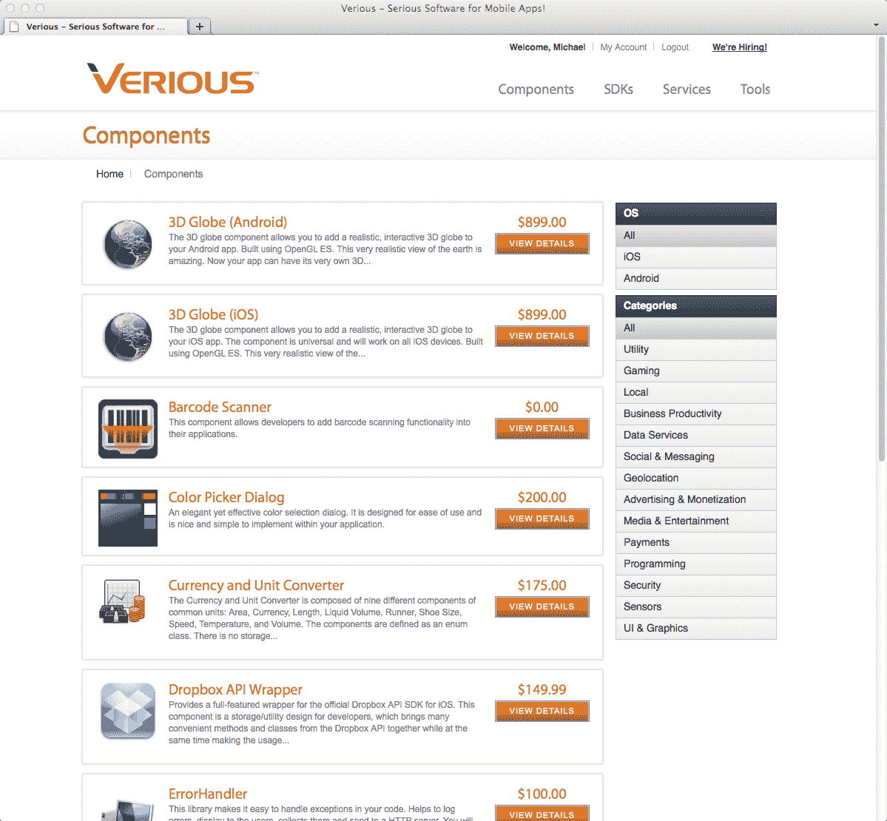
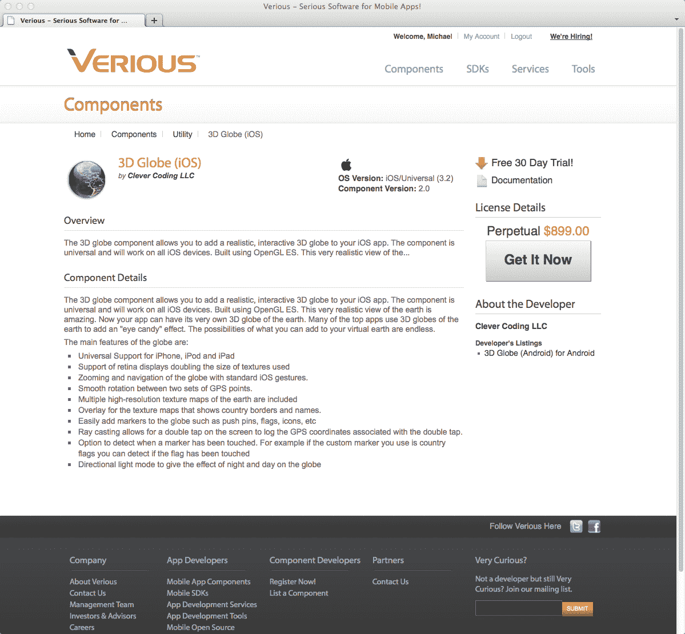

# Verious 推出首个移动应用组件市场 TechCrunch

> 原文：<https://web.archive.org/web/http://techcrunch.com/2011/09/12/verious-launches-first-marketplace-for-mobile-app-components/>

今天，TechCrunch Disrupt 决赛入围者 [Verious](https://web.archive.org/web/20230203055918/http://www.verious.com/) 将推出全球首个移动应用组件市场——即专门面向移动应用开发者的库、SDK(软件开发工具包)、插件、开源代码和其他第三方服务。到目前为止，还没有一个集中的资源库。

但 Verious 不仅仅是在其网站上组织移动应用组件，它还为开发者提供了一种通过版权保护许可系统向他人出售其组件的方式。

据[分析师](https://web.archive.org/web/20230203055918/http://www.research2guidance.com/shop/index.php/application-developer-market-2010-2015)称，移动应用程序开发服务市场预计到 2015 年将达到 1000 亿美元，因为许多独立开发者现在正在开发面向消费者的应用程序以及移动应用程序组件。直到现在还没有人想到推出这样的服务，这实际上有点令人惊讶。

使用 [Verious](https://web.archive.org/web/20230203055918/http://www.verious.com/) ，目标是通过提供他们需要的组件来帮助开发人员加快上市时间，但他们既没有时间也没有资源来构建自己。例如，有一个由 20，000 行代码组成的 3D 地球仪，花了 5 个月的时间和价值 50，000 美元的劳动力构建而成。网站上列出的许可费不到 1000 美元。

在发布前，Verious 的创始人与数千名开发人员进行了交谈，并编制了一份 1000 个组件的清单，以及价值 10 万美元的组件请求。这个初始目录的规模首先证明了这种服务存在的必要性——有许多移动应用程序组件需要开发人员跟上！

除了组织网站上的组件以便于发现之外，移动应用程序开发者还可以在 30 天的免费试用中测试这些组件。他们还可以发布和“跟踪”组件功能请求，这样销售人员就知道在开发过程中应该优先考虑哪些组件来满足市场需求。未来，还将增加对组件进行评级、审查和评论的功能。

该网站正在申请专利的许可证管理器允许卖家实施不同类型的许可模式，包括年费、永久费用、基于数量的分层定价、源代码买断等。Verious 将收取组件 20-40%的佣金(特许开发者 20%)，premier partners 上市 SDK 的介绍费，以及服务器端合作伙伴的收入分成。

发布时， [Verious](https://web.archive.org/web/20230203055918/http://www.verious.com/) 支持 iOS 和 Android，但将根据市场需求扩展到其他平台。

Verious 的管理团队由业内资深人士组成，包括首席执行官安尼尔·佩雷拉、营销副总裁 T2·唐·皮特和网络战略/运营主管 T4·迈克尔·科尔曼。他们的工作经历包括在 VeriSign、American Express、DataSphere、VMWare、Samsung、Openwave 和 TRUSTe 工作的时间。

该公司成立于 2011 年，由种子和天使投资人支持，包括查尔斯·里弗风险投资公司、X-G 风险投资公司、马克·布里托、伊基·范洛、吉尔·彭奇纳、克里希纳·韦达蒂等人。

法官问答

专家评委:[艾琳·李](https://web.archive.org/web/20230203055918/http://www.crunchbase.com/person/aileen-lee)(凯鹏华盈、珀金斯、考菲尔德&拜尔斯)[达斯汀·莫斯科维茨](https://web.archive.org/web/20230203055918/http://www.crunchbase.com/person/dustin-moskovitz)(阿萨纳)[迈克尔·帕瑞克](https://web.archive.org/web/20230203055918/http://www.crunchbase.com/person/michael-parekh)(MPi Capital)[约书亚·沙赫特](https://web.archive.org/web/20230203055918/http://www.crunchbase.com/person/joshua-schachter)(捷格)

艾尔:对潜在市场的估计？

答:1)据分析师称，应用服务市场——到 2015 年将达到 1000 亿美元，加上应用工具市场——到 2015 年将达到 300 亿美元。

DM:开发工具公司没能利用它。谁做得好？

答:很多公司都在做市场模型。

MP:质量控制？评级系统？

答:开发人员必须用代码制作一个样本应用程序，或者在 App Store 上有一个应用程序。是的，评分，评论，社区都来了。

JS:如何成为开发者的第一站？

答:每天都有公司推出 SDK。公司正在与 Verious now 合作，让他们的图书馆上市。他们希望在现场扩大客户群。

**演示:**

**Backstage interview:**