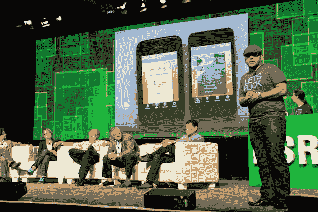

# CardFlick 希望你永远不再使用纸质名片 TechCrunch

> 原文：<https://web.archive.org/web/http://techcrunch.com/2011/09/13/cardflick-hopes-youll-never-use-paper-business-cards-again/>

今天的 [TechCrunch Disrupt](https://web.archive.org/web/20230205040857/http://www.disrupt.beta.techcrunch.com/) 观众选择冠军是数字名片共享应用 [CardFlick](https://web.archive.org/web/20230205040857/http://www.cardflick.co/) ，这是一款[最近推出的](https://web.archive.org/web/20230205040857/https://techcrunch.com/2011/07/07/cardflick-launches-location-based-mobile-professional-contact-sharing-app/) iPhone 应用，允许你与下载了该应用的其他人交换联系信息，或者通过电子邮件交换联系信息。

创始人 [Ketan Anjaria](https://web.archive.org/web/20230205040857/http://www.crunchbase.com/person/ketan-anjaria-2) 告诉我，这款应用与竞争对手 Bump 的不同之处在于它超越了数据交换，“我们关注个人品牌，我们让设计民主化。加上 Bump 不经常用。”使用 CardFlick，你可以登录脸书，应用程序将手动导入你的联系信息，将其变形为各种设计师数字卡片主题，然后你可以通过应用程序上的 Flick 选项卡或通过电子邮件与附近的人分享。

一旦你在附近，CardFlick 将向与你共享卡片的用户发送请求，该用户可以接受或拒绝你的卡片，这相当于 CardFlick 好友请求。CardFlick 上的任何联系人收藏都是云同步的，所以即使你删除应用程序并重新安装，你的联系人也不会受到影响。

该应用自 7 月份以来一直处于私人测试阶段，但本周三在 App Store 上线了 99 美分的付费应用，头几天的下载量超过了 1000 次。该应用程序于周日免费发布后，已有超过 7000 次下载。作为其病毒式传播的证据，Anjaria 透露，测试版中的顶级用户每人邀请了大约 30 人到 CardFlick，当一封电子邮件发出时(因为用户没有 CardFlick 应用程序)，它的平均点击率约为 60%，令人印象深刻。

Anjaria 希望最终为 CardFlick 用户提供分析，即让你知道你卡上的信息被点击了多少次。他希望通过提供不同主题的应用内购买和公司批量购买的订阅模式来赚钱。

在不久的将来，Anjaria 将为 Android、Windows Phone 和 Blackberry 发布 CardFlick，与 conferences 合作并修复脸书连接问题，该问题在今晚的大部分时间里一直困扰着 iPhone 应用程序。哦，对了，淘汰印刷名片，“都 2011 年了，为什么人们还在用名片，”他感叹道。

约西·瓦迪、马克·苏斯特、谷歌的陈德伟、Quora 的丽贝卡·考克斯等评委的提问，引发了“乔·格林”

**问:**好吧，我喜欢，它很有可能成为病毒。这很简单，很容易理解，“你按照自己想要的方式制作名片。”

我喜欢它，唯一的问题是对方必须有一部 iPhone。

**答:**用户获取至关重要。

MS: 这个设计看起来棒极了。我不认为这一个想法是一个大公司。你看看 Bump，他们现在正转向成为一个社交网络。如果你终于得到了人们的关注，想想第二幕。

弗利克的第二幕是什么？

**答:**主题市场，Android、Windows Mobile 的客户端，让公司可以选择购买订阅包。

**JG:** 默认体验是应该知道用户有没有 app。

我们正在努力。我们推出了一款付费应用，周日转为免费，之后下载量达到了 7000 次。

http://www.youtube.com/watch?v = YAkiQoxQoj4