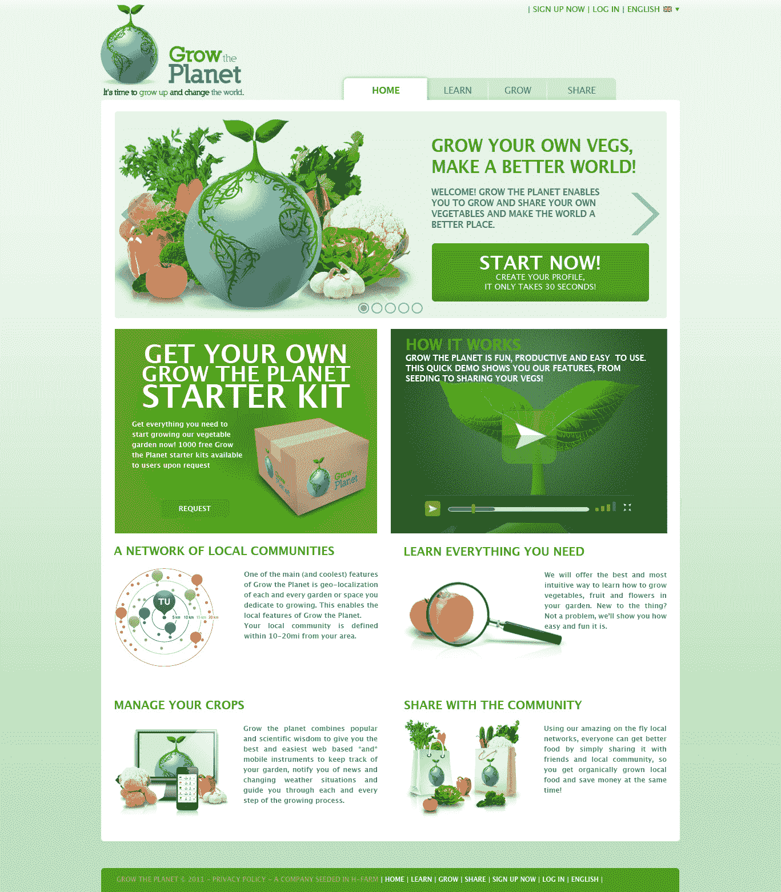

# farmville For Real Farming:Grow The Planet 推出社交网络，教你种植自己的食物 TechCrunch

> 原文：<https://web.archive.org/web/http://techcrunch.com/2011/09/13/farmville-for-real-farming-grow-the-planet-launches-social-network-to-teach-you-to-grow-your-own-food/>

# farmville For Real Farming:Grow The Planet 推出社交网络，教你种植自己的食物

菜园数量暴涨，有机食品和健康饮食也呈上升趋势。美国有超过 7000 万个花园，这正在产生一个潜在的数十亿美元的市场。一家名为 [Grow the Planet](https://web.archive.org/web/20230204190300/http://www.growtheplanet.com/) 的新创公司今天在 TechCrunch Disrupt 上发布，希望利用这个机会为现实世界制作一个 Farmville。“种植地球”希望成为业余爱好农民的社交网络，以及可以教任何人种植自己的蔬菜和草药的资源。

这家初创公司的网站汇集了关于植物和蔬菜的信息，提供种植技能和技术，以及所需活动的提示和建议，以成为个人农业资源。通过该网站的社交功能，用户可以分享意见或不断增长的建议，相互联系，甚至交换产品。Grow The Planet 还支持定位功能，允许用户查看地图以了解哪些用户在附近，他们在种植什么，并弹出(而不是图钉)西红柿和其他蔬菜，这样你就可以看到你周围有什么农产品。嘿，甚至给邻居一份黄瓜点心。

然而，该平台的核心在于每个用户都可以在阳台或室内设计自己的菜园，并根据季节、气候带、天气等接收种植蔬菜所需的提示。这家初创公司引入了对增长统计数据的广泛研究，并整合了气候数据和用户输入，以增加平台的广度。

虽然这家初创公司提供点对点功能，但用户也可以保留自己的花园日志，以跟踪他们在通往素食胜利的道路上的进展，安排并跟踪活动、待办事项和他们花园的整体状态(当然，也可以与内部社区以及其他社交网络分享进展)。

很多人都希望能够种植自己的花园，但不知道从哪里开始。美食家们已经对他们的农业狂热了，这里似乎真的有很大的潜力来培养一个热情的用户群。我说得对吗，绿拇指？

由于国家法律，人们不能出售自己的作物，但通过这种交换网络,“种植星球”找到了一个非常聪明的变通办法。至于创业公司如何赚钱？创始人说，从长远来看，他们想成为一个在线园艺商店；但目前,“成长星球”正在提供高级会员资格，提供更全面的建议、工具、与硬件审查整合的能力，以及扩展的知识和支持。

《成长星球》在这里真的产生了一个令人难以置信的想法，很高兴看到一家初创公司不只是试图成为“其他空间的 Airbnb”。这很有创意，如果这些家伙吸引了投资者的注意，我们也不会感到惊讶。

**演示:**

**Backstage interview:**