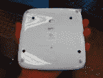

# 罗技的无线触控板标志着鼠标时代的终结(这次是 Windows 版)

> 原文：<https://web.archive.org/web/https://techcrunch.com/2011/09/13/im-never-giving-up-my-logitech-mx-gaming-mouse-never/>

# 罗技的无线触控板标志着鼠标时代的结束(这次是针对 Windows)

看起来很熟悉，是吧？罗技显然从苹果公司的无线触摸板中汲取了灵感，但在我看来这没什么。无线触控板没有苹果电脑的神奇功能，但罗技的新产品似乎有足够的室内技巧来完成工作，在 Windows 电脑上也一样。

很难忽略罗技无线触控板和苹果魔术触控板的相似之处，因此也很难忽略过去的帖子。你看，每毫克，鼠标的日子屈指可数，但显然，自从[宣布苹果传统鼠标死亡的臭名昭著的帖子](https://web.archive.org/web/20230203170545/https://techcrunch.com/2010/07/27/apple-magic-trackpad-mouse/)在一年多前发表后，这种受人尊敬的鼠标肯定正在缓慢而舒适地死去。不，鼠标并没有完全消亡，但是 MG 宣布神奇鼠标[是预示我们计算机未来的先驱](https://web.archive.org/web/20230203170545/https://techcrunch.com/2010/07/27/the-mouse-is-dead/)是正确的。我想未来就在这里。

 与 Apple Magic Trackpad 非常相似，Logitech Wireless Trackpad 允许四指多点触控，以便于导航、滚动、跳转标签和切换应用程序。然而，与苹果版本不同，这些功能没有内置于操作系统中，因此除了那些日常任务，该设备可能无法正常工作。

罗技无线触控板通过罗技神奇的 2.4GHz 统一接收器工作，允许总共五个无线罗技设备，包括鼠标和键盘。插入小 USB 接收器，开始多点触控的乐趣。

无线触控板采用标准的罗技服装。它是塑料的，但像罗技的所有其他产品一样，它看起来和感觉都很棒，但没有铝制的苹果魔力触控板那么神奇。罗技表示，一节 AA 电池将提供四个月的使用时间，谢天谢地，内置方便的 LED 电池指示灯。预计本月晚些时候，美国和欧洲零售商将推出售价 50 美元的无线触控板。

尽管 MG 声称，老鼠还没有死。苹果 Magic Trackpad 可能是其衰落的唯一原因，但不会超过 slate 设备的崛起。传统 PC 作为一个整体正在消亡，其速度比这些桌面触控板输入设备超越鼠标的速度还要快。也就是说，苹果触控板在苹果人群中一炮而红，因为 Mac 笔记本拥有任何笔记本中最棒的触控板，用户希望在他们的桌面上使用这种控制方案。Windows 笔记本就没那么幸运了，用户经常遭受可怕的触控板体验[最常见的原因是糟糕的驱动程序](https://web.archive.org/web/20230203170545/https://techcrunch.com/2010/04/15/please-wont-somebody-think-of-the-trackpads/)。

罗技公司对无线触控板的想法是正确的，但希望 Windows、驱动程序或第三方软件不会扼杀这个梦想。