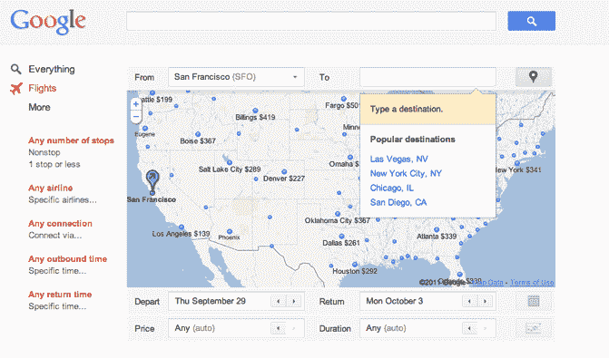

# ITA 驱动的谷歌旅行发布；Kayak 称其航班搜索“更胜一筹”

> 原文：<https://web.archive.org/web/http://techcrunch.com/2011/09/13/ita-powered-google-travel-launches-kayak-says-its-flight-search-is-superior/>

# ITA 驱动的谷歌旅行发布；Kayak 称其航班搜索是“上乘的”

几个月前，我们听说谷歌计划推出 ITA 综合航班搜索产品。作为背景，DOJ 最终[批准了](https://web.archive.org/web/20230205021104/https://techcrunch.com/2011/04/08/breaking-doj-approves-googles-ita-deal-with-conditions/)谷歌4 月份对机票软件公司 ITA 的 7 亿美元收购，谷歌[几天后正式完成收购](https://web.archive.org/web/20230205021104/https://techcrunch.com/2011/04/13/after-agreeing-to-doj-settlement-google-closes-700m-acquisition-of-ita-software/)。该交易正被调查为可能对在线旅游搜索行业构成反竞争，因为谷歌在旅游搜索领域的许多竞争对手都在使用 ITA 的软件，包括微软、Kayak 和 Expedia。今天，谷歌[发布了](https://web.archive.org/web/20230205021104/http://searchengineland.com/google-travel-search-takes-flight-with-first-ita-travel-product-92594)其航班搜索门户[谷歌旅行](https://web.archive.org/web/20230205021104/http://www.google.com/flights/)。

基本上，你输入你的出发点和目的地，日期，价格参数，持续时间和更多。您还可以为站点数量、航空公司、连接、出站和入站时间等设置过滤器。

搜索结果出现在同一页面上，在显示路线和票价的地图下方以类似网格的格式显示。您可以点击您选择的航班，选择想要的返程航班，并通过航空公司网站预订航班。

这是一个相当简单的网络界面，搜索引擎公司称谷歌也将尝试广告。该门户网站不提供单程或多城市票价。目前，旅游搜索只关注航班，但看看谷歌是否会在搜索网站上增加酒店和更多内容应该会很有趣。

最大的问题是，谷歌有意义地进入旅游搜索市场(配备 ITA 软件)将如何影响其竞争对手，如 Kayak、Expedia 和其他公司。Kayak 和 Expedia 目前提供更多功能丰富的搜索门户。但谷歌是搜索领域的巨头，因此认为该公司可以在旅游搜索领域获得可观的市场份额并非没有道理。

Kayak 发表这份声明是为了回应谷歌的旅游门户网站。我们对自己的竞争能力充满信心，我们相信我们的航班搜索技术是一流的。我们承认谷歌是一个强大的竞争对手，但他们并没有在他们进入的每个垂直领域都取得成功。我们使用多种数据源和专有技术，所有这些都有助于我们努力为人们提供全面、快速和准确的答案，以满足他们的航班搜索需求。