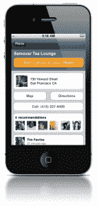

# Trippy:将你的朋友和社交推荐带到旅行规划中 TechCrunch

> 原文：<https://web.archive.org/web/http://techcrunch.com/2011/09/13/trippy-bringing-your-friends-and-social-recommendations-to-travel-planning/?utm_source=feedburner&utm_medium=feed&utm_campaign=Feed:+Techcrunch+(TechCrunch>)

# Trippy:把你的朋友和社交建议带到旅行计划中

有数百个旅游网站可以帮助你计划旅行，但这些指南通常以游戏化网络的形式出现，或者主要由来自当地专家(换句话说，陌生人)的可疑众包内容组成。通常情况下，这些人会被激励去写评论，使得信息变得可疑。诚然，有一些很酷的初创公司，如 [Triposo](https://web.archive.org/web/20230204184608/http://blog.triposo.com/) 和 [Gogobot](https://web.archive.org/web/20230204184608/http://www.gogobot.com/) ，但像前者这样的网站和应用程序正在采用一种算法方法来推荐旅游——看不到真人。

[今天在 TechCrunch Disrupt 上发布的初创公司 Trippy](https://web.archive.org/web/20230204184608/http://www.trippy.com/) 认为，来自你信任和了解你的人——你的朋友——的推荐总是更好。因此，Trippy 重复了古老的众包模式，旨在成为一个所谓的“朋友来源”旅行解决方案，将你的社交网络，如脸书，绑定到它的平台上，让你找到你的哪些朋友去过你正在考虑的目的地——无论他们是否在那里入住、生活、工作或学习。(很像 Spotify 对于音乐的模式。)

特里皮认为，利用你朋友(你绝对信任的人)的旅行经历远比从陌生人那里获得建议更有价值。很难不同意他们的观点，除非那个陌生人碰巧是个巫师。

通过一键推荐和脸书风格的评论，Trippy 让你的朋友字面上和象征性地告诉你什么样的酒店、餐馆和目的地适合你。这家初创公司提供了一个简单的自动完成工具，可以从一个完整的位置数据库中快速找到你想要的东西。然后，用户可以添加他们正在考虑的地方，这样朋友们就可以对行程发表评论，以脸书风格的评论反馈提供反馈。

这是 Trippy 最酷的功能之一:这家初创公司允许用户实时利用为他们计划的旅行制定的“friendsourced”路线，通过挑选你最喜欢的目的地建议(基于这些社交建议)。然后，Trippy 会自动将这些建议转换成路线，并在用户的旅行地图上标出旅程。

当旅行者准备好查询价格或预订行程时，他们可以在 Trippy 的平台上进行。这就是 Trippy 的赚钱计划，即在用户购物时，从酒店和第三方服务的收入中提成。

这家初创公司的移动应用程序允许用户在你滚动浏览他们在你的旅程中提供的建议时，实时查看你的照片。界面干净流畅，如果你的朋友是喜欢旅行的，Trippy 可能会有一些腿。

**演示:**

**Backstage interview:**