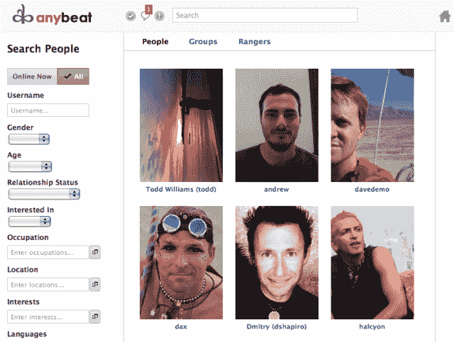

# 即将推出的社交网络 Altly 现在是 AnyBeat，进入私人测试版 TechCrunch

> 原文：<https://web.archive.org/web/http://techcrunch.com/2011/09/13/upcoming-social-network-altly-is-now-anybeat-goes-into-private-beta/>

# 即将到来的社交网络 Altly 现在是 AnyBeat，进入私人测试

我刚刚得到了一个新的[即将推出的社交网络服务](https://web.archive.org/web/20230204233957/https://techcrunch.com/2011/05/26/altly/)的演示，名为 [AnyBeat](https://web.archive.org/web/20230204233957/http://www.anybeat.com/) ，它以前被称为 [Altly](https://web.archive.org/web/20230204233957/http://www.crunchbase.com/company/altly) ，由 Veoh 创始人和前 MySpace 音乐执行官 [Dmitry Shapiro](https://web.archive.org/web/20230204233957/http://www.crunchbase.com/person/dmitry-shapiro) 创建。

我猜下面的截图已经让这一点变得很清楚了，但是现在开始的任何社交网络在功能和设计上都注定看起来像 Twitter、脸书或 Google+。毫无疑问，Anybeat 就是这样一个社交网络，它借鉴了这三种流行服务的元素和功能，但没有添加任何非常独特的东西(就目前而言)。

果然，Anybeat 看起来真的很干净，从我在演示中看到的来看，它是一个完美的社交网络，具有所有必要的功能。我的问题是，它缺乏存在的理由，尤其是考虑到这个世界上的 Twitters 和 Facebooks 所享有的领先优势。

替代品很好，甚至是必需的，但是用户也需要一个令人信服的理由来改变。

夏皮罗和他的团队增加了一些东西，试图让 Anybeat 脱颖而出，例如使用假名的能力，关注、分组、直接消息和即时消息其他成员的混合系统，使人们能够发现新用户关注的目录，集成的实时和可保存的搜索，有点像 Anybeat 成员有多棒的内部排名的“信用”分数，以及一个特殊的专用“问题”，这很像 Quora 或脸书问题。

但最终，至少就我所见，如果我已经在使用脸书、Twitter 和/或 Google+或其他任何社交网络，基本上没有什么会让我想使用 Anybeat。这在未来可能会改变，但现在我对此持怀疑态度。

Anybeat 已经从 Freestyle Capital、Social Leverage、DFJ、霍华德·林德森、汤姆·安德森和其他天使投资者那里筹集了超过 100 万美元的资金。

这项服务目前只接受邀请，但你可以注册以获得提醒。

