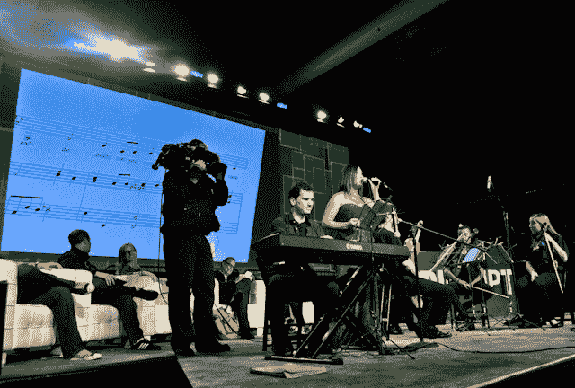
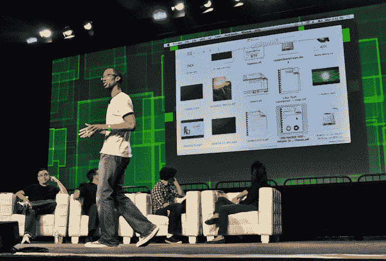
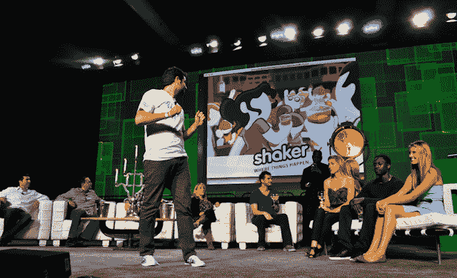
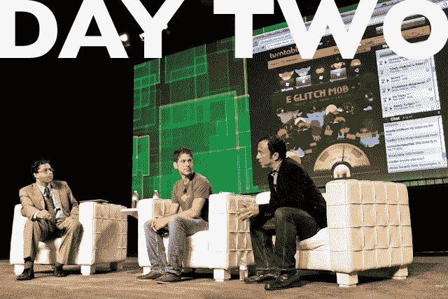
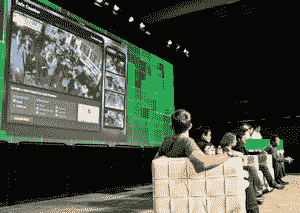
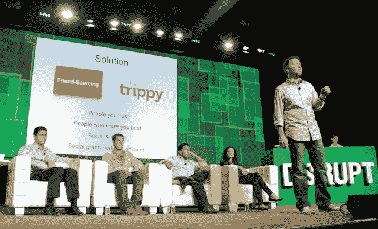
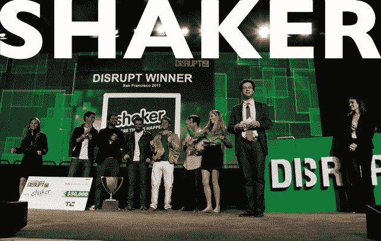
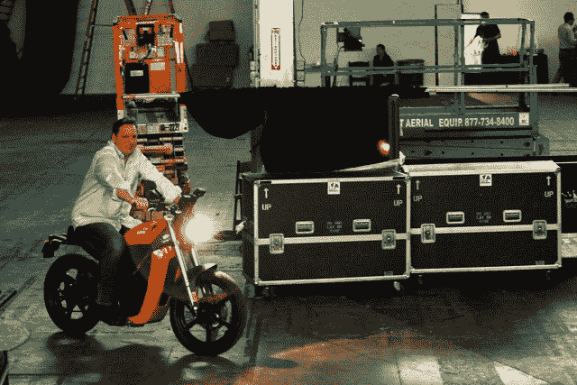

# 扰乱 SF 2011 终极指南

> 原文：<https://web.archive.org/web/http://techcrunch.com/2011/09/14/the-ultimate-guide-to-techcrunch-disrupt-sf-2011/>

TechCrunch 扰乱旧金山刚刚结束。在我们在 Disrupt 季精心营造的狂热期待氛围中，你可能已经错过了在这个无与伦比的会议上举行的一些会谈、小组讨论、发布会或创业活动。别担心。在这篇方便的综合文章中，我们收集了我们的写作和视频团队的所有内容。如果你今天只分享一件东西，那就把它变成这件吧。

几乎舞台上发生的一切都被 TechCrunch 电视台的眼睛捕捉到了，所以大多数帖子的底部都有视频，许多甚至有众包转录。更多视频可以在 [TCTV 档案馆](https://web.archive.org/web/20230204233050/http://techcrunch.tv/disrupt/)找到。从字面上看，我们有能力的摄影师拍摄的数千张照片可以在[这里](https://web.archive.org/web/20230204233050/http://www.flickr.com/photos/disruptsf2011)找到，包括大多数初创公司，我的照片(出现在帖子中)可以从 [TechCrunch Flickr 页面](https://web.archive.org/web/20230204233050/http://www.flickr.com/photos/techcrunch/)免费下载。当然，所有与这次和其他 Disrupt 会议相关的新闻都可以在[disrupt.beta.techcrunch.com](https://web.archive.org/web/20230204233050/http://disrupt.beta.techcrunch.com/)找到。请继续阅读我们其余报道的链接。

# 发布、小组讨论和炉边聊天

# 战场

**第一场会议:颠覆传统市场**

 [托纳拉](https://web.archive.org/web/20230204233050/https://techcrunch.com/2011/09/12/tonara-ipads-app-looks-to-reinvent-sheet-music-for-the-digital-age/):一个基于平板电脑的乐谱程序，当你弹奏
[法米戈](https://web.archive.org/web/20230204233050/https://techcrunch.com/2011/09/12/farmigo-tapping-into-the-power-of-the-web-to-bring-you-fresh-veggies/)时，它会进行聆听和调整:基于社区的当地新鲜农产品种植和销售
[HouseFix](https://web.archive.org/web/20230204233050/https://techcrunch.com/2011/09/12/housefix-bringing-social-recommendations-and-accountability-to-home-improvement/) :跟踪房屋维修并丰富与房屋承包商和服务的关系
[Openbucks](https://web.archive.org/web/20230204233050/https://techcrunch.com/2011/09/12/openbucks-buy-digital-goods-online-with-subway-giftcards-and-more/) :使用主要礼品卡提供商的无现金和无银行支付
[CakeHealth](https://web.archive.org/web/20230204233050/https://techcrunch.com/2011/09/12/cake-health-the-mint-for-health-insurance-launches-to-the-public/) :复杂但用户友好的保险费用、索赔等跟踪。

**第二场会议:推动网络向前发展**

**第三节:娱乐我们**

[【Shaker】](https://web.archive.org/web/20230204233050/https://techcrunch.com/2011/09/12/shaker/):一个社交的、与网络无关的社交环境
[YouNow](https://web.archive.org/web/20230204233050/https://techcrunch.com/2011/09/12/younow/) :大众评分的网络直播
[Amen](https://web.archive.org/web/20230204233050/https://techcrunch.com/2011/09/12/amen-aims-to-find-the-best-of-everything-with-a-smart-interface/) :一个各种各样的评分引擎(简单掌握，难以解释)
[IdleGames](https://web.archive.org/web/20230204233050/https://techcrunch.com/2011/09/12/idle-games/) :为社交网络开发下一代游戏
[quest . Li](https://web.archive.org/web/20230204233050/https://techcrunch.com/2011/09/12/quest-li/):gamifying 日常生活(创业巷观众挑选)

# 发布、小组讨论和炉边聊天

# 战场

**第四场:客户友好型企业**

 [TalkTo](https://web.archive.org/web/20230204233050/https://techcrunch.com/2011/09/13/talkto-allows-consumers-to-sms-any-local-business-and-get-a-quick-response/) :联系当地商家预约、反馈等。通过短信
[奖励 li](https://web.archive.org/web/20230204233050/https://techcrunch.com/2011/09/13/rewardli-lets-smbs-leverage-their-social-graph-to-get-discounts-on-purchases/) :让公司利用社交图
[SizeUp](https://web.archive.org/web/20230204233050/https://techcrunch.com/2011/09/13/sizeup-brings-mint-like-business-intelligence-and-competitive-analysis-to-smbs/) 进行团购:为小型企业提供丰富的本地指标以帮助他们成长
[Trello](https://web.archive.org/web/20230204233050/https://techcrunch.com/2011/09/13/joel-spolskys-trello-is-a-simple-workflow-and-list-manager-for-groups/) :通用工作流和任务管理平台
[Prism Skylabs](https://web.archive.org/web/20230204233050/https://techcrunch.com/2011/09/13/prism-skylabs-refocuses-security-cams-into-productive-video-assets/) :处理安全镜头以生成关于物理空间的强大分析信息

**第五场会议:本地网络**

**第六场:**增进理解

# 发布、小组讨论和炉边聊天

# 获胜者是…

我们的数百名申请人减少到 29 家战地公司(加上观众选择的两天)，然后是最后六家，他们有一段延长的时间将他们的公司重新推介给新的评委。经过一个小时的休息和考虑，他们回来了，带着消息说 [Shaker 将获得 5 万美元的奖金和久负盛名的 TechCrunch Disrupt Cup](https://web.archive.org/web/20230204233050/https://techcrunch.com/2011/09/14/and-the-winner-of-techcrunch-disrupt-is-shaker/) 。亚军 Prism Sky Labs 获得了一只镀金鞋。

恭喜获奖者！我们还要感谢今年申请、参加、赞助或支持 Disrupt 的所有人。我们期待着明年在旧金山，或者更早些时候在纽约，甚至在北京与大家再次见面。

另一方面，如果没有对迈克·阿灵顿和他对科技新闻的贡献的认可，这篇总结就不完整。多年来，TechCrunch 在他的领导下变得越来越大，越来越好。我想以个人名义向迈克表示感谢，但我认为罗恩·康韦的结束语所引发的起立鼓掌更有说服力:

祝你好运，迈克。

